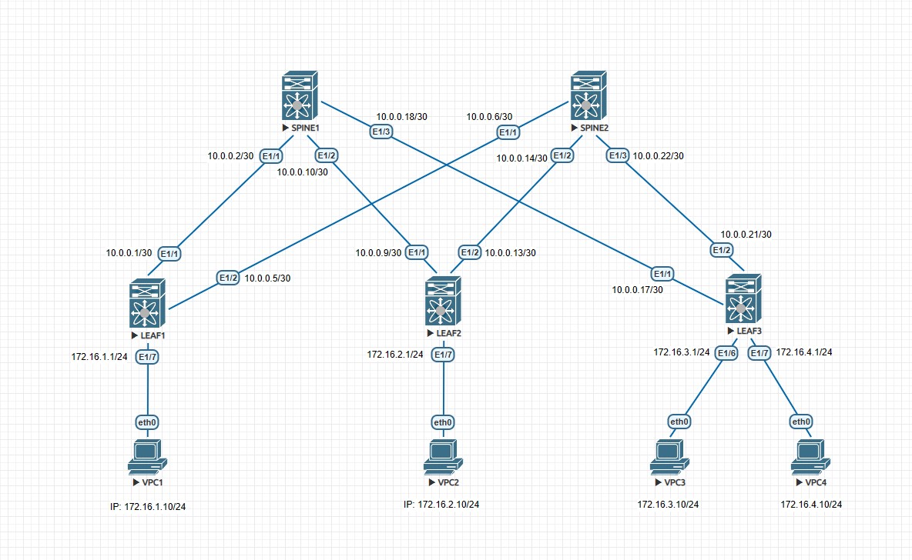

## Проектирование адресного пространства

### Цель:
- Собрать схему CLOS
- Распределить адресное пространство

#### <u>Таблица интерфейсов и адресации:</u>

|Device|Interface|IP Address|Subnet Mask|
|:-:|:-:|:-:|:-:|
|LEAF 1|Ethernet 1/1|10.0.0.1|255.255.255.252|
|SPINE 1|Ethernet 1/1|10.0.0.2|255.255.255.252|
|LEAF 1|Ethernet 1/2|10.0.0.5|255.255.255.252|
|SPINE 2|Ethernet 1/1|10.0.0.6|255.255.255.252|
|LEAF 2|Ethernet 1/1|10.0.0.9|255.255.255.252|
|SPINE 1|Ethernet 1/2|10.0.0.10|255.255.255.252|
|LEAF 2|Ethernet 1/2|10.0.0.13|255.255.255.252|
|SPINE 2|Ethernet 1/2|10.0.0.14|255.255.255.252|
|LEAF 3|Ethernet 1/1|10.0.0.17|255.255.255.252|
|SPINE 1|Ethernet1/3|10.0.0.18|255.255.255.252|
|LEAF 3|Ethernet 1/2|10.0.0.21|255.255.255.252|
|SPINE 2|Ethernet 1/3|10.0.0.22|255.255.255.252|
|LEAF 1|Ethernet 1/7|172.16.1.1|255.255.255.0|
|LEAF 2|Ethernet 1/7|172.16.2.1|255.255.255.0|
|LEAF 3|Ethernet 1/6|172.16.3.1|255.255.255.0|
|LEAF 3|Ethernet 1/7|172.16.4.1|255.255.255.0|
|VPC1|eth0|172.16.1.10|255.255.255.0|
|VPC2|eth0|172.16.2.10|255.255.255.0|
|VPC3|eth0|172.16.3.10|255.255.255.0|
|VPC4|eth0|172.16.4.10|255.255.255.0|

#### <u>Физическая схема сети:</u>



#### <u>Настройки, выполненные на оборудовании, для задействованных интерфейсов:</u>

SPINE1:
```
interface Ethernet1/1
  no switchport
  ip address 10.0.0.2/30
  no shutdown

interface Ethernet1/2
  no switchport
  ip address 10.0.0.10/30
  no shutdown

interface Ethernet1/3
  no switchport
  ip address 10.0.0.18/30
  no shutdown
  ```
  SPINE2:
  ```
interface Ethernet1/1
  no switchport
  ip address 10.0.0.6/30
  no shutdown

interface Ethernet1/2
  no switchport
  ip address 10.0.0.14/30
  no shutdown

interface Ethernet1/3
  no switchport
  ip address 10.0.0.22/30
  no shutdown
```
LEAF1:
```
interface Ethernet1/1
  no switchport
  ip address 10.0.0.1/30
  no shutdown

interface Ethernet1/2
  no switchport
  ip address 10.0.0.5/30
  no shutdown

interface Ethernet1/7
  no switchport
  ip address 172.16.1.1/24
  no shutdown
  ```
  LEAF2:
  ```
interface Ethernet1/1
  no switchport
  ip address 10.0.0.9/30
  no shutdown

interface Ethernet1/2
  no switchport
  ip address 10.0.0.13/30
  no shutdown

interface Ethernet1/7
  no switchport
  ip address 172.16.2.1/24
  no shutdown
  ```
  LEAF3:
  ```
interface Ethernet1/1
  no switchport
  ip address 10.0.0.17/30
  no shutdown

interface Ethernet1/2
  no switchport
  ip address 10.0.0.21/30
  no shutdown

interface Ethernet1/6
  no switchport
  ip address 172.16.3.1/24
  no shutdown

interface Ethernet1/7
  no switchport
  ip address 172.16.4.1/24
  no shutdown
  ```
  ICMP-проверка:

  ```
  SPINE1# ping 10.0.0.1
PING 10.0.0.1 (10.0.0.1): 56 data bytes
36 bytes from 10.0.0.2: Destination Host Unreachable
Request 0 timed out
64 bytes from 10.0.0.1: icmp_seq=1 ttl=254 time=15.206 ms
64 bytes from 10.0.0.1: icmp_seq=2 ttl=254 time=6.752 ms
64 bytes from 10.0.0.1: icmp_seq=3 ttl=254 time=4.928 ms
64 bytes from 10.0.0.1: icmp_seq=4 ttl=254 time=4.682 ms

--- 10.0.0.1 ping statistics ---
5 packets transmitted, 4 packets received, 20.00% packet loss
round-trip min/avg/max = 4.682/7.891/15.206 ms
```
```
SPINE2# ping 10.0.0.5
PING 10.0.0.5 (10.0.0.5): 56 data bytes
36 bytes from 10.0.0.6: Destination Host Unreachable
Request 0 timed out
64 bytes from 10.0.0.5: icmp_seq=1 ttl=254 time=11.246 ms
64 bytes from 10.0.0.5: icmp_seq=2 ttl=254 time=6.584 ms
64 bytes from 10.0.0.5: icmp_seq=3 ttl=254 time=8.688 ms
64 bytes from 10.0.0.5: icmp_seq=4 ttl=254 time=7.215 ms

--- 10.0.0.5 ping statistics ---
5 packets transmitted, 4 packets received, 20.00% packet loss
round-trip min/avg/max = 6.584/8.433/11.246 ms
```
```
LEAF1# ping 10.0.0.2
PING 10.0.0.2 (10.0.0.2): 56 data bytes
64 bytes from 10.0.0.2: icmp_seq=0 ttl=254 time=8.222 ms
64 bytes from 10.0.0.2: icmp_seq=1 ttl=254 time=8.607 ms
64 bytes from 10.0.0.2: icmp_seq=2 ttl=254 time=5.561 ms
64 bytes from 10.0.0.2: icmp_seq=3 ttl=254 time=9.608 ms
64 bytes from 10.0.0.2: icmp_seq=4 ttl=254 time=6.884 ms

--- 10.0.0.2 ping statistics ---
5 packets transmitted, 5 packets received, 0.00% packet loss
round-trip min/avg/max = 5.561/7.776/9.608 ms
```
```
LEAF2# ping 10.0.0.10
PING 10.0.0.10 (10.0.0.10): 56 data bytes
64 bytes from 10.0.0.10: icmp_seq=0 ttl=254 time=6.498 ms
64 bytes from 10.0.0.10: icmp_seq=1 ttl=254 time=6.792 ms
64 bytes from 10.0.0.10: icmp_seq=2 ttl=254 time=5.686 ms
64 bytes from 10.0.0.10: icmp_seq=3 ttl=254 time=5.706 ms
64 bytes from 10.0.0.10: icmp_seq=4 ttl=254 time=6.073 ms

--- 10.0.0.10 ping statistics ---
5 packets transmitted, 5 packets received, 0.00% packet loss
round-trip min/avg/max = 5.686/6.151/6.792 ms

LEAF2# ping 10.0.0.14
PING 10.0.0.14 (10.0.0.14): 56 data bytes
36 bytes from 10.0.0.13: Destination Host Unreachable
Request 0 timed out
64 bytes from 10.0.0.14: icmp_seq=1 ttl=254 time=5.72 ms
64 bytes from 10.0.0.14: icmp_seq=2 ttl=254 time=5.785 ms
64 bytes from 10.0.0.14: icmp_seq=3 ttl=254 time=13.056 ms
64 bytes from 10.0.0.14: icmp_seq=4 ttl=254 time=7.712 ms

--- 10.0.0.14 ping statistics ---
5 packets transmitted, 4 packets received, 20.00% packet loss
round-trip min/avg/max = 5.72/8.068/13.056 ms
```
```
LEAF3# ping 10.0.0.18
PING 10.0.0.18 (10.0.0.18): 56 data bytes
64 bytes from 10.0.0.18: icmp_seq=0 ttl=254 time=15.398 ms
64 bytes from 10.0.0.18: icmp_seq=1 ttl=254 time=8.858 ms
64 bytes from 10.0.0.18: icmp_seq=2 ttl=254 time=12.805 ms
64 bytes from 10.0.0.18: icmp_seq=3 ttl=254 time=12.795 ms
64 bytes from 10.0.0.18: icmp_seq=4 ttl=254 time=9.992 ms

--- 10.0.0.18 ping statistics ---
5 packets transmitted, 5 packets received, 0.00% packet loss
round-trip min/avg/max = 8.858/11.969/15.398 ms

LEAF3# ping 10.0.0.22
PING 10.0.0.22 (10.0.0.22): 56 data bytes
64 bytes from 10.0.0.22: icmp_seq=0 ttl=254 time=12.303 ms
64 bytes from 10.0.0.22: icmp_seq=1 ttl=254 time=12.856 ms
64 bytes from 10.0.0.22: icmp_seq=2 ttl=254 time=12.209 ms
64 bytes from 10.0.0.22: icmp_seq=3 ttl=254 time=5.181 ms
64 bytes from 10.0.0.22: icmp_seq=4 ttl=254 time=6.018 ms

--- 10.0.0.22 ping statistics ---
5 packets transmitted, 5 packets received, 0.00% packet loss
round-trip min/avg/max = 5.181/9.713/12.856 ms
```
Также приложеные полные конфигурационные файлы оборудования.