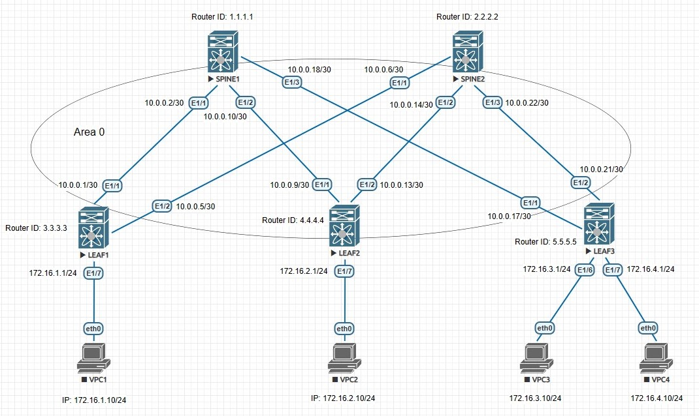

## OSPF

### Цели:
- настроить OSPF в Underlay-сети, для IP-связанности между всеми устройствами NXOS

### Описание выполнения лабораторной работы:
- запустить процесс OSPF UNDERLAY на каждом L3-коммутаторе
- назначить Router ID каждому устройству
- все интерфейсы, кроме клиентских, L3-коммутаторов располагаются в Backbone Area
- все интерфейсы, участвующие в OSPF, должны быть переведены в режим point-to-point

### Физическая схема сети:


#### <u>Таблица интерфейсов и адресации, участвующих в OSPF:</u>

|Device|Interface|IP Address|Subnet Mask|
|:-:|:-:|:-:|:-:|
|LEAF 1|Ethernet 1/1|10.0.0.1|255.255.255.252|
|SPINE 1|Ethernet 1/1|10.0.0.2|255.255.255.252|
|LEAF 1|Ethernet 1/2|10.0.0.5|255.255.255.252|
|SPINE 2|Ethernet 1/1|10.0.0.6|255.255.255.252|
|LEAF 2|Ethernet 1/1|10.0.0.9|255.255.255.252|
|SPINE 1|Ethernet 1/2|10.0.0.10|255.255.255.252|
|LEAF 2|Ethernet 1/2|10.0.0.13|255.255.255.252|
|SPINE 2|Ethernet 1/2|10.0.0.14|255.255.255.252|
|LEAF 3|Ethernet 1/1|10.0.0.17|255.255.255.252|
|SPINE 1|Ethernet1/3|10.0.0.18|255.255.255.252|
|LEAF 3|Ethernet 1/2|10.0.0.21|255.255.255.252|
|SPINE 2|Ethernet 1/3|10.0.0.22|255.255.255.252|
|LEAF 1|Ethernet 1/7|172.16.1.1|255.255.255.0|
|LEAF 2|Ethernet 1/7|172.16.2.1|255.255.255.0|
|LEAF 3|Ethernet 1/6|172.16.3.1|255.255.255.0|
|LEAF 3|Ethernet 1/7|172.16.4.1|255.255.255.0|

#### <u>Сети, анонсируемые в OSPF:</u>

|Device|Router ID|Network|Subnet Mask|
|:-:|:-:|:-:|:-:|
|SPINE1|1.1.1.1|10.0.0.0|255.255.255.252|
|SPINE1|1.1.1.1|10.0.0.8|255.255.255.252|
|SPINE1|1.1.1.1|10.0.0.16|255.255.255.252|
|SPINE2|2.2.2.2|10.0.0.0|255.255.255.252|
|SPINE2|2.2.2.2|10.0.0.8|255.255.255.252|
|SPINE2|2.2.2.2|10.0.0.16|255.255.255.252|
|LEAF1|3.3.3.3|10.0.0.0|255.255.255.252|
|LEAF1|3.3.3.3|10.0.0.4|255.255.255.252|
|LEAF2|4.4.4.4|10.0.0.8|255.255.255.252|
|LEAF2|4.4.4.4|10.0.0.12|255.255.255.252|
|LEAF3|5.5.5.5|10.0.0.16|255.255.255.252|
|LEAF3|5.5.5.5|10.0.0.20|255.255.255.252|

### Необходимые настройки на оборудовании:

#### <u>Настройка SPINE1:</u>
```
feature ospf
router ospf UNDERLAY
  router-id 1.1.1.1

interface Ethernet1/1
  no switchport
  ip address 10.0.0.2/30
  ip ospf network point-to-point
  ip router ospf UNDERLAY area 0.0.0.0
  no shutdown

interface Ethernet1/2
  no switchport
  ip address 10.0.0.10/30
  ip ospf network point-to-point
  ip router ospf UNDERLAY area 0.0.0.0
  no shutdown

interface Ethernet1/3
  no switchport
  ip address 10.0.0.18/30
  ip ospf network point-to-point
  ip router ospf UNDERLAY area 0.0.0.0
  no shutdown
```
#### <u>Настройка SPINE2:</u>
```
feature ospf
router ospf UNDERLAY
  router-id 2.2.2.2

interface Ethernet1/1
  no switchport
  ip address 10.0.0.6/30
  ip ospf network point-to-point
  ip router ospf UNDERLAY area 0.0.0.0
  no shutdown

interface Ethernet1/2
  no switchport
  ip address 10.0.0.14/30
  ip ospf network point-to-point
  ip router ospf UNDERLAY area 0.0.0.0
  no shutdown

interface Ethernet1/3
  no switchport
  ip address 10.0.0.22/30
  ip ospf network point-to-point
  ip router ospf UNDERLAY area 0.0.0.0
  no shutdown
```
#### <u>Настройка LEAF1:</u>
```
feature ospf
router ospf UNDERLAY
  router-id 3.3.3.3

interface Ethernet1/1
  no switchport
  ip address 10.0.0.1/30
  ip ospf network point-to-point
  ip router ospf UNDERLAY area 0.0.0.0
  no shutdown

interface Ethernet1/2
  no switchport
  ip address 10.0.0.5/30
  ip ospf network point-to-point
  ip router ospf UNDERLAY area 0.0.0.0
  no shutdown
```
#### <u>Настройка LEAF2:</u>
```
feature ospf
router ospf UNDERLAY
  router-id 4.4.4.4

interface Ethernet1/1
  no switchport
  ip address 10.0.0.9/30
  ip ospf network point-to-point
  ip router ospf UNDERLAY area 0.0.0.0
  no shutdown

interface Ethernet1/2
  no switchport
  ip address 10.0.0.13/30
  ip ospf network point-to-point
  ip router ospf UNDERLAY area 0.0.0.0
  no shutdown
```
#### <u>Настройка LEAF3:</u>
```
feature ospf
router ospf UNDERLAY
  router-id 5.5.5.5

interface Ethernet1/1
  no switchport
  ip address 10.0.0.17/30
  ip ospf network point-to-point
  ip router ospf UNDERLAY area 0.0.0.0
  no shutdown

interface Ethernet1/2
  no switchport
  ip address 10.0.0.21/30
  ip ospf network point-to-point
  ip router ospf UNDERLAY area 0.0.0.0
  no shutdown
```
### Проверка работоспособности OSPF в сети. Проверяем соседство, таблицу маршрутизации и LSDB:

<details>
<summary>Проверка на SPINE1</summary>

```
SPINE1# sh ip ospf  neighbors 
No such file or directory
 OSPF Process ID UNDERLAY VRF default
 Total number of neighbors: 3
 Neighbor ID     Pri State            Up Time  Address         Interface
 3.3.3.3           1 FULL/ -          00:30:35 10.0.0.1        Eth1/1 
 4.4.4.4           1 FULL/ -          00:09:05 10.0.0.9        Eth1/2 
 5.5.5.5           1 FULL/ -          00:30:31 10.0.0.17       Eth1/3 


SPINE1# sh ip route
No such file or directory
IP Route Table for VRF "default"
'*' denotes best ucast next-hop
'**' denotes best mcast next-hop
'[x/y]' denotes [preference/metric]
'%<string>' in via output denotes VRF <string>

10.0.0.0/30, ubest/mbest: 1/0, attached
    *via 10.0.0.2, Eth1/1, [0/0], 00:20:21, direct
10.0.0.2/32, ubest/mbest: 1/0, attached
    *via 10.0.0.2, Eth1/1, [0/0], 00:20:21, local
10.0.0.4/30, ubest/mbest: 1/0
    *via 10.0.0.1, Eth1/1, [110/80], 00:19:51, ospf-UNDERLAY, intra
10.0.0.8/30, ubest/mbest: 1/0, attached
    *via 10.0.0.10, Eth1/2, [0/0], 00:20:19, direct
10.0.0.10/32, ubest/mbest: 1/0, attached
    *via 10.0.0.10, Eth1/2, [0/0], 00:20:19, local
10.0.0.12/30, ubest/mbest: 2/0
    *via 10.0.0.1, Eth1/1, [110/120], 00:02:01, ospf-UNDERLAY, intra
    *via 10.0.0.17, Eth1/3, [110/120], 00:02:01, ospf-UNDERLAY, intra
10.0.0.16/30, ubest/mbest: 1/0, attached
    *via 10.0.0.18, Eth1/3, [0/0], 00:20:17, direct
10.0.0.18/32, ubest/mbest: 1/0, attached
    *via 10.0.0.18, Eth1/3, [0/0], 00:20:17, local
10.0.0.20/30, ubest/mbest: 1/0
    *via 10.0.0.17, Eth1/3, [110/80], 00:19:46, ospf-UNDERLAY, intra


SPINE1# sh ip ospf database 
No such file or directory
        OSPF Router with ID (1.1.1.1) (Process ID UNDERLAY VRF default)

                Router Link States (Area 0.0.0.0)

Link ID         ADV Router      Age        Seq#       Checksum Link Count
1.1.1.1         1.1.1.1         272        0x80000006 0x650c   6   
2.2.2.2         2.2.2.2         274        0x80000005 0x0f43   6   
3.3.3.3         3.3.3.3         493        0x80000004 0xc86a   4   
4.4.4.4         4.4.4.4         273        0x80000008 0x17ef   4   
5.5.5.5         5.5.5.5         493        0x80000004 0xb72b   4  
```
</details>
<details>
<summary>Проверка на SPINE2</summary>

```
SPINE2# sh ip ospf neighbors 
 OSPF Process ID UNDERLAY VRF default
 Total number of neighbors: 3
 Neighbor ID     Pri State            Up Time  Address         Interface
 3.3.3.3           1 FULL/ -          00:12:54 10.0.0.5        Eth1/1 
 4.4.4.4           1 FULL/ -          00:09:14 10.0.0.13       Eth1/2 
 5.5.5.5           1 FULL/ -          00:12:54 10.0.0.21       Eth1/3 

SPINE2# sh ip route 
IP Route Table for VRF "default"
'*' denotes best ucast next-hop
'**' denotes best mcast next-hop
'[x/y]' denotes [preference/metric]
'%<string>' in via output denotes VRF <string>

10.0.0.0/30, ubest/mbest: 1/0
    *via 10.0.0.5, Eth1/1, [110/80], 00:03:17, ospf-UNDERLAY, intra
10.0.0.4/30, ubest/mbest: 1/0, attached
    *via 10.0.0.6, Eth1/1, [0/0], 00:03:46, direct
10.0.0.6/32, ubest/mbest: 1/0, attached
    *via 10.0.0.6, Eth1/1, [0/0], 00:03:46, local
10.0.0.8/30, ubest/mbest: 2/0
    *via 10.0.0.5, Eth1/1, [110/120], 00:03:17, ospf-UNDERLAY, intra
    *via 10.0.0.21, Eth1/3, [110/120], 00:03:22, ospf-UNDERLAY, intra
10.0.0.12/30, ubest/mbest: 1/0, attached
    *via 10.0.0.14, Eth1/2, [0/0], 00:03:45, direct
10.0.0.14/32, ubest/mbest: 1/0, attached
    *via 10.0.0.14, Eth1/2, [0/0], 00:03:45, local
10.0.0.16/30, ubest/mbest: 1/0
    *via 10.0.0.21, Eth1/3, [110/80], 00:03:22, ospf-UNDERLAY, intra
10.0.0.20/30, ubest/mbest: 1/0, attached
    *via 10.0.0.22, Eth1/3, [0/0], 00:03:43, direct
10.0.0.22/32, ubest/mbest: 1/0, attached
    *via 10.0.0.22, Eth1/3, [0/0], 00:03:43, local
	
SPINE2# sh ip ospf database 
        OSPF Router with ID (2.2.2.2) (Process ID UNDERLAY VRF default)

                Router Link States (Area 0.0.0.0)

Link ID         ADV Router      Age        Seq#       Checksum Link Count
1.1.1.1         1.1.1.1         308        0x80000006 0x650c   6   
2.2.2.2         2.2.2.2         306        0x80000005 0x0f43   6   
3.3.3.3         3.3.3.3         528        0x80000004 0xc86a   4   
4.4.4.4         4.4.4.4         308        0x80000008 0x17ef   4   
5.5.5.5         5.5.5.5         528        0x80000004 0xb72b   4   
```
</details>
<details>
<summary>Проверка на LEAF1</summary>

```
LEAF1# sh ip ospf neighbors 
 OSPF Process ID UNDERLAY VRF default
 Total number of neighbors: 2
 Neighbor ID     Pri State            Up Time  Address         Interface
 1.1.1.1           1 FULL/ -          00:21:50 10.0.0.2        Eth1/1 
 2.2.2.2           1 FULL/ -          00:03:59 10.0.0.6        Eth1/2 

LEAF1# sh ip route 
IP Route Table for VRF "default"
'*' denotes best ucast next-hop
'**' denotes best mcast next-hop
'[x/y]' denotes [preference/metric]
'%<string>' in via output denotes VRF <string>

10.0.0.0/30, ubest/mbest: 1/0, attached
    *via 10.0.0.1, Eth1/1, [0/0], 00:23:38, direct
10.0.0.1/32, ubest/mbest: 1/0, attached
    *via 10.0.0.1, Eth1/1, [0/0], 00:23:38, local
10.0.0.4/30, ubest/mbest: 1/0, attached
    *via 10.0.0.5, Eth1/2, [0/0], 00:23:36, direct
10.0.0.5/32, ubest/mbest: 1/0, attached
    *via 10.0.0.5, Eth1/2, [0/0], 00:23:36, local
10.0.0.8/30, ubest/mbest: 1/0
    *via 10.0.0.2, Eth1/1, [110/80], 00:21:49, ospf-UNDERLAY, intra
10.0.0.12/30, ubest/mbest: 1/0
    *via 10.0.0.6, Eth1/2, [110/80], 00:03:58, ospf-UNDERLAY, intra
10.0.0.16/30, ubest/mbest: 1/0
    *via 10.0.0.2, Eth1/1, [110/80], 00:21:49, ospf-UNDERLAY, intra
10.0.0.20/30, ubest/mbest: 1/0
    *via 10.0.0.6, Eth1/2, [110/80], 00:03:58, ospf-UNDERLAY, intra
172.16.1.0/24, ubest/mbest: 1/0, attached
    *via 172.16.1.1, Eth1/7, [0/0], 00:23:34, direct
172.16.1.1/32, ubest/mbest: 1/0, attached
    *via 172.16.1.1, Eth1/7, [0/0], 00:23:34, local
	
LEAF1# sh ip ospf database 
       OSPF Router with ID (3.3.3.3) (Process ID UNDERLAY VRF default)

                Router Link States (Area 0.0.0.0)

Link ID         ADV Router      Age        Seq#       Checksum Link Count
1.1.1.1         1.1.1.1         360        0x80000006 0x650c   6   
2.2.2.2         2.2.2.2         360        0x80000005 0x0f43   6   
3.3.3.3         3.3.3.3         578        0x80000004 0xc86a   4   
4.4.4.4         4.4.4.4         361        0x80000008 0x17ef   4   
5.5.5.5         5.5.5.5         581        0x80000004 0xb72b   4   
```
</details>
<details>
<summary>Проверка на LEAF2</summary>

```
LEAF2# sh ip ospf neighbors 
 OSPF Process ID UNDERLAY VRF default
 Total number of neighbors: 2
 Neighbor ID     Pri State            Up Time  Address         Interface
 1.1.1.1           1 FULL/ -          00:00:56 10.0.0.10       Eth1/1 
 2.2.2.2           1 FULL/ -          00:00:56 10.0.0.14       Eth1/2 


LEAF2# sh ip route 
IP Route Table for VRF "default"
'*' denotes best ucast next-hop
'**' denotes best mcast next-hop
'[x/y]' denotes [preference/metric]
'%<string>' in via output denotes VRF <string>

10.0.0.0/30, ubest/mbest: 1/0
    *via 10.0.0.10, Eth1/1, [110/80], 00:00:56, ospf-UNDERLAY, intra
10.0.0.4/30, ubest/mbest: 1/0
    *via 10.0.0.14, Eth1/2, [110/80], 00:00:56, ospf-UNDERLAY, intra
10.0.0.8/30, ubest/mbest: 1/0, attached
    *via 10.0.0.9, Eth1/1, [0/0], 00:01:12, direct
10.0.0.9/32, ubest/mbest: 1/0, attached
    *via 10.0.0.9, Eth1/1, [0/0], 00:01:12, local
10.0.0.12/30, ubest/mbest: 1/0, attached
    *via 10.0.0.13, Eth1/2, [0/0], 00:01:11, direct
10.0.0.13/32, ubest/mbest: 1/0, attached
    *via 10.0.0.13, Eth1/2, [0/0], 00:01:11, local
10.0.0.16/30, ubest/mbest: 1/0
    *via 10.0.0.10, Eth1/1, [110/80], 00:00:56, ospf-UNDERLAY, intra
10.0.0.20/30, ubest/mbest: 1/0
    *via 10.0.0.14, Eth1/2, [110/80], 00:00:56, ospf-UNDERLAY, intra
172.16.2.0/24, ubest/mbest: 1/0, attached
    *via 172.16.2.1, Eth1/7, [0/0], 00:01:11, direct
172.16.2.1/32, ubest/mbest: 1/0, attached
    *via 172.16.2.1, Eth1/7, [0/0], 00:01:11, local
	
LEAF2# sh ip ospf database 
       OSPF Router with ID (4.4.4.4) (Process ID UNDERLAY VRF default)

                Router Link States (Area 0.0.0.0)

Link ID         ADV Router      Age        Seq#       Checksum Link Count
1.1.1.1         1.1.1.1         386        0x80000006 0x650c   6   
2.2.2.2         2.2.2.2         388        0x80000005 0x0f43   6   
3.3.3.3         3.3.3.3         606        0x80000004 0xc86a   4   
4.4.4.4         4.4.4.4         385        0x80000008 0x17ef   4   
5.5.5.5         5.5.5.5         607        0x80000004 0xb72b   4  
```
</details>
<details>
<summary>Проверка на LEAF3</summary>

```
LEAF3# sh ip ospf neighbors 
 OSPF Process ID UNDERLAY VRF default
 Total number of neighbors: 2
 Neighbor ID     Pri State            Up Time  Address         Interface
 1.1.1.1           1 FULL/ -          00:22:55 10.0.0.18       Eth1/1 
 2.2.2.2           1 FULL/ -          00:05:09 10.0.0.22       Eth1/2 

LEAF3# sh ip route 
IP Route Table for VRF "default"
'*' denotes best ucast next-hop
'**' denotes best mcast next-hop
'[x/y]' denotes [preference/metric]
'%<string>' in via output denotes VRF <string>

10.0.0.0/30, ubest/mbest: 1/0
    *via 10.0.0.18, Eth1/1, [110/80], 00:23:18, ospf-UNDERLAY, intra
10.0.0.4/30, ubest/mbest: 1/0
    *via 10.0.0.22, Eth1/2, [110/80], 00:05:28, ospf-UNDERLAY, intra
10.0.0.8/30, ubest/mbest: 1/0
    *via 10.0.0.18, Eth1/1, [110/80], 00:23:18, ospf-UNDERLAY, intra
10.0.0.12/30, ubest/mbest: 1/0
    *via 10.0.0.22, Eth1/2, [110/80], 00:05:28, ospf-UNDERLAY, intra
10.0.0.16/30, ubest/mbest: 1/0, attached
    *via 10.0.0.17, Eth1/1, [0/0], 00:23:45, direct
10.0.0.17/32, ubest/mbest: 1/0, attached
    *via 10.0.0.17, Eth1/1, [0/0], 00:23:45, local
10.0.0.20/30, ubest/mbest: 1/0, attached
    *via 10.0.0.21, Eth1/2, [0/0], 00:23:42, direct
10.0.0.21/32, ubest/mbest: 1/0, attached
    *via 10.0.0.21, Eth1/2, [0/0], 00:23:42, local
172.16.3.0/24, ubest/mbest: 1/0, attached
    *via 172.16.3.1, Eth1/6, [0/0], 00:23:41, direct
172.16.3.1/32, ubest/mbest: 1/0, attached
    *via 172.16.3.1, Eth1/6, [0/0], 00:23:41, local
172.16.4.0/24, ubest/mbest: 1/0, attached
    *via 172.16.4.1, Eth1/7, [0/0], 00:23:39, direct
172.16.4.1/32, ubest/mbest: 1/0, attached
    *via 172.16.4.1, Eth1/7, [0/0], 00:23:39, local
	
	
LEAF3# sh ip ospf database 
       OSPF Router with ID (5.5.5.5) (Process ID UNDERLAY VRF default)

                Router Link States (Area 0.0.0.0)

Link ID         ADV Router      Age        Seq#       Checksum Link Count
1.1.1.1         1.1.1.1         414        0x80000006 0x650c   6   
2.2.2.2         2.2.2.2         414        0x80000005 0x0f43   6   
3.3.3.3         3.3.3.3         635        0x80000004 0xc86a   4   
4.4.4.4         4.4.4.4         415        0x80000008 0x17ef   4   
5.5.5.5         5.5.5.5         633        0x80000004 0xb72b   4 
```
</details>