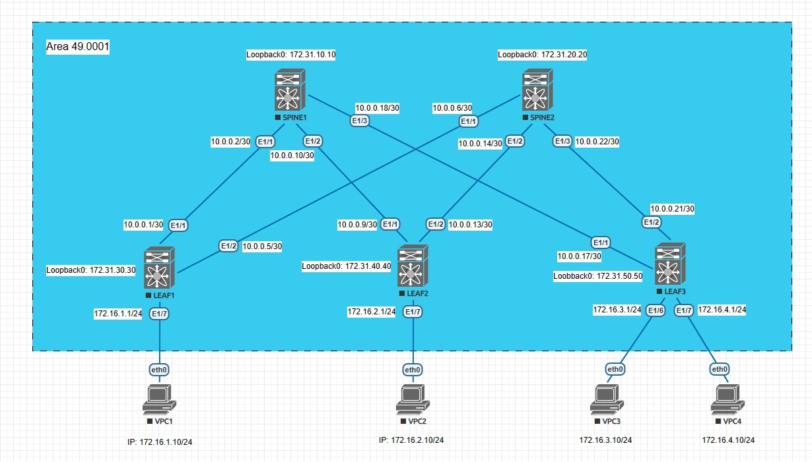

## IS-IS

### Цели:
- исследовать построение Underlay сети с использованием IS-IS

### Описание выполнения лабораторной работы:
- создать интерфейс Loopback 0 на каждом устройстве и сформировать на его основе Network Entity Title
- запустить процесс IS-IS UNDERLAY на каждом L3-коммутаторе
- все L3-коммутаторы располагаются в Area 49.0001
- задать уровень взаимодействия L1 между всеми коммутаторами
- включить протокол IS-IS на соответствующих интерфейсах всех коммутаторов

### Физическая схема сети:


#### <u>Таблица интерфейсов и адресации, участвующих в IS-IS:</u>

|Device|Interface|IP Address|Subnet Mask|
|:-:|:-:|:-:|:-:|
|LEAF 1|Ethernet 1/1|10.0.0.1|255.255.255.252|
|SPINE 1|Ethernet 1/1|10.0.0.2|255.255.255.252|
|LEAF 1|Ethernet 1/2|10.0.0.5|255.255.255.252|
|SPINE 2|Ethernet 1/1|10.0.0.6|255.255.255.252|
|LEAF 2|Ethernet 1/1|10.0.0.9|255.255.255.252|
|SPINE 1|Ethernet 1/2|10.0.0.10|255.255.255.252|
|LEAF 2|Ethernet 1/2|10.0.0.13|255.255.255.252|
|SPINE 2|Ethernet 1/2|10.0.0.14|255.255.255.252|
|LEAF 3|Ethernet 1/1|10.0.0.17|255.255.255.252|
|SPINE 1|Ethernet1/3|10.0.0.18|255.255.255.252|
|LEAF 3|Ethernet 1/2|10.0.0.21|255.255.255.252|
|SPINE 2|Ethernet 1/3|10.0.0.22|255.255.255.252|

#### <u>Сети, анонсируемые в IS-IS:</u>

|Device|Loopback 0|Network Entity Title|Network|Subnet Mask|
|:-:|:-:|:-:|:-:|:-:|
|SPINE1|172.31.10.10|49.0001.1720.3101.0010.00|10.0.0.0|255.255.255.252|
|SPINE1|172.31.10.10|49.0001.1720.3101.0010.00|10.0.0.8|255.255.255.252|
|SPINE1|172.31.10.10|49.0001.1720.3101.0010.00|10.0.0.16|255.255.255.252|
|SPINE2|172.31.20.20|49.0001.1720.3102.0020.00|10.0.0.0|255.255.255.252|
|SPINE2|172.31.20.20|49.0001.1720.3102.0020.00|10.0.0.8|255.255.255.252|
|SPINE2|172.31.20.20|49.0001.1720.3102.0020.00|10.0.0.16|255.255.255.252|
|LEAF1|172.31.30.30|49.0001.1720.3103.0030.00|10.0.0.0|255.255.255.252|
|LEAF1|172.31.30.30|49.0001.1720.3103.0030.00|10.0.0.4|255.255.255.252|
|LEAF2|172.31.40.40|49.0001.1720.3104.0040.00|10.0.0.8|255.255.255.252|
|LEAF2|172.31.40.40|49.0001.1720.3104.0040.00|10.0.0.12|255.255.255.252|
|LEAF3|172.31.50.50|49.0001.1720.3105.0050.00|10.0.0.16|255.255.255.252|
|LEAF3|172.31.50.50|49.0001.1720.3105.0050.00|10.0.0.20|255.255.255.252|

### Необходимые настройки на оборудовании:

#### <u>Настройка SPINE1:</u>
```
feature isis
router isis UNDERLAY
  net 49.0001.1720.3101.0010.00
  is-type level-1

interface Ethernet1/1
  no switchport
  ip address 10.0.0.2/30
  ip router isis UNDERLAY
  no shutdown

interface Ethernet1/2
  no switchport
  ip address 10.0.0.10/30
  ip router isis UNDERLAY
  no shutdown

interface Ethernet1/3
  no switchport
  ip address 10.0.0.18/30
  ip router isis UNDERLAY
  no shutdown
```

#### <u>Настройка SPINE2:</u>
```
feature isis
router isis UNDERLAY
  net 49.0001.1720.3102.0020.00
  is-type level-1

interface Ethernet1/1
  no switchport
  ip address 10.0.0.6/30
  ip router isis UNDERLAY
  no shutdown

interface Ethernet1/2
  no switchport
  ip address 10.0.0.14/30
  ip router isis UNDERLAY
  no shutdown

interface Ethernet1/3
  no switchport
  ip address 10.0.0.22/30
  ip router isis UNDERLAY
  no shutdown
  ```
  #### <u>Настройка LEAF1:</u>
```
feature isis
router isis UNDERLAY
  net 49.0001.1720.3103.0030.00
  is-type level-1

interface Ethernet1/1
  no switchport
  ip address 10.0.0.1/30
  ip router isis UNDERLAY
  no shutdown

interface Ethernet1/2
  no switchport
  ip address 10.0.0.5/30
  ip router isis UNDERLAY
  no shutdown
  ```
  #### <u>Настройка LEAF2:</u>
```
feature isis
router isis UNDERLAY
  net 49.0001.1720.3104.0040.00
  is-type level-1

interface Ethernet1/1
  no switchport
  ip address 10.0.0.9/30
  ip router isis UNDERLAY
  no shutdown

interface Ethernet1/2
  no switchport
  ip address 10.0.0.13/30
  ip router isis UNDERLAY
  no shutdown
  ```
  #### <u>Настройка LEAF3:</u>
```
feature isis
router isis UNDERLAY
  net 49.0001.1720.3105.0050.00
  is-type level-1

interface Ethernet1/1
  no switchport
  ip address 10.0.0.17/30
  ip router isis UNDERLAY
  no shutdown

interface Ethernet1/2
  no switchport
  ip address 10.0.0.21/30
  ip router isis UNDERLAY
  no shutdown
  ```
### Проверка работоспособности IS-IS в сети. Проверяем смежность, таблицу маршрутизации и базу данных протокола:

<details>
<summary>Проверка на SPINE1</summary>

```
SPINE1# sh isis adjacency 
IS-IS process: UNDERLAY VRF: default
IS-IS adjacency database:
Legend: '!': No AF level connectivity in given topology
System ID       SNPA            Level  State  Hold Time  Interface
LEAF1           5003.0000.1b08  1      UP     00:00:07   Ethernet1/1
LEAF2           5004.0000.1b08  1      UP     00:00:07   Ethernet1/2
LEAF3           5005.0000.1b08  1      UP     00:00:08   Ethernet1/3


SPINE1# sh ip route isis
IP Route Table for VRF "default"
'*' denotes best ucast next-hop
'**' denotes best mcast next-hop
'[x/y]' denotes [preference/metric]
'%<string>' in via output denotes VRF <string>

10.0.0.4/30, ubest/mbest: 1/0
    *via 10.0.0.1, Eth1/1, [115/80], 00:32:55, isis-UNDERLAY, L1
10.0.0.12/30, ubest/mbest: 1/0
    *via 10.0.0.9, Eth1/2, [115/80], 00:19:27, isis-UNDERLAY, L1
10.0.0.20/30, ubest/mbest: 1/0
    *via 10.0.0.17, Eth1/3, [115/80], 00:00:54, isis-UNDERLAY, L1


SPINE1# sh isis database 
IS-IS Process: UNDERLAY LSP database VRF: default
IS-IS Level-1 Link State Database
  LSPID                 Seq Number   Checksum  Lifetime   A/P/O/T
  SPINE1.00-00        * 0x00000009   0xDE05    930        0/0/0/1
  SPINE2.00-00          0x00000009   0xF598    928        0/0/0/1
  LEAF1.00-00           0x00000005   0x8FF5    674        0/0/0/1
  LEAF1.01-00           0x00000005   0x4AD1    1175       0/0/0/1
  LEAF1.02-00           0x00000004   0xDC2E    705        0/0/0/1
  LEAF2.00-00           0x00000004   0x0604    959        0/0/0/1
  LEAF2.01-00           0x00000003   0x17E4    879        0/0/0/1
  LEAF2.02-00           0x00000003   0xA742    950        0/0/0/1
  LEAF3.00-00           0x00000002   0x2966    929        0/0/0/1
  LEAF3.01-00           0x00000001   0xE3F7    929        0/0/0/1
  LEAF3.02-00           0x00000001   0x7455    929        0/0/0/1

IS-IS Level-2 Link State Database
  LSPID                 Seq Number   Checksum  Lifetime   A/P/O/T
```
</details>
<details>
<summary>Проверка на SPINE2</summary>

```
SPINE2# sh isis adjacency
IS-IS process: UNDERLAY VRF: default
IS-IS adjacency database:
Legend: '!': No AF level connectivity in given topology
System ID       SNPA            Level  State  Hold Time  Interface
LEAF1           5003.0000.1b08  1      UP     00:00:09   Ethernet1/1
LEAF2           5004.0000.1b08  1      UP     00:00:08   Ethernet1/2
LEAF3           5005.0000.1b08  1      UP     00:00:09   Ethernet1/3


SPINE2# sh ip route isis
IP Route Table for VRF "default"
'*' denotes best ucast next-hop
'**' denotes best mcast next-hop
'[x/y]' denotes [preference/metric]
'%<string>' in via output denotes VRF <string>

10.0.0.0/30, ubest/mbest: 1/0
    *via 10.0.0.5, Eth1/1, [115/80], 00:39:25, isis-UNDERLAY, L1
10.0.0.8/30, ubest/mbest: 1/0
    *via 10.0.0.13, Eth1/2, [115/80], 00:25:57, isis-UNDERLAY, L1
10.0.0.16/30, ubest/mbest: 1/0
    *via 10.0.0.21, Eth1/3, [115/80], 00:07:24, isis-UNDERLAY, L1
	
SPINE2# sh isis database 
IS-IS Process: UNDERLAY LSP database VRF: default
IS-IS Level-1 Link State Database
  LSPID                 Seq Number   Checksum  Lifetime   A/P/O/T
  SPINE1.00-00          0x00000009   0xDE05    732        0/0/0/1
  SPINE2.00-00        * 0x00000009   0xF598    733        0/0/0/1
  LEAF1.00-00           0x00000006   0x8DF6    1041       0/0/0/1
  LEAF1.01-00           0x00000005   0x4AD1    978        0/0/0/1
  LEAF1.02-00           0x00000005   0xDA2F    1094       0/0/0/1
  LEAF2.00-00           0x00000004   0x0604    763        0/0/0/1
  LEAF2.01-00           0x00000003   0x17E4    683        0/0/0/1
  LEAF2.02-00           0x00000003   0xA742    754        0/0/0/1
  LEAF3.00-00           0x00000002   0x2966    732        0/0/0/1
  LEAF3.01-00           0x00000001   0xE3F7    733        0/0/0/1
  LEAF3.02-00           0x00000001   0x7455    733        0/0/0/1

IS-IS Level-2 Link State Database
  LSPID                 Seq Number   Checksum  Lifetime   A/P/O/T
```
</details>
<details>
<summary>Проверка на LEAF1</summary>

```
LEAF1# sh isis adjacency 
IS-IS process: UNDERLAY VRF: default
IS-IS adjacency database:
Legend: '!': No AF level connectivity in given topology
System ID       SNPA            Level  State  Hold Time  Interface
SPINE1          5001.0000.1b08  1      UP     00:00:30   Ethernet1/1
SPINE2          5002.0000.1b08  1      UP     00:00:28   Ethernet1/2

LEAF1# sh ip route isis
IP Route Table for VRF "default"
'*' denotes best ucast next-hop
'**' denotes best mcast next-hop
'[x/y]' denotes [preference/metric]
'%<string>' in via output denotes VRF <string>

10.0.0.8/30, ubest/mbest: 1/0
    *via 10.0.0.2, Eth1/1, [115/80], 00:41:18, isis-UNDERLAY, L1
10.0.0.12/30, ubest/mbest: 1/0
    *via 10.0.0.6, Eth1/2, [115/80], 00:41:18, isis-UNDERLAY, L1
10.0.0.16/30, ubest/mbest: 1/0
    *via 10.0.0.2, Eth1/1, [115/80], 00:41:18, isis-UNDERLAY, L1
10.0.0.20/30, ubest/mbest: 1/0
    *via 10.0.0.6, Eth1/2, [115/80], 00:41:18, isis-UNDERLAY, L1
	
LEAF1# sh isis database 
IS-IS Process: UNDERLAY LSP database VRF: default
IS-IS Level-1 Link State Database
  LSPID                 Seq Number   Checksum  Lifetime   A/P/O/T
  SPINE1.00-00          0x0000000A   0xDC06    1079       0/0/0/1
  SPINE2.00-00          0x0000000A   0xF399    1153       0/0/0/1
  LEAF1.00-00         * 0x00000006   0x8DF6    866        0/0/0/1
  LEAF1.01-00         * 0x00000005   0x4AD1    804        0/0/0/1
  LEAF1.02-00         * 0x00000005   0xDA2F    920        0/0/0/1
  LEAF2.00-00           0x00000005   0x0405    1121       0/0/0/1
  LEAF2.01-00           0x00000004   0x15E5    1049       0/0/0/1
  LEAF2.02-00           0x00000004   0xA543    1155       0/0/0/1
  LEAF3.00-00           0x00000003   0x2767    1110       0/0/0/1
  LEAF3.01-00           0x00000002   0xE1F8    1099       0/0/0/1
  LEAF3.02-00           0x00000002   0x7256    1130       0/0/0/1

IS-IS Level-2 Link State Database
  LSPID                 Seq Number   Checksum  Lifetime   A/P/O/T
```
</details>
<details>
<summary>Проверка на LEAF2</summary>

```
LEAF2# sh isis adjacency 
IS-IS process: UNDERLAY VRF: default
IS-IS adjacency database:
Legend: '!': No AF level connectivity in given topology
System ID       SNPA            Level  State  Hold Time  Interface
SPINE1          5001.0000.1b08  1      UP     00:00:28   Ethernet1/1
SPINE2          5002.0000.1b08  1      UP     00:00:30   Ethernet1/2

LEAF2# sh ip route isis
IP Route Table for VRF "default"
'*' denotes best ucast next-hop
'**' denotes best mcast next-hop
'[x/y]' denotes [preference/metric]
'%<string>' in via output denotes VRF <string>

10.0.0.0/30, ubest/mbest: 1/0
    *via 10.0.0.10, Eth1/1, [115/80], 00:29:56, isis-UNDERLAY, L1
10.0.0.4/30, ubest/mbest: 1/0
    *via 10.0.0.14, Eth1/2, [115/80], 00:29:56, isis-UNDERLAY, L1
10.0.0.16/30, ubest/mbest: 1/0
    *via 10.0.0.10, Eth1/1, [115/80], 00:29:56, isis-UNDERLAY, L1
10.0.0.20/30, ubest/mbest: 1/0
    *via 10.0.0.14, Eth1/2, [115/80], 00:29:56, isis-UNDERLAY, L1
	
LEAF2# sh isis database 
IS-IS Process: UNDERLAY LSP database VRF: default
IS-IS Level-1 Link State Database
  LSPID                 Seq Number   Checksum  Lifetime   A/P/O/T
  SPINE1.00-00          0x0000000A   0xDC06    1022       0/0/0/1
  SPINE2.00-00          0x0000000A   0xF399    1097       0/0/0/1
  LEAF1.00-00           0x00000006   0x8DF6    808        0/0/0/1
  LEAF1.01-00           0x00000005   0x4AD1    745        0/0/0/1
  LEAF1.02-00           0x00000005   0xDA2F    861        0/0/0/1
  LEAF2.00-00         * 0x00000005   0x0405    1066       0/0/0/1
  LEAF2.01-00         * 0x00000004   0x15E5    994        0/0/0/1
  LEAF2.02-00         * 0x00000004   0xA543    1100       0/0/0/1
  LEAF3.00-00           0x00000003   0x2767    1053       0/0/0/1
  LEAF3.01-00           0x00000002   0xE1F8    1042       0/0/0/1
  LEAF3.02-00           0x00000002   0x7256    1073       0/0/0/1

IS-IS Level-2 Link State Database
  LSPID                 Seq Number   Checksum  Lifetime   A/P/O/T
```
</details>
<details>
<summary>Проверка на LEAF3</summary>

```
LEAF3# sh isis adjacency 
IS-IS process: UNDERLAY VRF: default
IS-IS adjacency database:
Legend: '!': No AF level connectivity in given topology
System ID       SNPA            Level  State  Hold Time  Interface
SPINE1          5001.0000.1b08  1      UP     00:00:26   Ethernet1/1
SPINE2          5002.0000.1b08  1      UP     00:00:24   Ethernet1/2

LEAF3# sh ip route isis
IP Route Table for VRF "default"
'*' denotes best ucast next-hop
'**' denotes best mcast next-hop
'[x/y]' denotes [preference/metric]
'%<string>' in via output denotes VRF <string>

10.0.0.0/30, ubest/mbest: 1/0
    *via 10.0.0.18, Eth1/1, [115/80], 00:12:11, isis-UNDERLAY, L1
10.0.0.4/30, ubest/mbest: 1/0
    *via 10.0.0.22, Eth1/2, [115/80], 00:12:11, isis-UNDERLAY, L1
10.0.0.8/30, ubest/mbest: 1/0
    *via 10.0.0.18, Eth1/1, [115/80], 00:12:11, isis-UNDERLAY, L1
10.0.0.12/30, ubest/mbest: 1/0
    *via 10.0.0.22, Eth1/2, [115/80], 00:12:11, isis-UNDERLAY, L1
	
LEAF3# sh isis database 
IS-IS Process: UNDERLAY LSP database VRF: default
IS-IS Level-1 Link State Database
  LSPID                 Seq Number   Checksum  Lifetime   A/P/O/T
  SPINE1.00-00          0x0000000A   0xDC06    975        0/0/0/1
  SPINE2.00-00          0x0000000A   0xF399    1049       0/0/0/1
  LEAF1.00-00           0x00000006   0x8DF6    760        0/0/0/1
  LEAF1.01-00           0x00000005   0x4AD1    698        0/0/0/1
  LEAF1.02-00           0x00000005   0xDA2F    814        0/0/0/1
  LEAF2.00-00           0x00000005   0x0405    1016       0/0/0/1
  LEAF2.01-00           0x00000004   0x15E5    945        0/0/0/1
  LEAF2.02-00           0x00000004   0xA543    1050       0/0/0/1
  LEAF3.00-00         * 0x00000003   0x2767    1008       0/0/0/1
  LEAF3.01-00         * 0x00000002   0xE1F8    997        0/0/0/1
  LEAF3.02-00         * 0x00000002   0x7256    1027       0/0/0/1

IS-IS Level-2 Link State Database
  LSPID                 Seq Number   Checksum  Lifetime   A/P/O/T
```
</details>

Как видно из выводов команд, L3-коммутаторы установили соседство и обмениваются маршрутной информацией. Также прилагаются полные конфигурационные файлы всего оборудования сети.