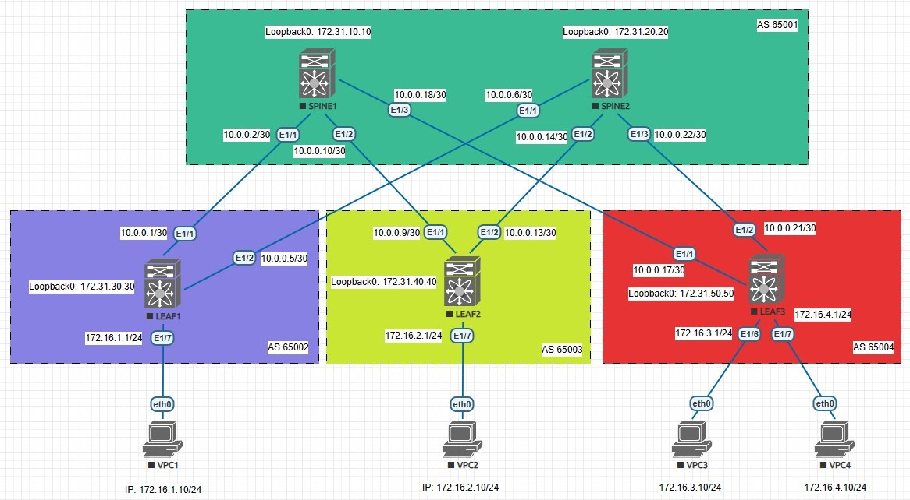

## eBGP

### Цели:
- исследовать построение Underlay сети с использованием eBGP

### Описание выполнения лабораторной работы:
- выбрать номера автономных систем (AS):
    - для SPINE1 и SPINE2 - AS 65001
    - для LEAF1, LEAF2 и LEAF2 - AS 65002, 65003 и 65004 соответсвенно
-

### Физическая схема сети:

#### <u>Таблица интерфейсов и адресации, участвующих в eBGP:</u>

|Device|Interface|IP Address|Subnet Mask|
|:-:|:-:|:-:|:-:|
|LEAF 1|Ethernet 1/1|10.0.0.1|255.255.255.252|
|SPINE 1|Ethernet 1/1|10.0.0.2|255.255.255.252|
|LEAF 1|Ethernet 1/2|10.0.0.5|255.255.255.252|
|SPINE 2|Ethernet 1/1|10.0.0.6|255.255.255.252|
|LEAF 2|Ethernet 1/1|10.0.0.9|255.255.255.252|
|SPINE 1|Ethernet 1/2|10.0.0.10|255.255.255.252|
|LEAF 2|Ethernet 1/2|10.0.0.13|255.255.255.252|
|SPINE 2|Ethernet 1/2|10.0.0.14|255.255.255.252|
|LEAF 3|Ethernet 1/1|10.0.0.17|255.255.255.252|
|SPINE 1|Ethernet1/3|10.0.0.18|255.255.255.252|
|LEAF 3|Ethernet 1/2|10.0.0.21|255.255.255.252|
|SPINE 2|Ethernet 1/3|10.0.0.22|255.255.255.252|
|LEAF 1|Ethernet 1/7|172.16.1.1|255.255.255.0|
|LEAF 2|Ethernet 1/7|172.16.2.1|255.255.255.0|
|LEAF 3|Ethernet 1/6|172.16.3.1|255.255.255.0|
|LEAF 3|Ethernet 1/7|172.16.4.1|255.255.255.0|