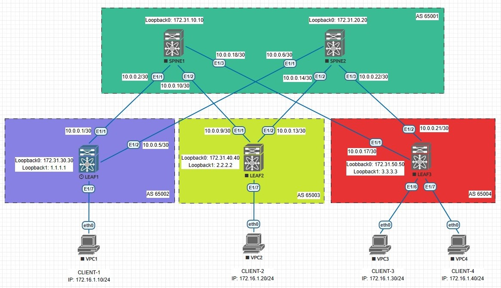

## VxLAN. EVPN L2

### Цель:
- Настроить Overlay на основе VxLAN EVPN для L2 связанности между клиентами

### Описание выполнения лабораторной работы:
- В качестве Underlay-сети для IP-связанности будем использовать eBGP. Настройка eBGP проводилась в [предыдущей](https://github.com/gadzhikuliev/otus_design_of_data_center_networks/tree/main/labs/lab04) лабораторной работе
- Настроить eBGP peering в Address Family L2VPN EVPN, указать BGP-соседство с IP-адресами Loopback 0 соседних устройств
- Выбрать VNI и VLAN ID. Создать VLAN и связать его с VNI на всех LEAF-коммутаторах
- Создать интерфейсы Loopback 1 на LEAF-коммутаторах и задать им IP-адреса
- Создать и настроить интерфейсы VxLAN на всех LEAF-коммутаторах - NVE
- Прописать VLAN на физических интерфейсах в Access Mode, к которым подключены клиентские устройства
- Выполнить проверку работы EVPN и VxLAN на всех устройствах


### Физическая схема сети:


#### <u>Таблица интерфейсов и адресации, участвующих в eBGP:</u>

|Device|Interface|IP Address|Subnet Mask|
|:-:|:-:|:-:|:-:|
|LEAF 1|Ethernet 1/1|10.0.0.1|255.255.255.252|
|SPINE 1|Ethernet 1/1|10.0.0.2|255.255.255.252|
|LEAF 1|Ethernet 1/2|10.0.0.5|255.255.255.252|
|SPINE 2|Ethernet 1/1|10.0.0.6|255.255.255.252|
|LEAF 2|Ethernet 1/1|10.0.0.9|255.255.255.252|
|SPINE 1|Ethernet 1/2|10.0.0.10|255.255.255.252|
|LEAF 2|Ethernet 1/2|10.0.0.13|255.255.255.252|
|SPINE 2|Ethernet 1/2|10.0.0.14|255.255.255.252|
|LEAF 3|Ethernet 1/1|10.0.0.17|255.255.255.252|
|SPINE 1|Ethernet1/3|10.0.0.18|255.255.255.252|
|LEAF 3|Ethernet 1/2|10.0.0.21|255.255.255.252|
|SPINE 2|Ethernet 1/3|10.0.0.22|255.255.255.252|

#### <u>Адреса интерфейсов Loopback 0, используемые в eBGP для Address Family L2VPN EVPN:</u>

|Device|Loopback 0|Subnet Mask|
|:-:|:-:|:-:|
|SPINE1|172.31.10.10|255.255.255.255|
|SPINE2|172.31.20.20|255.255.255.255|
|LEAF1|172.31.30.30|255.255.255.255|
|LEAF2|172.31.40.40|255.255.255.255|
|LEAF3|172.31.50.50|255.255.255.255|

#### <u>Адреса интерфейсов Loopback 1, используемые в NVE на LEAF-коммутаторах:</u>

|Device|Loopback 0|Subnet Mask|
|:-:|:-:|:-:|
|LEAF1|1.1.1.1|255.255.255.255|
|LEAF2|2.2.2.2|255.255.255.255|
|LEAF3|3.3.3.3|255.255.255.255|

### Необходимые настройки на оборудовании:

#### <u>Настройка SPINE1:</u>
```
nv overlay evpn
feature bgp
feature vn-segment-vlan-based
feature bfd
feature nv overlay

router bgp 65001
  router-id 172.31.10.10
  bestpath as-path multipath-relax
  address-family ipv4 unicast
    network 172.31.10.10/32
    maximum-paths 4
  address-family l2vpn evpn
    retain route-target all
  template peer LEAF-IPv4
    bfd
    address-family ipv4 unicast
  template peer LEAF-L2VPN
    update-source loopback0
    disable-connected-check
    address-family l2vpn evpn
      send-community
      send-community extended
  neighbor 10.0.0.1
    inherit peer LEAF-IPv4
    remote-as 65002
    update-source Ethernet1/1
  neighbor 10.0.0.9
    inherit peer LEAF-IPv4
    remote-as 65003
    update-source Ethernet1/2
  neighbor 10.0.0.17
    inherit peer LEAF-IPv4
    remote-as 65004
    update-source Ethernet1/3
  neighbor 172.31.30.30
    inherit peer LEAF-L2VPN
    remote-as 65002
  neighbor 172.31.40.40
    inherit peer LEAF-L2VPN
    remote-as 65003
  neighbor 172.31.50.50
    inherit peer LEAF-L2VPN
    remote-as 65004
```
#### <u>Настройка SPINE2:</u>
```
nv overlay evpn
feature bgp
feature vn-segment-vlan-based
feature bfd
feature nv overlay

router bgp 65001
  router-id 172.31.20.20
  bestpath as-path multipath-relax
  address-family ipv4 unicast
    network 172.31.20.20/32
    maximum-paths 4
  address-family l2vpn evpn
    retain route-target all
  template peer LEAF-IPv4
    bfd
    address-family ipv4 unicast
  template peer LEAF-L2VPN
    update-source loopback0
    disable-connected-check
    address-family l2vpn evpn
      send-community
      send-community extended
  neighbor 10.0.0.5
    inherit peer LEAF-IPv4
    remote-as 65002
    update-source Ethernet1/1
  neighbor 10.0.0.13
    inherit peer LEAF-IPv4
    remote-as 65003
    update-source Ethernet1/2
  neighbor 10.0.0.21
    inherit peer LEAF-IPv4
    remote-as 65004
    update-source Ethernet1/3
  neighbor 172.31.30.30
    inherit peer LEAF-L2VPN
    remote-as 65002
  neighbor 172.31.40.40
    inherit peer LEAF-L2VPN
    remote-as 65003
  neighbor 172.31.50.50
    inherit peer LEAF-L2VPN
    remote-as 65004
```
#### <u>Настройка LEAF1:</u>
```
nv overlay evpn
feature bgp
feature vn-segment-vlan-based
feature bfd
feature nv overlay

vlan 10
  vn-segment 10000

interface nve1
  no shutdown
  host-reachability protocol bgp
  source-interface loopback1
  member vni 10000
    ingress-replication protocol bgp

interface Ethernet1/7
  description CLIENT-1
  switchport access vlan 10

router bgp 65002
  router-id 172.31.30.30
  bestpath as-path multipath-relax
  address-family ipv4 unicast
    network 1.1.1.1/32
    network 172.31.30.30/32
    maximum-paths 4
  address-family l2vpn evpn
    retain route-target all
  template peer SPINE-IPv4
    bfd
    remote-as 65001
    address-family ipv4 unicast
  template peer SPINE-L2VPN
    remote-as 65001
    update-source loopback0
    ebgp-multihop 3
    address-family l2vpn evpn
      send-community
      send-community extended
  neighbor 10.0.0.2
    inherit peer SPINE-IPv4
    update-source Ethernet1/1
  neighbor 10.0.0.6
    inherit peer SPINE-IPv4
    update-source Ethernet1/2
  neighbor 172.31.10.10
    inherit peer SPINE-L2VPN
  neighbor 172.31.20.20
    inherit peer SPINE-L2VPN
evpn
  vni 10000 l2
    rd 172.31.30.30:10000
    route-target import 172.31.30.30:10000
    route-target export 172.31.30.30:10000
```
#### <u>Настройка LEAF2:</u>
```
nv overlay evpn
feature bgp
feature vn-segment-vlan-based
feature bfd
feature nv overlay

vlan 10
  vn-segment 10000

interface nve1
  no shutdown
  host-reachability protocol bgp
  source-interface loopback1
  member vni 10000
    ingress-replication protocol bgp

interface Ethernet1/7
  description CLIENT-2
  switchport access vlan 10

router bgp 65003
  router-id 172.31.40.40
  bestpath as-path multipath-relax
  address-family ipv4 unicast
    network 2.2.2.2/32
    network 172.31.40.40/32
    maximum-paths 4
  address-family l2vpn evpn
    retain route-target all
  template peer SPINE-IPv4
    bfd
    remote-as 65001
    address-family ipv4 unicast
  template peer SPINE-L2VPN
    remote-as 65001
    update-source loopback0
    ebgp-multihop 3
    address-family l2vpn evpn
      send-community
      send-community extended
  neighbor 10.0.0.10
    inherit peer SPINE-IPv4
    update-source Ethernet1/1
  neighbor 10.0.0.14
    inherit peer SPINE-IPv4
    update-source Ethernet1/2
  neighbor 172.31.10.10
    inherit peer SPINE-L2VPN
  neighbor 172.31.20.20
    inherit peer SPINE-L2VPN
evpn
  vni 10000 l2
    rd 172.31.40.40:10000
    route-target import 172.31.30.30:10000
    route-target export 172.31.30.30:10000
```
#### <u>Настройка LEAF3:</u>
```
nv overlay evpn
feature bgp
feature vn-segment-vlan-based
feature bfd
feature nv overlay

vlan 10
  vn-segment 10000

interface nve1
  no shutdown
  host-reachability protocol bgp
  source-interface loopback1
  member vni 10000
    ingress-replication protocol bgp

interface Ethernet1/6
  description CLIENT-3
  switchport access vlan 10

interface Ethernet1/7
  description CLIENT-4
  switchport access vlan 10

router bgp 65004
  router-id 172.31.50.50
  bestpath as-path multipath-relax
  address-family ipv4 unicast
    network 3.3.3.3/32
    network 172.31.50.50/32
    maximum-paths 4
  address-family l2vpn evpn
    retain route-target all
  template peer SPINE-IPv4
    bfd
    remote-as 65001
    address-family ipv4 unicast
  template peer SPINE-L2VPN
    remote-as 65001
    update-source loopback0
    ebgp-multihop 3
    address-family l2vpn evpn
      send-community
      send-community extended
  neighbor 10.0.0.18
    inherit peer SPINE-IPv4
    update-source Ethernet1/1
  neighbor 10.0.0.22
    inherit peer SPINE-IPv4
    update-source Ethernet1/2
  neighbor 172.31.10.10
    inherit peer SPINE-L2VPN
  neighbor 172.31.20.20
    inherit peer SPINE-L2VPN
evpn
  vni 10000 l2
    rd 172.31.50.50:10000
    route-target import 172.31.30.30:10000
    route-target export 172.31.30.30:10000
```
### Проверка работоспособности EVPN / VxLAN. Проверяем соседство по L2VPN между устройствами и таблицу маршрутизации Route Distinguisher. На LEAF-коммутаторах проверяем также NVE Peers:

<details>
<summary>Проверка на SPINE1</summary>

```
SPINE1# sh bgp l2vpn evpn summary 
BGP summary information for VRF default, address family L2VPN EVPN
BGP router identifier 172.31.10.10, local AS number 65001
BGP table version is 37, L2VPN EVPN config peers 3, capable peers 3
7 network entries and 7 paths using 1708 bytes of memory
BGP attribute entries [6/1032], BGP AS path entries [3/18]
BGP community entries [0/0], BGP clusterlist entries [0/0]

Neighbor        V    AS MsgRcvd MsgSent   TblVer  InQ OutQ Up/Down  State/PfxRcd
172.31.30.30    4 65002      59      52       37    0    0 00:47:10 2         
172.31.40.40    4 65003      57      52       37    0    0 00:47:10 2         
172.31.50.50    4 65004      59      51       37    0    0 00:47:13 3 

SPINE1# sh bgp l2vpn evpn
BGP routing table information for VRF default, address family L2VPN EVPN
BGP table version is 37, Local Router ID is 172.31.10.10
Status: s-suppressed, x-deleted, S-stale, d-dampened, h-history, *-valid, >-best
Path type: i-internal, e-external, c-confed, l-local, a-aggregate, r-redist, I-injected
Origin codes: i - IGP, e - EGP, ? - incomplete, | - multipath, & - backup, 2 - best2

   Network            Next Hop            Metric     LocPrf     Weight Path
Route Distinguisher: 172.31.30.30:10000
*>e[2]:[0]:[0]:[48]:[0050.7966.6806]:[0]:[0.0.0.0]/216
                      1.1.1.1                                        0 65002 i
*>e[3]:[0]:[32]:[1.1.1.1]/88
                      1.1.1.1                                        0 65002 i

Route Distinguisher: 172.31.40.40:10000
*>e[2]:[0]:[0]:[48]:[0050.7966.6807]:[0]:[0.0.0.0]/216
                      2.2.2.2                                        0 65003 i
*>e[3]:[0]:[32]:[2.2.2.2]/88
                      2.2.2.2                                        0 65003 i

Route Distinguisher: 172.31.50.50:10000
*>e[2]:[0]:[0]:[48]:[0050.7966.6808]:[0]:[0.0.0.0]/216
                      3.3.3.3                                        0 65004 i
*>e[2]:[0]:[0]:[48]:[0050.7966.6809]:[0]:[0.0.0.0]/216
                      3.3.3.3                                        0 65004 i
*>e[3]:[0]:[32]:[3.3.3.3]/88
                      3.3.3.3                                        0 65004 i
```
</details>
<details>
<summary>Проверка на SPINE2</summary>

```
SPINE2# sh bgp l2vpn evpn summary 
BGP summary information for VRF default, address family L2VPN EVPN
BGP router identifier 172.31.20.20, local AS number 65001
BGP table version is 12, L2VPN EVPN config peers 3, capable peers 3
7 network entries and 7 paths using 1708 bytes of memory
BGP attribute entries [6/1032], BGP AS path entries [3/18]
BGP community entries [0/0], BGP clusterlist entries [0/0]

Neighbor        V    AS MsgRcvd MsgSent   TblVer  InQ OutQ Up/Down  State/PfxRcd
172.31.30.30    4 65002      32      30       12    0    0 00:24:50 2         
172.31.40.40    4 65003      32      30       12    0    0 00:24:49 2         
172.31.50.50    4 65004      33      30       12    0    0 00:24:54 3 

SPINE2# sh bgp l2vpn evpn 
BGP routing table information for VRF default, address family L2VPN EVPN
BGP table version is 12, Local Router ID is 172.31.20.20
Status: s-suppressed, x-deleted, S-stale, d-dampened, h-history, *-valid, >-best
Path type: i-internal, e-external, c-confed, l-local, a-aggregate, r-redist, I-injected
Origin codes: i - IGP, e - EGP, ? - incomplete, | - multipath, & - backup, 2 - best2

   Network            Next Hop            Metric     LocPrf     Weight Path
Route Distinguisher: 172.31.30.30:10000
*>e[2]:[0]:[0]:[48]:[0050.7966.6806]:[0]:[0.0.0.0]/216
                      1.1.1.1                                        0 65002 i
*>e[3]:[0]:[32]:[1.1.1.1]/88
                      1.1.1.1                                        0 65002 i

Route Distinguisher: 172.31.40.40:10000
*>e[2]:[0]:[0]:[48]:[0050.7966.6807]:[0]:[0.0.0.0]/216
                      2.2.2.2                                        0 65003 i
*>e[3]:[0]:[32]:[2.2.2.2]/88
                      2.2.2.2                                        0 65003 i

Route Distinguisher: 172.31.50.50:10000
*>e[2]:[0]:[0]:[48]:[0050.7966.6808]:[0]:[0.0.0.0]/216
                      3.3.3.3                                        0 65004 i
*>e[2]:[0]:[0]:[48]:[0050.7966.6809]:[0]:[0.0.0.0]/216
                      3.3.3.3                                        0 65004 i
*>e[3]:[0]:[32]:[3.3.3.3]/88
                      3.3.3.3                                        0 65004 i			  
```
</details>
<details>
<summary>Проверка на LEAF1</summary>

```
LEAF1# sh bgp l2vpn evpn summary 
BGP summary information for VRF default, address family L2VPN EVPN
BGP router identifier 172.31.30.30, local AS number 65002
BGP table version is 44, L2VPN EVPN config peers 2, capable peers 2
12 network entries and 17 paths using 2928 bytes of memory
BGP attribute entries [9/1548], BGP AS path entries [2/20]
BGP community entries [0/0], BGP clusterlist entries [0/0]

Neighbor        V    AS MsgRcvd MsgSent   TblVer  InQ OutQ Up/Down  State/PfxRcd
172.31.10.10    4 65001      59      55       44    0    0 00:48:54 5         
172.31.20.20    4 65001      36      31       44    0    0 00:25:45 5   

LEAF1# sh bgp l2vpn evpn 
BGP routing table information for VRF default, address family L2VPN EVPN
BGP table version is 44, Local Router ID is 172.31.30.30
Status: s-suppressed, x-deleted, S-stale, d-dampened, h-history, *-valid, >-best
Path type: i-internal, e-external, c-confed, l-local, a-aggregate, r-redist, I-injected
Origin codes: i - IGP, e - EGP, ? - incomplete, | - multipath, & - backup, 2 - best2

   Network            Next Hop            Metric     LocPrf     Weight Path
Route Distinguisher: 172.31.30.30:10000    (L2VNI 10000)
*>l[2]:[0]:[0]:[48]:[0050.7966.6806]:[0]:[0.0.0.0]/216
                      1.1.1.1                           100      32768 i
*>e[2]:[0]:[0]:[48]:[0050.7966.6807]:[0]:[0.0.0.0]/216
                      172.31.10.10                                   0 65001 65003 i
*>e[2]:[0]:[0]:[48]:[0050.7966.6808]:[0]:[0.0.0.0]/216
                      172.31.10.10                                   0 65001 65004 i
*>e[2]:[0]:[0]:[48]:[0050.7966.6809]:[0]:[0.0.0.0]/216
                      172.31.20.20                                   0 65001 65004 i
*>l[3]:[0]:[32]:[1.1.1.1]/88
                      1.1.1.1                           100      32768 i
*>e[3]:[0]:[32]:[2.2.2.2]/88
                      172.31.10.10                                   0 65001 65003 i
*>e[3]:[0]:[32]:[3.3.3.3]/88
                      172.31.10.10                                   0 65001 65004 i

Route Distinguisher: 172.31.40.40:10000
* e[2]:[0]:[0]:[48]:[0050.7966.6807]:[0]:[0.0.0.0]/216
                      172.31.20.20                                   0 65001 65003 i
*>e                   172.31.10.10                                   0 65001 65003 i
* e[3]:[0]:[32]:[2.2.2.2]/88
                      172.31.20.20                                   0 65001 65003 i
*>e                   172.31.10.10                                   0 65001 65003 i

Route Distinguisher: 172.31.50.50:10000
* e[2]:[0]:[0]:[48]:[0050.7966.6808]:[0]:[0.0.0.0]/216
                      172.31.20.20                                   0 65001 65004 i
*>e                   172.31.10.10                                   0 65001 65004 i
* e[2]:[0]:[0]:[48]:[0050.7966.6809]:[0]:[0.0.0.0]/216
                      172.31.10.10                                   0 65001 65004 i
*>e                   172.31.20.20                                   0 65001 65004 i
* e[3]:[0]:[32]:[3.3.3.3]/88
                      172.31.20.20                                   0 65001 65004 i
*>e                   172.31.10.10                                   0 65001 65004 i

LEAF1# sh nve peers 
Interface Peer-IP                                 State LearnType Uptime   Router-Mac       
--------- --------------------------------------  ----- --------- -------- -----------------
nve1      2.2.2.2                                 Up    CP        00:30:12 n/a              
nve1      3.3.3.3                                 Up    CP        00:30:12 n/a              
nve1      172.31.10.10                            Up    CP        00:30:12 n/a              
nve1      172.31.20.20                            Up    CP        00:23:26 n/a       
```
</details>
<details>
<summary>Проверка на LEAF2</summary>

```
LEAF2# sh bgp l2vpn evpn summary 
BGP summary information for VRF default, address family L2VPN EVPN
BGP router identifier 172.31.40.40, local AS number 65003
BGP table version is 47, L2VPN EVPN config peers 2, capable peers 2
12 network entries and 17 paths using 2928 bytes of memory
BGP attribute entries [9/1548], BGP AS path entries [2/20]
BGP community entries [0/0], BGP clusterlist entries [0/0]

Neighbor        V    AS MsgRcvd MsgSent   TblVer  InQ OutQ Up/Down  State/PfxRcd
172.31.10.10    4 65001      65      57       47    0    0 00:50:51 5         
172.31.20.20    4 65001      38      33       47    0    0 00:27:40 5 

LEAF2# sh bgp l2vpn evpn 
BGP routing table information for VRF default, address family L2VPN EVPN
BGP table version is 47, Local Router ID is 172.31.40.40
Status: s-suppressed, x-deleted, S-stale, d-dampened, h-history, *-valid, >-best
Path type: i-internal, e-external, c-confed, l-local, a-aggregate, r-redist, I-injected
Origin codes: i - IGP, e - EGP, ? - incomplete, | - multipath, & - backup, 2 - best2

   Network            Next Hop            Metric     LocPrf     Weight Path
Route Distinguisher: 172.31.30.30:10000
* e[2]:[0]:[0]:[48]:[0050.7966.6806]:[0]:[0.0.0.0]/216
                      172.31.20.20                                   0 65001 65002 i
*>e                   172.31.10.10                                   0 65001 65002 i
* e[3]:[0]:[32]:[1.1.1.1]/88
                      172.31.20.20                                   0 65001 65002 i
*>e                   172.31.10.10                                   0 65001 65002 i

Route Distinguisher: 172.31.40.40:10000    (L2VNI 10000)
*>e[2]:[0]:[0]:[48]:[0050.7966.6806]:[0]:[0.0.0.0]/216
                      172.31.10.10                                   0 65001 65002 i
*>l[2]:[0]:[0]:[48]:[0050.7966.6807]:[0]:[0.0.0.0]/216
                      2.2.2.2                           100      32768 i
*>e[2]:[0]:[0]:[48]:[0050.7966.6808]:[0]:[0.0.0.0]/216
                      172.31.10.10                                   0 65001 65004 i
*>e[2]:[0]:[0]:[48]:[0050.7966.6809]:[0]:[0.0.0.0]/216
                      172.31.20.20                                   0 65001 65004 i
*>e[3]:[0]:[32]:[1.1.1.1]/88
                      172.31.10.10                                   0 65001 65002 i
*>l[3]:[0]:[32]:[2.2.2.2]/88
                      2.2.2.2                           100      32768 i
*>e[3]:[0]:[32]:[3.3.3.3]/88
                      172.31.10.10                                   0 65001 65004 i

Route Distinguisher: 172.31.50.50:10000
* e[2]:[0]:[0]:[48]:[0050.7966.6808]:[0]:[0.0.0.0]/216
                      172.31.20.20                                   0 65001 65004 i
*>e                   172.31.10.10                                   0 65001 65004 i
* e[2]:[0]:[0]:[48]:[0050.7966.6809]:[0]:[0.0.0.0]/216
                      172.31.10.10                                   0 65001 65004 i
*>e                   172.31.20.20                                   0 65001 65004 i
* e[3]:[0]:[32]:[3.3.3.3]/88
                      172.31.20.20                                   0 65001 65004 i
*>e                   172.31.10.10                                   0 65001 65004 i

LEAF2# sh nve peers 
Interface Peer-IP                                 State LearnType Uptime   Router-Mac       
--------- --------------------------------------  ----- --------- -------- -----------------
nve1      1.1.1.1                                 Up    CP        00:32:14 n/a              
nve1      3.3.3.3                                 Up    CP        00:41:17 n/a              
nve1      172.31.10.10                            Up    CP        00:32:14 n/a              
nve1      172.31.20.20                            Up    CP        00:25:15 n/a    
```
</details>
<details>
<summary>Проверка на LEAF3</summary>

```
LEAF3# sh bgp l2vpn evpn summary 
BGP summary information for VRF default, address family L2VPN EVPN
BGP router identifier 172.31.50.50, local AS number 65004
BGP table version is 51, L2VPN EVPN config peers 2, capable peers 2
10 network entries and 13 paths using 2440 bytes of memory
BGP attribute entries [7/1204], BGP AS path entries [2/20]
BGP community entries [0/0], BGP clusterlist entries [0/0]

Neighbor        V    AS MsgRcvd MsgSent   TblVer  InQ OutQ Up/Down  State/PfxRcd
172.31.10.10    4 65001      65      59       51    0    0 00:52:49 3         
172.31.20.20    4 65001      40      35       51    0    0 00:29:40 3  

LEAF3# sh bgp l2vpn evpn 
BGP routing table information for VRF default, address family L2VPN EVPN
BGP table version is 51, Local Router ID is 172.31.50.50
Status: s-suppressed, x-deleted, S-stale, d-dampened, h-history, *-valid, >-best
Path type: i-internal, e-external, c-confed, l-local, a-aggregate, r-redist, I-injected
Origin codes: i - IGP, e - EGP, ? - incomplete, | - multipath, & - backup, 2 - best2

   Network            Next Hop            Metric     LocPrf     Weight Path
Route Distinguisher: 172.31.30.30:10000
* e[3]:[0]:[32]:[1.1.1.1]/88
                      172.31.20.20                                   0 65001 65002 i
*>e                   172.31.10.10                                   0 65001 65002 i

Route Distinguisher: 172.31.40.40:10000
* e[2]:[0]:[0]:[48]:[0050.7966.6807]:[0]:[0.0.0.0]/216
                      172.31.20.20                                   0 65001 65003 i
*>e                   172.31.10.10                                   0 65001 65003 i
* e[3]:[0]:[32]:[2.2.2.2]/88
                      172.31.20.20                                   0 65001 65003 i
*>e                   172.31.10.10                                   0 65001 65003 i

Route Distinguisher: 172.31.50.50:10000    (L2VNI 10000)
*>e[2]:[0]:[0]:[48]:[0050.7966.6807]:[0]:[0.0.0.0]/216
                      172.31.10.10                                   0 65001 65003 i
*>l[2]:[0]:[0]:[48]:[0050.7966.6808]:[0]:[0.0.0.0]/216
                      3.3.3.3                           100      32768 i
*>l[2]:[0]:[0]:[48]:[0050.7966.6809]:[0]:[0.0.0.0]/216
                      3.3.3.3                           100      32768 i
*>e[3]:[0]:[32]:[1.1.1.1]/88
                      172.31.10.10                                   0 65001 65002 i
*>e[3]:[0]:[32]:[2.2.2.2]/88
                      172.31.10.10                                   0 65001 65003 i
*>l[3]:[0]:[32]:[3.3.3.3]/88
                      3.3.3.3                           100      32768 i
					  
LEAF3# sh nve peers 
Interface Peer-IP                                 State LearnType Uptime   Router-Mac       
--------- --------------------------------------  ----- --------- -------- -----------------
nve1      1.1.1.1                                 Up    CP        00:34:22 n/a              
nve1      2.2.2.2                                 Up    CP        00:43:43 n/a              
nve1      172.31.10.10                            Up    CP        00:42:01 n/a    
```
</details>

Вывод команд свидетельствует, что все коммутаторы установили соседство по L2VPN EVPN и обмениваются маршрутной информацией. Также видим туннель VxLAN (NVE Peering) между LEAF1, LEAF2 и LEAF3.