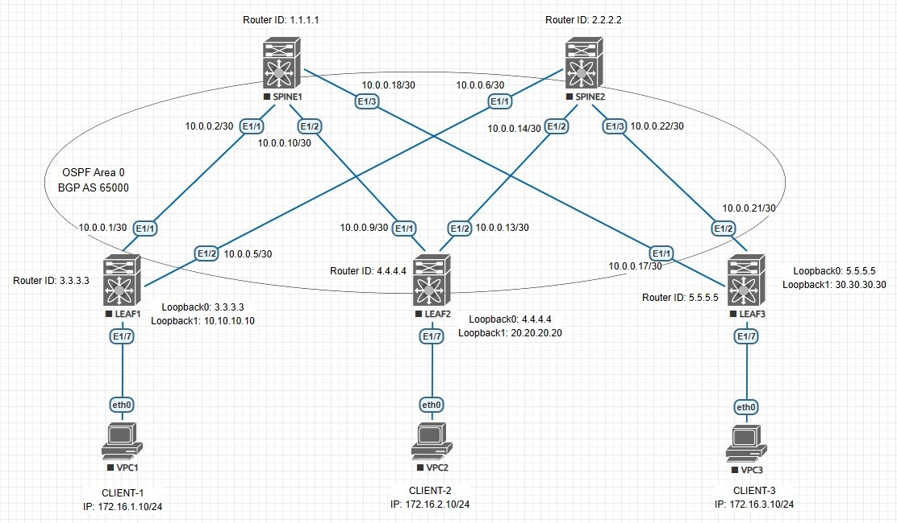

## VxLAN. EVPN L3

### Цель:
- Рассмотреть возможности маршрутизации с использованием EVPN между различными VNI

### Описание выполнения лабораторной работы:
- В качестве Underlay-сети для IP-связанности будем использовать OSPF. Настройка OSPF проводилась в [данной](https://github.com/gadzhikuliev/otus_design_of_data_center_networks/tree/main/labs/lab02) лабораторной работе. В текущей работе был также включён протокол BFD и настроен в OSPF
- Добавить также на LEAF-коммутаторах интерфейсы Loopback 1, задать IP-адреса и анонсировать их в OSPF. Интерфейсы Loopback 0 добавлены в анонсы ранее
- Проверить маршруты, полученные по OSPF
- Настроить iBGP peering в Address Family L2VPN EVPN, в качестве соседей указать интерфейсы Loopback 0
- Выбрать VNI и VLAN ID для клиентов. Создать VLAN и связать его с VNI на всех LEAF-коммутаторах
- Задать VLAN на интерфейсах с клиентскими Virtual PC
- Выбрать VNI и VLAN ID для использования L3 VNI, одинаковый для всех LEAF-коммутаторов
- Создать интерфейсы VLAN, добавить их в VRF PROD, задать IP-адрес на всех LEAF-коммутаторах.
Это шлюзы для наших клиентских Virtual PC. На интерфейсе для L3 VPN не задаем IP-адрес, вместо этого задаём параметр <b>ip forward</b> 
- Настроить EVPN для VNI, связанных с VLAN клиентов, на всех LEAF-коммутаторах
- Создать и настроить интерфейсы VxLAN на всех LEAF-коммутаторах - NVE
- Выполнить проверку на LEAF-коммутаторах и на Virtual PC

### Физическая схема сети:


#### <u>Адреса интерфейсов Loopback 0, используемые в iBGP для Address Family L2VPN EVPN:</u>

|Device|Loopback 0|Subnet Mask|
|:-:|:-:|:-:|
|SPINE1|1.1.1.1|255.255.255.255|
|SPINE2|2.2.2.2|255.255.255.255|
|LEAF1|3.3.3.3|255.255.255.255|
|LEAF2|4.4.4.4|255.255.255.255|
|LEAF3|5.5.5.5|255.255.255.255|

#### <u>Адреса интерфейсов Loopback 1, используемые в интерфейсах NVE:</u>

|Device|Loopback 0|Subnet Mask|
|:-:|:-:|:-:|
|LEAF1|10.10.10.10|255.255.255.255|
|LEAF2|20.20.20.20|255.255.255.255|
|LEAF3|30.30.30.30|255.255.255.255|

#### <u>VLAN ID и VNI</u>:
|Device|VLAN ID|VNI|Client|
|:-:|:-:|:-:|:-:|
|LEAF1|10|10000|CLIENT-1|
|LEAF2|20|20000|CLIENT-2|
|LEAF3|30|30000|CLIENT-3|

#### Для L3 VNI выберем VLAN ID 99 и VNI 9000 для всех LEAF-коммутаторов

### Необходимые настройки на оборудовании:

#### <u>Настройка SPINE1:</u>
```
nv overlay evpn
feature bgp

router bgp 65000
  router-id 1.1.1.1
  address-family l2vpn evpn
    maximum-paths ibgp 4
    retain route-target all
  template peer LEAF-L2VPN
    remote-as 65000
    update-source loopback0
    address-family l2vpn evpn
      send-community
      send-community extended
      route-reflector-client
  neighbor 3.3.3.3
    inherit peer LEAF-L2VPN
  neighbor 4.4.4.4
    inherit peer LEAF-L2VPN
  neighbor 5.5.5.5
    inherit peer LEAF-L2VPN
```
#### <u>Настройка SPINE2:</u>
```
nv overlay evpn
feature bgp

router bgp 65000
  router-id 2.2.2.2
  address-family l2vpn evpn
    maximum-paths ibgp 4
    retain route-target all
  template peer LEAF-L2VPN
    remote-as 65000
    update-source loopback0
    address-family l2vpn evpn
      send-community
      send-community extended
      route-reflector-client
  neighbor 3.3.3.3
    inherit peer LEAF-L2VPN
  neighbor 4.4.4.4
    inherit peer LEAF-L2VPN
  neighbor 5.5.5.5
    inherit peer LEAF-L2VPN
```
#### <u>Настройка LEAF1:</u>
```
nv overlay evpn
feature bgp
feature interface-vlan
feature vn-segment-vlan-based
feature nv overlay

fabric forwarding anycast-gateway-mac 0000.1111.2222

vlan 10
  vn-segment 10000
vlan 99
  vn-segment 99000

vrf context PROD
  vni 99000
  rd auto
  address-family ipv4 unicast
    route-target both auto
    route-target both auto evpn

interface Vlan10
  no shutdown
  vrf member PROD
  ip address 172.16.1.1/24
  fabric forwarding mode anycast-gateway

interface Vlan99
  description Inter VXLAN Routing
  no shutdown
  vrf member PROD
  ip forward

interface nve1
  no shutdown
  host-reachability protocol bgp
  source-interface loopback1
  member vni 10000
    ingress-replication protocol bgp
  member vni 99000 associate-vrf

router bgp 65000
  router-id 3.3.3.3
  address-family l2vpn evpn
    maximum-paths ibgp 3
    retain route-target all
  template peer SPINE-L2VPN
    remote-as 65000
    update-source loopback0
    address-family l2vpn evpn
      send-community
      send-community extended
  neighbor 1.1.1.1
    inherit peer SPINE-L2VPN
  neighbor 2.2.2.2
    inherit peer SPINE-L2VPN
  vrf PROD
    address-family ipv4 unicast
evpn
  vni 10000 l2
    rd auto
    route-target import auto
    route-target export auto
```
#### <u>Настройка LEAF2:</u>
```
nv overlay evpn
feature bgp
feature interface-vlan
feature vn-segment-vlan-based
feature nv overlay

fabric forwarding anycast-gateway-mac 0000.1111.2222

vlan 20
  vn-segment 20000
vlan 99
  vn-segment 99000

vrf context PROD
  vni 99000
  rd auto
  address-family ipv4 unicast
    route-target both auto
    route-target both auto evpn

interface Vlan20
  no shutdown
  vrf member PROD
  ip address 172.16.2.1/24
  fabric forwarding mode anycast-gateway

interface Vlan99
  description Inter VXLAN Routing
  no shutdown
  vrf member PROD
  ip forward

interface nve1
  no shutdown
  host-reachability protocol bgp
  source-interface loopback1
  member vni 20000
    ingress-replication protocol bgp
  member vni 99000 associate-vrf

router bgp 65000
  router-id 4.4.4.4
  address-family l2vpn evpn
    maximum-paths ibgp 3
    retain route-target all
  template peer SPINE-L2VPN
    remote-as 65000
    update-source loopback0
    address-family l2vpn evpn
      send-community
      send-community extended
  neighbor 1.1.1.1
    inherit peer SPINE-L2VPN
  neighbor 2.2.2.2
    inherit peer SPINE-L2VPN
  vrf PROD
    address-family ipv4 unicast
evpn
  vni 20000 l2
    rd auto
    route-target import auto
    route-target export auto
```
#### <u>Настройка LEAF3:</u>
```
nv overlay evpn
feature bgp
feature interface-vlan
feature vn-segment-vlan-based
feature nv overlay

fabric forwarding anycast-gateway-mac 0000.1111.2222

vlan 30
  vn-segment 30000
vlan 99
  vn-segment 99000

vrf context PROD
  vni 99000
  rd auto
  address-family ipv4 unicast
    route-target both auto
    route-target both auto evpn

interface Vlan30
  no shutdown
  vrf member PROD
  ip address 172.16.3.1/24
  fabric forwarding mode anycast-gateway

interface Vlan99
  description Inter VXLAN Routing
  no shutdown
  vrf member PROD
  ip forward

interface nve1
  no shutdown
  host-reachability protocol bgp
  source-interface loopback1
  member vni 30000
    ingress-replication protocol bgp
  member vni 99000 associate-vrf

router bgp 65000
  router-id 5.5.5.5
  address-family l2vpn evpn
    maximum-paths ibgp 3
    retain route-target all
  template peer SPINE-L2VPN
    remote-as 65000
    update-source loopback0
    address-family l2vpn evpn
      send-community
      send-community extended
  neighbor 1.1.1.1
    inherit peer SPINE-L2VPN
  neighbor 2.2.2.2
    inherit peer SPINE-L2VPN
  vrf PROD
    address-family ipv4 unicast
evpn
  vni 30000 l2
    rd auto
    route-target import auto
    route-target export auto
```
### Проверка работоспособности EVPN / VxLAN L3VPN на всех LEAF-коммутаторах. Проверяем таблицу маршрутизации, таблицу Route Distinguisher, NVE Peers и таблицу MAC-адресов. Выполняем PING-проверку между клиентами:

<details>
<summary>Проверка на LEAF1</summary>

```
LEAF1# sh bgp l2vpn evpn
BGP routing table information for VRF default, address family L2VPN EVPN
BGP table version is 19, Local Router ID is 3.3.3.3
Status: s-suppressed, x-deleted, S-stale, d-dampened, h-history, *-valid, >-best
Path type: i-internal, e-external, c-confed, l-local, a-aggregate, r-redist, I-i
njected
Origin codes: i - IGP, e - EGP, ? - incomplete, | - multipath, & - backup, 2 - b
est2

   Network            Next Hop            Metric     LocPrf     Weight Path
Route Distinguisher: 3.3.3.3:32777    (L2VNI 10000)
*>l[2]:[0]:[0]:[48]:[0050.7966.6806]:[0]:[0.0.0.0]/216
                      10.10.10.10                       100      32768 i
*>l[2]:[0]:[0]:[48]:[0050.7966.6806]:[32]:[172.16.1.10]/272
                      10.10.10.10                       100      32768 i
*>l[3]:[0]:[32]:[10.10.10.10]/88
                      10.10.10.10                       100      32768 i

Route Distinguisher: 4.4.4.4:32787
* i[2]:[0]:[0]:[48]:[0050.7966.6807]:[0]:[0.0.0.0]/216
                      20.20.20.20                       100          0 i
*>i                   20.20.20.20                       100          0 i
* i[2]:[0]:[0]:[48]:[0050.7966.6807]:[32]:[172.16.2.10]/272
                      20.20.20.20                       100          0 i
*>i                   20.20.20.20                       100          0 i
* i[3]:[0]:[32]:[20.20.20.20]/88
                      20.20.20.20                       100          0 i
*>i                   20.20.20.20                       100          0 i

Route Distinguisher: 5.5.5.5:32797
*>i[2]:[0]:[0]:[48]:[0050.7966.6809]:[0]:[0.0.0.0]/216
                      30.30.30.30                       100          0 i
* i                   30.30.30.30                       100          0 i
*>i[2]:[0]:[0]:[48]:[0050.7966.6809]:[32]:[172.16.3.10]/272
                      30.30.30.30                       100          0 i
* i                   30.30.30.30                       100          0 i
*>i[3]:[0]:[32]:[30.30.30.30]/88
                      30.30.30.30                       100          0 i
* i                   30.30.30.30                       100          0 i

Route Distinguisher: 3.3.3.3:3    (L3VNI 99000)
*>i[2]:[0]:[0]:[48]:[0050.7966.6807]:[32]:[172.16.2.10]/272
                      20.20.20.20                       100          0 i
*>i[2]:[0]:[0]:[48]:[0050.7966.6809]:[32]:[172.16.3.10]/272
                      30.30.30.30                       100          0 i


LEAF1# sh nve peers
Interface Peer-IP                                 State LearnType Uptime   Route
r-Mac
--------- --------------------------------------  ----- --------- -------- -----
------------
nve1      20.20.20.20                             Up    CP        00:21:17 5004.0000.1b08
nve1      30.30.30.30                             Up    CP        00:01:37 5005.0000.1b08

LEAF1# sh ip route vrf PROD
IP Route Table for VRF "PROD"
'*' denotes best ucast next-hop
'**' denotes best mcast next-hop
'[x/y]' denotes [preference/metric]
'%<string>' in via output denotes VRF <string>

172.16.1.0/24, ubest/mbest: 1/0, attached
    *via 172.16.1.1, Vlan10, [0/0], 01:05:25, direct
172.16.1.1/32, ubest/mbest: 1/0, attached
    *via 172.16.1.1, Vlan10, [0/0], 01:05:25, local
172.16.1.10/32, ubest/mbest: 1/0, attached
    *via 172.16.1.10, Vlan10, [190/0], 00:22:22, hmm
172.16.2.10/32, ubest/mbest: 1/0
    *via 20.20.20.20%default, [200/0], 00:22:19, bgp-65000, internal, tag 65000,
 segid: 99000 tunnelid: 0x14141414 encap: VXLAN

172.16.3.10/32, ubest/mbest: 1/0
    *via 30.30.30.30%default, [200/0], 00:02:39, bgp-65000, internal, tag 65000,
 segid: 99000 tunnelid: 0x1e1e1e1e encap: VXLAN

LEAF1# sh mac address-table
Legend:
        * - primary entry, G - Gateway MAC, (R) - Routed MAC, O - Overlay MAC
        age - seconds since last seen,+ - primary entry using vPC Peer-Link,
        (T) - True, (F) - False, C - ControlPlane MAC, ~ - vsan
   VLAN     MAC Address      Type      age     Secure NTFY Ports
---------+-----------------+--------+---------+------+----+------------------
*   10     0050.7966.6806   dynamic  0         F      F    Eth1/7
*   99     5003.0000.1b08   static   -         F      F    Vlan99
*   99     5004.0000.1b08   static   -         F      F    nve1(20.20.20.20)
*   99     5005.0000.1b08   static   -         F      F    nve1(30.30.30.30)
G    -     0000.1111.2222   static   -         F      F    sup-eth1(R)
G    -     5003.0000.1b08   static   -         F      F    sup-eth1(R)
G   10     5003.0000.1b08   static   -         F      F    sup-eth1(R)
G   99     5003.0000.1b08   static   -         F      F    sup-eth1(R)
```
</details>
<details>
<summary>Проверка на LEAF2</summary>

```
LEAF2# sh bgp l2vpn evpn
BGP routing table information for VRF default, address family L2VPN EVPN
BGP table version is 19, Local Router ID is 4.4.4.4
Status: s-suppressed, x-deleted, S-stale, d-dampened, h-history, *-valid, >-best
Path type: i-internal, e-external, c-confed, l-local, a-aggregate, r-redist, I-i
njected
Origin codes: i - IGP, e - EGP, ? - incomplete, | - multipath, & - backup, 2 - b
est2

   Network            Next Hop            Metric     LocPrf     Weight Path
Route Distinguisher: 3.3.3.3:32777
*>i[2]:[0]:[0]:[48]:[0050.7966.6806]:[0]:[0.0.0.0]/216
                      10.10.10.10                       100          0 i
* i                   10.10.10.10                       100          0 i
* i[2]:[0]:[0]:[48]:[0050.7966.6806]:[32]:[172.16.1.10]/272
                      10.10.10.10                       100          0 i
*>i                   10.10.10.10                       100          0 i
* i[3]:[0]:[32]:[10.10.10.10]/88
                      10.10.10.10                       100          0 i
*>i                   10.10.10.10                       100          0 i

Route Distinguisher: 4.4.4.4:32787    (L2VNI 20000)
*>l[2]:[0]:[0]:[48]:[0050.7966.6807]:[0]:[0.0.0.0]/216
                      20.20.20.20                       100      32768 i
*>l[2]:[0]:[0]:[48]:[0050.7966.6807]:[32]:[172.16.2.10]/272
                      20.20.20.20                       100      32768 i
*>l[3]:[0]:[32]:[20.20.20.20]/88
                      20.20.20.20                       100      32768 i

Route Distinguisher: 5.5.5.5:32797
* i[2]:[0]:[0]:[48]:[0050.7966.6809]:[0]:[0.0.0.0]/216
                      30.30.30.30                       100          0 i
*>i                   30.30.30.30                       100          0 i
* i[2]:[0]:[0]:[48]:[0050.7966.6809]:[32]:[172.16.3.10]/272
                      30.30.30.30                       100          0 i
*>i                   30.30.30.30                       100          0 i
* i[3]:[0]:[32]:[30.30.30.30]/88
                      30.30.30.30                       100          0 i
*>i                   30.30.30.30                       100          0 i

Route Distinguisher: 4.4.4.4:3    (L3VNI 99000)
*>i[2]:[0]:[0]:[48]:[0050.7966.6806]:[32]:[172.16.1.10]/272
                      10.10.10.10                       100          0 i
*>i[2]:[0]:[0]:[48]:[0050.7966.6809]:[32]:[172.16.3.10]/272
                      30.30.30.30                       100          0 i

LEAF2# sh nve peers
Interface Peer-IP                                 State LearnType Uptime   Route
r-Mac
--------- --------------------------------------  ----- --------- -------- -----
------------
nve1      10.10.10.10                             Up    CP        00:23:19 5003.0000.1b08
nve1      30.30.30.30                             Up    CP        00:03:36 5005.0000.1b08

LEAF2# sh ip route vrf PROD
IP Route Table for VRF "PROD"
'*' denotes best ucast next-hop
'**' denotes best mcast next-hop
'[x/y]' denotes [preference/metric]
'%<string>' in via output denotes VRF <string>

172.16.1.10/32, ubest/mbest: 1/0
    *via 10.10.10.10%default, [200/0], 00:23:40, bgp-65000, internal, tag 65000,
 segid: 99000 tunnelid: 0xa0a0a0a encap: VXLAN

172.16.2.0/24, ubest/mbest: 1/0, attached
    *via 172.16.2.1, Vlan20, [0/0], 00:49:49, direct
172.16.2.1/32, ubest/mbest: 1/0, attached
    *via 172.16.2.1, Vlan20, [0/0], 00:49:49, local
172.16.2.10/32, ubest/mbest: 1/0, attached
    *via 172.16.2.10, Vlan20, [190/0], 00:23:38, hmm
172.16.3.10/32, ubest/mbest: 1/0
    *via 30.30.30.30%default, [200/0], 00:03:57, bgp-65000, internal, tag 65000,
 segid: 99000 tunnelid: 0x1e1e1e1e encap: VXLAN

LEAF2# sh mac address-table
Legend:
        * - primary entry, G - Gateway MAC, (R) - Routed MAC, O - Overlay MAC
        age - seconds since last seen,+ - primary entry using vPC Peer-Link,
        (T) - True, (F) - False, C - ControlPlane MAC, ~ - vsan
   VLAN     MAC Address      Type      age     Secure NTFY Ports
---------+-----------------+--------+---------+------+----+------------------
*   20     0050.7966.6807   dynamic  0         F      F    Eth1/7
*   99     5003.0000.1b08   static   -         F      F    nve1(10.10.10.10)
*   99     5004.0000.1b08   static   -         F      F    Vlan99
*   99     5005.0000.1b08   static   -         F      F    nve1(30.30.30.30)
G    -     0000.1111.2222   static   -         F      F    sup-eth1(R)
G    -     5004.0000.1b08   static   -         F      F    sup-eth1(R)
G   20     5004.0000.1b08   static   -         F      F    sup-eth1(R)
G   99     5004.0000.1b08   static   -         F      F    sup-eth1(R)
```
</details>
<details>
<summary>Проверка на LEAF3</summary>

```
LEAF3# sh bgp l2vpn evpn
BGP routing table information for VRF default, address family L2VPN EVPN
BGP table version is 23, Local Router ID is 5.5.5.5
Status: s-suppressed, x-deleted, S-stale, d-dampened, h-history, *-valid, >-best
Path type: i-internal, e-external, c-confed, l-local, a-aggregate, r-redist, I-injected
Origin codes: i - IGP, e - EGP, ? - incomplete, | - multipath, & - backup, 2 - best2

   Network            Next Hop            Metric     LocPrf     Weight Path
Route Distinguisher: 3.3.3.3:32777
*>i[2]:[0]:[0]:[48]:[0050.7966.6806]:[0]:[0.0.0.0]/216
                      10.10.10.10                       100          0 i
* i                   10.10.10.10                       100          0 i
* i[2]:[0]:[0]:[48]:[0050.7966.6806]:[32]:[172.16.1.10]/272
                      10.10.10.10                       100          0 i
*>i                   10.10.10.10                       100          0 i
* i[3]:[0]:[32]:[10.10.10.10]/88
                      10.10.10.10                       100          0 i
*>i                   10.10.10.10                       100          0 i

Route Distinguisher: 4.4.4.4:32787
* i[2]:[0]:[0]:[48]:[0050.7966.6807]:[0]:[0.0.0.0]/216
                      20.20.20.20                       100          0 i
*>i                   20.20.20.20                       100          0 i
* i[2]:[0]:[0]:[48]:[0050.7966.6807]:[32]:[172.16.2.10]/272
                      20.20.20.20                       100          0 i
*>i                   20.20.20.20                       100          0 i
* i[3]:[0]:[32]:[20.20.20.20]/88
                      20.20.20.20                       100          0 i
*>i                   20.20.20.20                       100          0 i

Route Distinguisher: 5.5.5.5:32797    (L2VNI 30000)
*>l[2]:[0]:[0]:[48]:[0050.7966.6809]:[0]:[0.0.0.0]/216
                      30.30.30.30                       100      32768 i
*>l[2]:[0]:[0]:[48]:[0050.7966.6809]:[32]:[172.16.3.10]/272
                      30.30.30.30                       100      32768 i
*>l[3]:[0]:[32]:[30.30.30.30]/88
                      30.30.30.30                       100      32768 i

Route Distinguisher: 5.5.5.5:3    (L3VNI 99000)
*>i[2]:[0]:[0]:[48]:[0050.7966.6806]:[32]:[172.16.1.10]/272
                      10.10.10.10                       100          0 i
*>i[2]:[0]:[0]:[48]:[0050.7966.6807]:[32]:[172.16.2.10]/272
                      20.20.20.20                       100          0 i


LEAF3# sh nve peers
Interface Peer-IP                                 State LearnType Uptime   Router-Mac
--------- --------------------------------------  ----- --------- -------- -----------------
nve1      10.10.10.10                             Up    CP        00:06:15 5003.0000.1b08
nve1      20.20.20.20                             Up    CP        00:06:15 5004.0000.1b08

LEAF3# sh ip route vrf PROD
IP Route Table for VRF "PROD"
'*' denotes best ucast next-hop
'**' denotes best mcast next-hop
'[x/y]' denotes [preference/metric]
'%<string>' in via output denotes VRF <string>

172.16.1.10/32, ubest/mbest: 1/0
    *via 10.10.10.10%default, [200/0], 00:06:33, bgp-65000, internal, tag 65000, segid: 99000 tunnelid: 0xa0a0a0a encap: VXLAN

172.16.2.10/32, ubest/mbest: 1/0
    *via 20.20.20.20%default, [200/0], 00:06:33, bgp-65000, internal, tag 65000, segid: 99000 tunnelid: 0x14141414 encap: VXLAN

172.16.3.0/24, ubest/mbest: 1/0, attached
    *via 172.16.3.1, Vlan30, [0/0], 00:18:58, direct
172.16.3.1/32, ubest/mbest: 1/0, attached
    *via 172.16.3.1, Vlan30, [0/0], 00:18:58, local
172.16.3.10/32, ubest/mbest: 1/0, attached
    *via 172.16.3.10, Vlan30, [190/0], 00:17:31, hmm

LEAF3# sh mac address-table
Legend:
        * - primary entry, G - Gateway MAC, (R) - Routed MAC, O - Overlay MAC
        age - seconds since last seen,+ - primary entry using vPC Peer-Link,
        (T) - True, (F) - False, C - ControlPlane MAC, ~ - vsan
   VLAN     MAC Address      Type      age     Secure NTFY Ports
---------+-----------------+--------+---------+------+----+------------------
*   30     0050.7966.6809   dynamic  0         F      F    Eth1/7
*   99     5003.0000.1b08   static   -         F      F    nve1(10.10.10.10)
*   99     5004.0000.1b08   static   -         F      F    nve1
*   99     5005.0000.1b08   static   -         F      F    Vlan99
G    -     0000.1111.2222   static   -         F      F    sup-eth1(R)
G    -     5005.0000.1b08   static   -         F      F    sup-eth1(R)
G   30     5005.0000.1b08   static   -         F      F    sup-eth1(R)
G   99     5005.0000.1b08   static   -         F      F    sup-eth1(R)
```
</details>
<details>
<summary>Проверка на клиенстких Virtual PC</summary>

```
CLIENT-1> sh ip

NAME        : CLIENT-1[1]
IP/MASK     : 172.16.1.10/24
GATEWAY     : 172.16.1.1
DNS         :
MAC         : 00:50:79:66:68:06
LPORT       : 20000
RHOST:PORT  : 127.0.0.1:30000
MTU         : 1500

CLIENT-1> ping 172.16.2.10

84 bytes from 172.16.2.10 icmp_seq=1 ttl=62 time=16.317 ms
84 bytes from 172.16.2.10 icmp_seq=2 ttl=62 time=13.849 ms
84 bytes from 172.16.2.10 icmp_seq=3 ttl=62 time=13.077 ms
84 bytes from 172.16.2.10 icmp_seq=4 ttl=62 time=17.218 ms
84 bytes from 172.16.2.10 icmp_seq=5 ttl=62 time=15.361 ms

CLIENT-1> ping 172.16.3.10

84 bytes from 172.16.3.10 icmp_seq=1 ttl=62 time=15.784 ms
84 bytes from 172.16.3.10 icmp_seq=2 ttl=62 time=14.186 ms
84 bytes from 172.16.3.10 icmp_seq=3 ttl=62 time=14.642 ms
84 bytes from 172.16.3.10 icmp_seq=4 ttl=62 time=15.021 ms
84 bytes from 172.16.3.10 icmp_seq=5 ttl=62 time=14.317 ms

-----------------------------------------------------------

CLIENT-2> sh ip

NAME        : CLIENT-2[1]
IP/MASK     : 172.16.2.10/24
GATEWAY     : 172.16.2.1
DNS         :
MAC         : 00:50:79:66:68:07
LPORT       : 20000
RHOST:PORT  : 127.0.0.1:30000
MTU         : 1500

CLIENT-2> ping 172.16.1.10

84 bytes from 172.16.1.10 icmp_seq=1 ttl=62 time=14.419 ms
84 bytes from 172.16.1.10 icmp_seq=2 ttl=62 time=17.815 ms
84 bytes from 172.16.1.10 icmp_seq=3 ttl=62 time=15.492 ms
84 bytes from 172.16.1.10 icmp_seq=4 ttl=62 time=18.342 ms
84 bytes from 172.16.1.10 icmp_seq=5 ttl=62 time=16.426 ms

CLIENT-2> ping 172.16.3.10

84 bytes from 172.16.3.10 icmp_seq=1 ttl=62 time=14.117 ms
84 bytes from 172.16.3.10 icmp_seq=2 ttl=62 time=15.336 ms
84 bytes from 172.16.3.10 icmp_seq=3 ttl=62 time=19.268 ms
84 bytes from 172.16.3.10 icmp_seq=4 ttl=62 time=13.326 ms
84 bytes from 172.16.3.10 icmp_seq=5 ttl=62 time=14.214 ms

------------------------------------------------------------

CLIENT-3> sh ip

NAME        : CLIENT-3[1]
IP/MASK     : 172.16.3.10/24
GATEWAY     : 172.16.3.1
DNS         :
MAC         : 00:50:79:66:68:09
LPORT       : 20000
RHOST:PORT  : 127.0.0.1:30000
MTU         : 1500

CLIENT-3> ping 172.16.1.10

84 bytes from 172.16.1.10 icmp_seq=1 ttl=62 time=25.839 ms
84 bytes from 172.16.1.10 icmp_seq=2 ttl=62 time=14.925 ms
84 bytes from 172.16.1.10 icmp_seq=3 ttl=62 time=21.274 ms
84 bytes from 172.16.1.10 icmp_seq=4 ttl=62 time=15.788 ms
84 bytes from 172.16.1.10 icmp_seq=5 ttl=62 time=15.807 ms

CLIENT-3> ping 172.16.2.10

84 bytes from 172.16.2.10 icmp_seq=1 ttl=62 time=20.582 ms
84 bytes from 172.16.2.10 icmp_seq=2 ttl=62 time=19.907 ms
84 bytes from 172.16.2.10 icmp_seq=3 ttl=62 time=19.923 ms
84 bytes from 172.16.2.10 icmp_seq=4 ttl=62 time=15.242 ms
84 bytes from 172.16.2.10 icmp_seq=5 ttl=62 time=17.656 ms
```
</details>

Вывод команд свидетельсвует о том, что LEAF-коммутаторы установили соседство по L2VPN EVPN и обмениваются маршрутной информацией. Также видим туннели VxLAN (NVE Peering) между LEAF1, LEAF2 и LEAF3; видим MAC-адреса VTEP за NVE-интерфейсами. И, самое главное, клиентские Virtual PC пингуют друг друга.