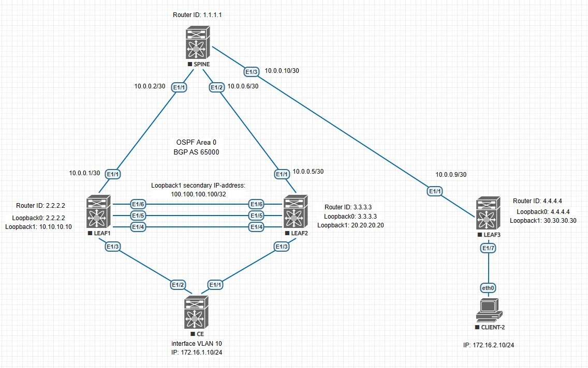

## VxLAN. vPC

### Цель:
- Настроить отказоустойчивое подключение клиентов с использованием vPC

### Описание выполнения лабораторной работы:
- Underlay и Overlay настроены, согласно [данной](https://github.com/gadzhikuliev/otus_design_of_data_center_networks/tree/main/labs/lab06) лабораторной работе
- Исключаем SPINE2 из топологии для экономии ресурсов эмулятора
- Задаем Loopback-адреса, согласно плану сети
- Назначаем на LEAF1 и LEAF2 интерфейсу Loopback 1 также одинаковый secondary IP-адрес - 100.100.100.100/32
- Проверяем, чтобы все коммутаторы обменивались маршрутной инофрмацией
- Настраиваем VLAN ID и VNI на LEAF1 и LEAF2 идентично друг другу
- Создаём агрегированные логические интерфесы на LEAF1 и LEAF2:
    - Port-Channel 200 (Ethernet 1/4 и Ethernet 1/5)- будет использован в качестве vPC Peer-Link
    - Port-Channel 100 (Ethernet 1/3)- vPC Member Link для клиента
    - Интерфейсы переводим в mode trunk
- Подключаем интерфейсы Ethernet 1/6 на LEAF1 и LEAF2 друг к другу: они будут использоватьмя как vPC Peer-Keepalive Link
- На коомутаторе CE также создаём Port-Channel 100 (Ethernet 1/1 и Ethernet 1/2), переводим в режим mode trunk
- На коомутаторе CE также создаём VLAN 10, задаём IP-адрес. Интерфейс будет использоваться в качестве клиента
- На LEAF1 и LEAF2 настраиваем домен vPC и проверяем его работу
- Выполняем общую проверку работосопобности Overlay-сети

### Физическая схема сети:


#### Loopback-интерфейсы на коммутаторах:

|Device|Loopback 0|Loopback 1|Loopback 1 secondary IP|
|:-:|:-:|:-:|:-:|
|LEAF1|2.2.2.2/32|10.10.10.10/32|100.100.100.100/32|
|LEAF2|3.3.3.3/32|20.20.20.20/32|100.100.100.100/32|
|LEAF3|4.4.4.4/32|30.30.30.30/32|-|
|SPINE|1.1.1.1/32|-|-|

#### Клиентские сети 

|Device|VLAN ID|Network|
|:-:|:-:|:-:|
|LEAF1|10|172.16.1.0/24|
|LEAF2|10|172.16.1.0/24|
|LEAF3|20|172.16.2.0/24|

#### Адресация для Peer-Keepalive Link

|Device|Interface|IP Address|
|:-:|:-:|:-:|
|LEAF1|Ethernet 1/6|192.168.0.1/30|
|LEAF2|Ethernet 1/6|192.168.0.2/30|

### Необходимые настройки на оборудовании:

#### <u>Настройка LEAF1:</u>

```
feature lacp
feature vpc

vrf context KEEPALIVE

vpc domain 10
  peer-switch
  role priority 20
  peer-keepalive destination 192.168.0.2 source 192.168.0.1 vrf KEEPALIVE
  delay restore 10
  peer-gateway
  ip arp synchronize

interface port-channel100
  description CE
  switchport mode trunk
  vpc 100

interface port-channel200
  description Peer-Link Aggregation
  switchport mode trunk
  spanning-tree port type network
  vpc peer-link

interface Ethernet1/3
  description CE
  switchport mode trunk
  channel-group 100 mode active

interface Ethernet1/4
  description Peer-Link
  switchport mode trunk
  channel-group 200 mode active

interface Ethernet1/5
  description Peer-Link
  switchport mode trunk
  channel-group 200 mode active

interface Ethernet1/6
  description Peer-Keepalive Port
  no switchport
  vrf member KEEPALIVE
  ip address 192.168.0.1/30
  no shutdown

  interface loopback1
  ip address 10.10.10.10/32
  ip address 100.100.100.100/32 secondary
  ip router ospf UNDERLAY area 0.0.0.0
```
#### <u>Настройка LEAF2:</u>

```
feature lacp
feature vpc

vrf context KEEPALIVE

vpc domain 10
  peer-switch
  role priority 30
  peer-keepalive destination 192.168.0.1 source 192.168.0.2 vrf KEEPALIVE
  delay restore 10
  peer-gateway
  ip arp synchronize

interface port-channel100
  description CE
  switchport mode trunk
  vpc 100

interface port-channel200
  description Peer-Link Aggregation
  switchport mode trunk
  spanning-tree port type network
  vpc peer-link

interface Ethernet1/3
  description CE
  switchport mode trunk
  channel-group 100 mode active

interface Ethernet1/4
  description Peer-Link
  switchport mode trunk
  channel-group 200 mode active

interface Ethernet1/5
  description Peer-Link
  switchport mode trunk
  channel-group 200 mode active

interface Ethernet1/6
  description Peer-Keepalive Port
  no switchport
  vrf member KEEPALIVE
  ip address 192.168.0.2/30
  no shutdown

interface loopback1
  ip address 20.20.20.20/32
  ip address 100.100.100.100/32 secondary
  ip router ospf UNDERLAY area 0.0.0.0
```
#### <u>Настройка CE:</u>

```
feature interface-vlan
feature lacp

ip route 0.0.0.0/0 172.16.1.1

vlan 10
  name CLIENT-1

interface Vlan10
  no shutdown
  ip address 172.16.1.10/24

interface port-channel100
  description To LEAFS
  switchport mode trunk

interface Ethernet1/1
  switchport mode trunk
  channel-group 100 mode active

interface Ethernet1/2
  switchport mode trunk
  channel-group 100 mode active
```

### Проверка работособности vPC и общая проверка Overlay: таблица маршрутизации IP, таблица маршрутизации L2VPN, NVE Peers. Также посмотрим таблицу MAC-адресов и ARP-таблицу:

<details>
<summary>Проверка на LEAF1</summary>

```
LEAF1#  sh vpc
Legend:
                (*) - local vPC is down, forwarding via vPC peer-link

vPC domain id                     : 10
Peer status                       : peer adjacency formed ok
vPC keep-alive status             : peer is alive
Configuration consistency status  : success
Per-vlan consistency status       : success
Type-2 consistency status         : success
vPC role                          : primary
Number of vPCs configured         : 1
Peer Gateway                      : Enabled
Dual-active excluded VLANs        : -
Graceful Consistency Check        : Enabled
Auto-recovery status              : Disabled
Delay-restore status              : Timer is off.(timeout = 10s)
Delay-restore SVI status          : Timer is off.(timeout = 10s)
Operational Layer3 Peer-router    : Disabled
Virtual-peerlink mode             : Disabled

vPC Peer-link status
---------------------------------------------------------------------
id    Port   Status Active vlans
--    ----   ------ -------------------------------------------------
1     Po200  up     1,10,99

vPC status
----------------------------------------------------------------------------
Id    Port          Status Consistency Reason                Active vlans
--    ------------  ------ ----------- ------                ---------------
100   Po100         up     success     success               1,10,99

LEAF1# sh ip route vrf PROD
IP Route Table for VRF "PROD"
'*' denotes best ucast next-hop
'**' denotes best mcast next-hop
'[x/y]' denotes [preference/metric]
'%<string>' in via output denotes VRF <string>

172.16.1.0/24, ubest/mbest: 1/0, attached
    *via 172.16.1.1, Vlan10, [0/0], 00:44:26, direct
172.16.1.1/32, ubest/mbest: 1/0, attached
    *via 172.16.1.1, Vlan10, [0/0], 00:44:26, local
172.16.1.10/32, ubest/mbest: 1/0, attached
    *via 172.16.1.10, Vlan10, [190/0], 00:43:17, hmm
172.16.2.10/32, ubest/mbest: 1/0
    *via 30.30.30.30%default, [200/0], 00:43:34, bgp-65000, internal, tag 65000, segid: 99000 tunnelid: 0x1e1e1e1e encap: VXLAN

LEAF1# sh bgp l2vpn evpn
BGP routing table information for VRF default, address family L2VPN EVPN
BGP table version is 17, Local Router ID is 2.2.2.2
Status: s-suppressed, x-deleted, S-stale, d-dampened, h-history, *-valid, >-best
Path type: i-internal, e-external, c-confed, l-local, a-aggregate, r-redist, I-i
njected
Origin codes: i - IGP, e - EGP, ? - incomplete, | - multipath, & - backup, 2 - b
est2

   Network            Next Hop            Metric     LocPrf     Weight Path
Route Distinguisher: 2.2.2.2:32777    (L2VNI 10000)
*>l[2]:[0]:[0]:[48]:[5002.0000.1b08]:[0]:[0.0.0.0]/216
                      100.100.100.100                   100      32768 i
*>l[2]:[0]:[0]:[48]:[5002.0000.1b08]:[32]:[172.16.1.10]/272
                      100.100.100.100                   100      32768 i
*>l[3]:[0]:[32]:[100.100.100.100]/88
                      100.100.100.100                   100      32768 i

Route Distinguisher: 4.4.4.4:32787
*>i[2]:[0]:[0]:[48]:[0050.7966.6806]:[0]:[0.0.0.0]/216
                      30.30.30.30                       100          0 i
*>i[2]:[0]:[0]:[48]:[0050.7966.6806]:[32]:[172.16.2.10]/272
                      30.30.30.30                       100          0 i
*>i[3]:[0]:[32]:[30.30.30.30]/88
                      30.30.30.30                       100          0 i

Route Distinguisher: 2.2.2.2:4    (L3VNI 99000)
*>l[2]:[0]:[0]:[48]:[5003.0000.1b08]:[0]:[0.0.0.0]/216
                      100.100.100.100                   100      32768 i
*>i[2]:[0]:[0]:[48]:[0050.7966.6806]:[32]:[172.16.2.10]/272
                      30.30.30.30                       100          0 i

LEAF1# sh mac address-table
Legend:
        * - primary entry, G - Gateway MAC, (R) - Routed MAC, O - Overlay MAC
        age - seconds since last seen,+ - primary entry using vPC Peer-Link,
        (T) - True, (F) - False, C - ControlPlane MAC, ~ - vsan
   VLAN     MAC Address      Type      age     Secure NTFY Ports
---------+-----------------+--------+---------+------+----+------------------
+   10     5002.0000.1b08   dynamic  0         F      F    Po100
*   99     0200.6464.6464   static   -         F      F    Vlan99
*   99     5003.0000.1b08   static   -         F      F    Vlan99
*   99     5005.0000.1b08   static   -         F      F    nve1(30.30.30.30)
G    -     0000.1111.2222   static   -         F      F    sup-eth1(R)
G    -     0200.6464.6464   static   -         F      F    sup-eth1(R)
G    -     5003.0000.1b08   static   -         F      F    sup-eth1(R)
G   10     5003.0000.1b08   static   -         F      F    sup-eth1(R)
G   99     5003.0000.1b08   static   -         F      F    sup-eth1(R)
G   10     5004.0000.1b08   static   -         F      F    vPC Peer-Link(R)
G   99     5004.0000.1b08   static   -         F      F    vPC Peer-Link(R)


LEAF1# sh nve peers
Interface Peer-IP                                 State LearnType Uptime   Route
r-Mac
--------- --------------------------------------  ----- --------- -------- -----------------
nve1      30.30.30.30                             Up    CP        00:57:11 5005.0000.1b08


LEAF1# sh ip arp vlan 10 vrf PROD

Flags: * - Adjacencies learnt on non-active FHRP router
       + - Adjacencies synced via CFSoE
       # - Adjacencies Throttled for Glean
       CP - Added via L2RIB, Control plane Adjacencies
       PS - Added via L2RIB, Peer Sync
       RO - Re-Originated Peer Sync Entry
       D - Static Adjacencies attached to down interface

IP ARP Table
Total number of entries: 1
Address         Age       MAC Address     Interface       Flags
172.16.1.10     00:02:37  5002.0000.1b08  Vlan10          +
```
</details>
<details>
<summary>Проверка на LEAF2</summary>

```
LEAF2# sh vpc
Legend:
                (*) - local vPC is down, forwarding via vPC peer-link

vPC domain id                     : 10
Peer status                       : peer adjacency formed ok
vPC keep-alive status             : peer is alive
Configuration consistency status  : success
Per-vlan consistency status       : success
Type-2 consistency status         : success
vPC role                          : secondary
Number of vPCs configured         : 1
Peer Gateway                      : Enabled
Dual-active excluded VLANs        : -
Graceful Consistency Check        : Enabled
Auto-recovery status              : Disabled
Delay-restore status              : Timer is off.(timeout = 10s)
Delay-restore SVI status          : Timer is off.(timeout = 10s)
Operational Layer3 Peer-router    : Disabled
Virtual-peerlink mode             : Disabled

vPC Peer-link status
---------------------------------------------------------------------
id    Port   Status Active vlans
--    ----   ------ -------------------------------------------------
1     Po200  up     1,10,99

vPC status
----------------------------------------------------------------------------
Id    Port          Status Consistency Reason                Active vlans
--    ------------  ------ ----------- ------                ---------------
100   Po100         up     success     success               1,10,99

LEAF2# sh ip route vrf PROD
IP Route Table for VRF "PROD"
'*' denotes best ucast next-hop
'**' denotes best mcast next-hop
'[x/y]' denotes [preference/metric]
'%<string>' in via output denotes VRF <string>

172.16.1.0/24, ubest/mbest: 1/0, attached
    *via 172.16.1.1, Vlan10, [0/0], 01:06:59, direct
172.16.1.1/32, ubest/mbest: 1/0, attached
    *via 172.16.1.1, Vlan10, [0/0], 01:06:59, local
172.16.1.10/32, ubest/mbest: 1/0, attached
    *via 172.16.1.10, Vlan10, [190/0], 00:50:03, hmm
172.16.2.10/32, ubest/mbest: 1/0
    *via 30.30.30.30%default, [200/0], 01:05:25, bgp-65000, internal, tag 65000, segid: 99000 tunnelid: 0x1e1e1e1e encap: VXLAN

LEAF2# sh bgp l2vpn evpn
BGP routing table information for VRF default, address family L2VPN EVPN
BGP table version is 17, Local Router ID is 3.3.3.3
Status: s-suppressed, x-deleted, S-stale, d-dampened, h-history, *-valid, >-best
Path type: i-internal, e-external, c-confed, l-local, a-aggregate, r-redist, I-injected
Origin codes: i - IGP, e - EGP, ? - incomplete, | - multipath, & - backup, 2 - best2

   Network            Next Hop            Metric     LocPrf     Weight Path
Route Distinguisher: 3.3.3.3:32777    (L2VNI 10000)
*>l[2]:[0]:[0]:[48]:[5002.0000.1b08]:[0]:[0.0.0.0]/216
                      100.100.100.100                   100      32768 i
*>l[2]:[0]:[0]:[48]:[5002.0000.1b08]:[32]:[172.16.1.10]/272
                      100.100.100.100                   100      32768 i
*>l[3]:[0]:[32]:[100.100.100.100]/88
                      100.100.100.100                   100      32768 i

Route Distinguisher: 4.4.4.4:32787
*>i[2]:[0]:[0]:[48]:[0050.7966.6806]:[0]:[0.0.0.0]/216
                      30.30.30.30                       100          0 i
*>i[2]:[0]:[0]:[48]:[0050.7966.6806]:[32]:[172.16.2.10]/272
                      30.30.30.30                       100          0 i
*>i[3]:[0]:[32]:[30.30.30.30]/88
                      30.30.30.30                       100          0 i

Route Distinguisher: 3.3.3.3:4    (L3VNI 99000)
*>l[2]:[0]:[0]:[48]:[5004.0000.1b08]:[0]:[0.0.0.0]/216
                      100.100.100.100                   100      32768 i
*>i[2]:[0]:[0]:[48]:[0050.7966.6806]:[32]:[172.16.2.10]/272
                      30.30.30.30                       100          0 i


LEAF2# sh mac address-table
Legend:
        * - primary entry, G - Gateway MAC, (R) - Routed MAC, O - Overlay MAC
        age - seconds since last seen,+ - primary entry using vPC Peer-Link,
        (T) - True, (F) - False, C - ControlPlane MAC, ~ - vsan
   VLAN     MAC Address      Type      age     Secure NTFY Ports
---------+-----------------+--------+---------+------+----+------------------
*   10     5002.0000.1b08   dynamic  0         F      F    Po100
*   99     0200.6464.6464   static   -         F      F    Vlan99
*   99     5004.0000.1b08   static   -         F      F    Vlan99
*   99     5005.0000.1b08   static   -         F      F    nve1(30.30.30.30)
G    -     0000.1111.2222   static   -         F      F    sup-eth1(R)
G    -     0200.6464.6464   static   -         F      F    sup-eth1(R)
G   10     5003.0000.1b08   static   -         F      F    vPC Peer-Link(R)
G   99     5003.0000.1b08   static   -         F      F    vPC Peer-Link(R)
G    -     5004.0000.1b08   static   -         F      F    sup-eth1(R)
G   10     5004.0000.1b08   static   -         F      F    sup-eth1(R)
G   99     5004.0000.1b08   static   -         F      F    sup-eth1(R)

LEAF2# sh nve peers
Interface Peer-IP                                 State LearnType Uptime   Router-Mac
--------- --------------------------------------  ----- --------- -------- -----------------
nve1      30.30.30.30                             Up    CP        01:11:50 5005.0000.1b08

LEAF2# sh ip arp vlan 10 vrf PROD

Flags: * - Adjacencies learnt on non-active FHRP router
       + - Adjacencies synced via CFSoE
       # - Adjacencies Throttled for Glean
       CP - Added via L2RIB, Control plane Adjacencies
       PS - Added via L2RIB, Peer Sync
       RO - Re-Originated Peer Sync Entry
       D - Static Adjacencies attached to down interface

IP ARP Table
Total number of entries: 1
Address         Age       MAC Address     Interface       Flags
172.16.1.10     00:03:29  5002.0000.1b08  Vlan10
```
</details>
<details>
<summary>Проверка на LEAF3</summary>

```
LEAF3# sh ip route vrf PROD
IP Route Table for VRF "PROD"
'*' denotes best ucast next-hop
'**' denotes best mcast next-hop
'[x/y]' denotes [preference/metric]
'%<string>' in via output denotes VRF <string>

172.16.1.10/32, ubest/mbest: 1/0
    *via 100.100.100.100%default, [200/0], 00:51:36, bgp-65000, internal, tag 65000, segid: 99000 tunnelid: 0x64646464 encap: VXLAN
172.16.2.0/24, ubest/mbest: 1/0, attached
    *via 172.16.2.1, Vlan20, [0/0], 01:22:06, direct
172.16.2.1/32, ubest/mbest: 1/0, attached
    *via 172.16.2.1, Vlan20, [0/0], 01:22:06, local
172.16.2.10/32, ubest/mbest: 1/0, attached
    *via 172.16.2.10, Vlan20, [190/0], 01:09:32, hmm

LEAF3# sh bgp l2vpn evpn
BGP routing table information for VRF default, address family L2VPN EVPN
BGP table version is 20, Local Router ID is 4.4.4.4
Status: s-suppressed, x-deleted, S-stale, d-dampened, h-history, *-valid, >-best
Path type: i-internal, e-external, c-confed, l-local, a-aggregate, r-redist, I-i
njected
Origin codes: i - IGP, e - EGP, ? - incomplete, | - multipath, & - backup, 2 - b
est2

   Network            Next Hop            Metric     LocPrf     Weight Path
Route Distinguisher: 2.2.2.2:4
*>i[2]:[0]:[0]:[48]:[5003.0000.1b08]:[0]:[0.0.0.0]/216
                      100.100.100.100                   100          0 i

Route Distinguisher: 2.2.2.2:32777
*>i[2]:[0]:[0]:[48]:[5002.0000.1b08]:[0]:[0.0.0.0]/216
                      100.100.100.100                   100          0 i
*>i[2]:[0]:[0]:[48]:[5002.0000.1b08]:[32]:[172.16.1.10]/272
                      100.100.100.100                   100          0 i
*>i[3]:[0]:[32]:[100.100.100.100]/88
                      100.100.100.100                   100          0 i

Route Distinguisher: 3.3.3.3:4
*>i[2]:[0]:[0]:[48]:[5004.0000.1b08]:[0]:[0.0.0.0]/216
                      100.100.100.100                   100          0 i

Route Distinguisher: 3.3.3.3:32777
*>i[2]:[0]:[0]:[48]:[5002.0000.1b08]:[0]:[0.0.0.0]/216
                      100.100.100.100                   100          0 i
*>i[2]:[0]:[0]:[48]:[5002.0000.1b08]:[32]:[172.16.1.10]/272
                      100.100.100.100                   100          0 i
*>i[3]:[0]:[32]:[100.100.100.100]/88
                      100.100.100.100                   100          0 i

Route Distinguisher: 4.4.4.4:32787    (L2VNI 20000)
*>l[2]:[0]:[0]:[48]:[0050.7966.6806]:[0]:[0.0.0.0]/216
                      30.30.30.30                       100      32768 i
*>l[2]:[0]:[0]:[48]:[0050.7966.6806]:[32]:[172.16.2.10]/272
                      30.30.30.30                       100      32768 i
*>l[3]:[0]:[32]:[30.30.30.30]/88
                      30.30.30.30                       100      32768 i

Route Distinguisher: 4.4.4.4:3    (L3VNI 99000)
*>i[2]:[0]:[0]:[48]:[5003.0000.1b08]:[0]:[0.0.0.0]/216
                      100.100.100.100                   100          0 i
*>i[2]:[0]:[0]:[48]:[5004.0000.1b08]:[0]:[0.0.0.0]/216
                      100.100.100.100                   100          0 i
*>i[2]:[0]:[0]:[48]:[5002.0000.1b08]:[32]:[172.16.1.10]/272
                      100.100.100.100                   100          0 i
* i                   100.100.100.100                   100          0 i


LEAF3# sh mac address-table
Legend:
        * - primary entry, G - Gateway MAC, (R) - Routed MAC, O - Overlay MAC
        age - seconds since last seen,+ - primary entry using vPC Peer-Link,
        (T) - True, (F) - False, C - ControlPlane MAC, ~ - vsan
   VLAN     MAC Address      Type      age     Secure NTFY Ports
---------+-----------------+--------+---------+------+----+------------------
*   20     0050.7966.6806   dynamic  0         F      F    Eth1/7
*   99     0200.6464.6464   static   -         F      F    nve1(100.100.100.100)
*   99     5005.0000.1b08   static   -         F      F    Vlan99
G    -     0000.1111.2222   static   -         F      F    sup-eth1(R)
G    -     5005.0000.1b08   static   -         F      F    sup-eth1(R)
G   20     5005.0000.1b08   static   -         F      F    sup-eth1(R)
G   99     5005.0000.1b08   static   -         F      F    sup-eth1(R)


LEAF3# sh nve peers
Interface Peer-IP                                 State LearnType Uptime   Route
r-Mac
--------- --------------------------------------  ----- --------- -------- -----------------
nve1      100.100.100.100                         Up    CP        00:53:37 0200.6464.6464
```
</details>
<details>
<summary>Проверка на клиентах - CE и CLIENT-2</summary>

```
CE# sh ip int brief

IP Interface Status for VRF "default"(1)
Interface            IP Address      Interface Status
Vlan10               172.16.1.10     protocol-up/link-up/admin-up
CE#
CE#
CE# ping 172.16.2.10
PING 172.16.2.10 (172.16.2.10): 56 data bytes
64 bytes from 172.16.2.10: icmp_seq=0 ttl=61 time=85.886 ms
64 bytes from 172.16.2.10: icmp_seq=1 ttl=61 time=22.082 ms
64 bytes from 172.16.2.10: icmp_seq=2 ttl=61 time=32.115 ms
64 bytes from 172.16.2.10: icmp_seq=3 ttl=61 time=25.753 ms
64 bytes from 172.16.2.10: icmp_seq=4 ttl=61 time=20.525 ms

--- 172.16.2.10 ping statistics ---
5 packets transmitted, 5 packets received, 0.00% packet loss
round-trip min/avg/max = 20.525/37.272/85.886 ms

------------------------------------------------------------------

CLIENT-2> sh ip

NAME        : CLIENT-2[1]
IP/MASK     : 172.16.2.10/24
GATEWAY     : 172.16.2.1
DNS         :
MAC         : 00:50:79:66:68:06
LPORT       : 20000
RHOST:PORT  : 127.0.0.1:30000
MTU         : 1500

CLIENT-2> ping 172.16.1.10

84 bytes from 172.16.1.10 icmp_seq=1 ttl=253 time=33.728 ms
84 bytes from 172.16.1.10 icmp_seq=2 ttl=253 time=17.495 ms
84 bytes from 172.16.1.10 icmp_seq=3 ttl=253 time=21.441 ms
84 bytes from 172.16.1.10 icmp_seq=4 ttl=253 time=18.267 ms
84 bytes from 172.16.1.10 icmp_seq=5 ttl=253 time=28.418 ms
```
</details>

Как видно из выводов команд, vPC-домен корректно работает. VTEP-коммутаторы обмениваются маршрутной информацией. VxLAN-туннели работают, видим MAC-адреса VTEP за интерфейсами NVE, также мы видим клиентские IP- и MAC-адреса в таблицах маршрутизации. Клиенты CE и CLIENT-2 пингуют друг друга.