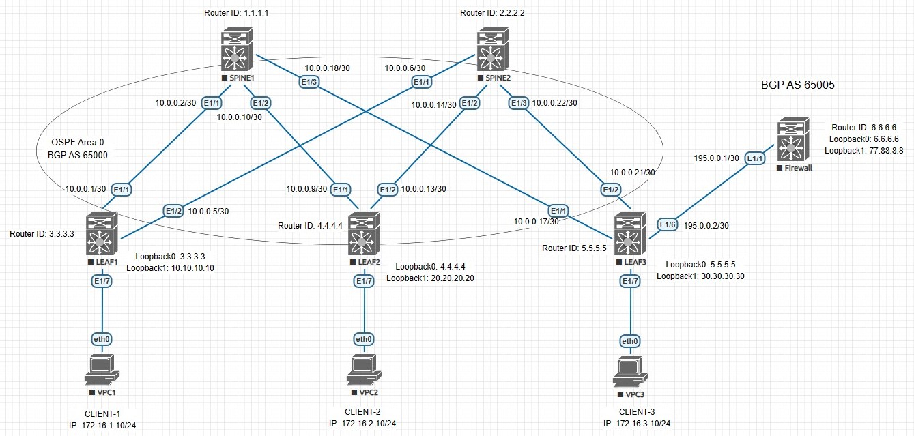

## VxLAN. Оптимизация таблиц маршрутизации

### Цель:
- Разобрать EVPN Route Type 5 и его применение

### Описание выполнения лабораторной работы:
- Underlay и Overlay настроены, согласно [данной](https://github.com/gadzhikuliev/otus_design_of_data_center_networks/tree/main/labs/lab06) лабораторной работе
- Настроить устройство Firewall в AS 65005:
    - Интерфейсы, IP-адресация
    - eBGP
- На Firewall создать интерфейс Loopback 1 и задать ему IP-адрес: он будет имитировать узел из внешней сети - 77.88.8.8/32
- Анонсировать на Firewall в BGP суммарный маршрут с префиксом: 77.88.0.0/16
- LEAF3 выбран в качестве Border. На нём необходимо настроить eBGP Peering с Firewall
- Интерфейс LEAF3 для соединения с Firewall добавить в VRF PROD
- Настройки для eBGP на LEAF3 выполнить в VRF PROD:
    - Анонсировать суммарный маршрут для всех клиентских сетей - 172.16.0.0/22
- Выполнить проверку наличия Route Type 5 и общую проверку работоспособности фабрики

### Физическая схема сети:


#### Интерфейсы, которые будут настроены:

|Device|Interface|IP Address|Subnet Mask|VRF|
|:-:|:-:|:-:|:-:|:-:|
|LEAF3|Ethernet 1/6|195.0.0.2|255.255.255.252|PROD|
|Firewall|Ethernet 1/1|195.0.0.1|255.255.255.252|-|
|Firewall|Loopback 0|6.6.6.6|255.255.255.255|-|
|Firewall|Loopback 1|77.88.8.8|255.255.255.255|-|

#### Анонсируемые маршруты
|Device|Route|
|:-:|:-:|
|Firewall|77.88.0.0/16|
|LEAF3|172.16.0.0/22|

### Необходимые настройки на оборудовании:

#### <u>Настройка LEAF3:</u>
```
feature bgp
feature bfd

interface Ethernet1/6
  description Link to Firewall
  no switchport
  vrf member PROD
  ip address 195.0.0.2/30
  no shutdown

router bgp 65000
  router-id 5.5.5.5
  address-family ipv4 unicast
    network 5.5.5.5/32
  address-family l2vpn evpn
    maximum-paths ibgp 3
    retain route-target all
  template peer SPINE-L2VPN
    remote-as 65000
    update-source loopback0
    address-family l2vpn evpn
      send-community
      send-community extended
  neighbor 1.1.1.1
    inherit peer SPINE-L2VPN
  neighbor 2.2.2.2
    inherit peer SPINE-L2VPN
  vrf PROD
    address-family ipv4 unicast
      network 5.5.5.5/32
      network 172.16.3.0/24
      aggregate-address 172.16.0.0/22 as-set summary-only
    neighbor 195.0.0.1
      bfd
      remote-as 65005
      update-source Ethernet1/6
      address-family ipv4 unicast
```
#### <u>Настройка Firewall:</u>
```
feature bgp
feature bfd

interface Ethernet1/1
  description Link to LEAF3 Border
  no switchport
  ip address 195.0.0.1/30
  no shutdown

interface loopback0
  ip address 6.6.6.6/32

interface loopback1
  ip address 77.88.8.8/32
icam monitor scale

line console
line vty
router bgp 65005
  router-id 6.6.6.6
  address-family ipv4 unicast
    network 6.6.6.6/32
    network 77.88.8.8/32
    aggregate-address 77.88.0.0/16 as-set summary-only
  neighbor 195.0.0.2
    bfd
    remote-as 65000
    update-source Ethernet1/1
    address-family ipv4 unicast
```
### Проверка работособности фабрики в целом и Route Type 5

<details>
<summary>Проверка на LEAF1</summary>

```
LEAF1# sh ip route bgp-65000 vrf PROD
IP Route Table for VRF "PROD"
'*' denotes best ucast next-hop
'**' denotes best mcast next-hop
'[x/y]' denotes [preference/metric]
'%<string>' in via output denotes VRF <string>

6.6.6.6/32, ubest/mbest: 1/0
    *via 30.30.30.30%default, [200/0], 00:02:05, bgp-65000, internal, tag 65005,
 segid: 99000 tunnelid: 0x1e1e1e1e encap: VXLAN

77.88.0.0/16, ubest/mbest: 1/0
    *via 30.30.30.30%default, [200/0], 00:02:05, bgp-65000, internal, tag 65005,
 segid: 99000 tunnelid: 0x1e1e1e1e encap: VXLAN

172.16.0.0/22, ubest/mbest: 1/0
    *via 30.30.30.30%default, [200/0], 00:02:05, bgp-65000, internal, tag 65000,
 segid: 99000 tunnelid: 0x1e1e1e1e encap: VXLAN

172.16.2.10/32, ubest/mbest: 1/0
    *via 20.20.20.20%default, [200/0], 00:02:05, bgp-65000, internal, tag 65000,
 segid: 99000 tunnelid: 0x14141414 encap: VXLAN

172.16.3.10/32, ubest/mbest: 1/0
    *via 30.30.30.30%default, [200/0], 00:02:05, bgp-65000, internal, tag 65000,
 segid: 99000 tunnelid: 0x1e1e1e1e encap: VXLAN


LEAF1# sh bgp l2vpn evpn
BGP routing table information for VRF default, address family L2VPN EVPN
BGP table version is 51, Local Router ID is 3.3.3.3
Status: s-suppressed, x-deleted, S-stale, d-dampened, h-history, *-valid, >-best
Path type: i-internal, e-external, c-confed, l-local, a-aggregate, r-redist, I-i
njected
Origin codes: i - IGP, e - EGP, ? - incomplete, | - multipath, & - backup, 2 - b
est2

   Network            Next Hop            Metric     LocPrf     Weight Path
Route Distinguisher: 3.3.3.3:32777    (L2VNI 10000)
*>l[2]:[0]:[0]:[48]:[0050.7966.6806]:[0]:[0.0.0.0]/216
                      10.10.10.10                       100      32768 i
*>l[2]:[0]:[0]:[48]:[0050.7966.6806]:[32]:[172.16.1.10]/272
                      10.10.10.10                       100      32768 i
*>l[3]:[0]:[32]:[10.10.10.10]/88
                      10.10.10.10                       100      32768 i

Route Distinguisher: 4.4.4.4:32787
*>i[2]:[0]:[0]:[48]:[0050.7966.6807]:[0]:[0.0.0.0]/216
                      20.20.20.20                       100          0 i
* i                   20.20.20.20                       100          0 i
*>i[2]:[0]:[0]:[48]:[0050.7966.6807]:[32]:[172.16.2.10]/272
                      20.20.20.20                       100          0 i
* i                   20.20.20.20                       100          0 i
*>i[3]:[0]:[32]:[20.20.20.20]/88
                      20.20.20.20                       100          0 i
* i                   20.20.20.20                       100          0 i

Route Distinguisher: 5.5.5.5:3
*>i[5]:[0]:[0]:[16]:[77.88.0.0]/224
                      30.30.30.30                       100          0 65005 i
* i                   30.30.30.30                       100          0 65005 i
*>i[5]:[0]:[0]:[22]:[172.16.0.0]/224
                      30.30.30.30                       100          0 i
* i                   30.30.30.30                       100          0 i
*>i[5]:[0]:[0]:[32]:[6.6.6.6]/224
                      30.30.30.30                       100          0 65005 i
* i                   30.30.30.30                       100          0 65005 i

Route Distinguisher: 5.5.5.5:32797
*>i[2]:[0]:[0]:[48]:[0050.7966.6809]:[0]:[0.0.0.0]/216
                      30.30.30.30                       100          0 i
* i                   30.30.30.30                       100          0 i
*>i[2]:[0]:[0]:[48]:[0050.7966.6809]:[32]:[172.16.3.10]/272
                      30.30.30.30                       100          0 i
* i                   30.30.30.30                       100          0 i
*>i[3]:[0]:[32]:[30.30.30.30]/88
                      30.30.30.30                       100          0 i
* i                   30.30.30.30                       100          0 i

Route Distinguisher: 3.3.3.3:3    (L3VNI 99000)
*>i[2]:[0]:[0]:[48]:[0050.7966.6807]:[32]:[172.16.2.10]/272
                      20.20.20.20                       100          0 i
*>i[2]:[0]:[0]:[48]:[0050.7966.6809]:[32]:[172.16.3.10]/272
                      30.30.30.30                       100          0 i
*>i[5]:[0]:[0]:[16]:[77.88.0.0]/224
                      30.30.30.30                       100          0 65005 i
*>i[5]:[0]:[0]:[22]:[172.16.0.0]/224
                      30.30.30.30                       100          0 i
*>i[5]:[0]:[0]:[32]:[6.6.6.6]/224
                      30.30.30.30                       100          0 65005 i

LEAF1# sh nve peers
Interface Peer-IP                                 State LearnType Uptime   Router-Mac
--------- --------------------------------------  ----- --------- -------- -----------------
nve1      20.20.20.20                             Up    CP        00:16:42 5004.0000.1b08
nve1      30.30.30.30                             Up    CP        00:16:42 5005.0000.1b08

```
</details>
<details>
<summary>Проверка на LEAF2</summary>

```
LEAF2# sh ip route bgp-65000 vrf PROD
IP Route Table for VRF "PROD"
'*' denotes best ucast next-hop
'**' denotes best mcast next-hop
'[x/y]' denotes [preference/metric]
'%<string>' in via output denotes VRF <string>

6.6.6.6/32, ubest/mbest: 1/0
    *via 30.30.30.30%default, [200/0], 00:05:31, bgp-65000, internal, tag 65005,
 segid: 99000 tunnelid: 0x1e1e1e1e encap: VXLAN

77.88.0.0/16, ubest/mbest: 1/0
    *via 30.30.30.30%default, [200/0], 00:05:31, bgp-65000, internal, tag 65005,
 segid: 99000 tunnelid: 0x1e1e1e1e encap: VXLAN

172.16.0.0/22, ubest/mbest: 1/0
    *via 30.30.30.30%default, [200/0], 00:05:31, bgp-65000, internal, tag 65000,
 segid: 99000 tunnelid: 0x1e1e1e1e encap: VXLAN

172.16.1.10/32, ubest/mbest: 1/0
    *via 10.10.10.10%default, [200/0], 00:03:57, bgp-65000, internal, tag 65000,
 segid: 99000 tunnelid: 0xa0a0a0a encap: VXLAN

172.16.3.10/32, ubest/mbest: 1/0
    *via 30.30.30.30%default, [200/0], 00:05:31, bgp-65000, internal, tag 65000,
 segid: 99000 tunnelid: 0x1e1e1e1e encap: VXLAN

LEAF2# sh bgp l2vpn evpn
BGP routing table information for VRF default, address family L2VPN EVPN
BGP table version is 45, Local Router ID is 4.4.4.4
Status: s-suppressed, x-deleted, S-stale, d-dampened, h-history, *-valid, >-best
Path type: i-internal, e-external, c-confed, l-local, a-aggregate, r-redist, I-i
njected
Origin codes: i - IGP, e - EGP, ? - incomplete, | - multipath, & - backup, 2 - b
est2

   Network            Next Hop            Metric     LocPrf     Weight Path
Route Distinguisher: 3.3.3.3:32777
*>i[2]:[0]:[0]:[48]:[0050.7966.6806]:[0]:[0.0.0.0]/216
                      10.10.10.10                       100          0 i
* i                   10.10.10.10                       100          0 i
* i[2]:[0]:[0]:[48]:[0050.7966.6806]:[32]:[172.16.1.10]/272
                      10.10.10.10                       100          0 i
*>i                   10.10.10.10                       100          0 i
*>i[3]:[0]:[32]:[10.10.10.10]/88
                      10.10.10.10                       100          0 i
* i                   10.10.10.10                       100          0 i

Route Distinguisher: 4.4.4.4:32787    (L2VNI 20000)
*>l[2]:[0]:[0]:[48]:[0050.7966.6807]:[0]:[0.0.0.0]/216
                      20.20.20.20                       100      32768 i
*>l[2]:[0]:[0]:[48]:[0050.7966.6807]:[32]:[172.16.2.10]/272
                      20.20.20.20                       100      32768 i
*>l[3]:[0]:[32]:[20.20.20.20]/88
                      20.20.20.20                       100      32768 i

Route Distinguisher: 5.5.5.5:3
*>i[5]:[0]:[0]:[16]:[77.88.0.0]/224
                      30.30.30.30                       100          0 65005 i
* i                   30.30.30.30                       100          0 65005 i
*>i[5]:[0]:[0]:[22]:[172.16.0.0]/224
                      30.30.30.30                       100          0 i
* i                   30.30.30.30                       100          0 i
*>i[5]:[0]:[0]:[32]:[6.6.6.6]/224
                      30.30.30.30                       100          0 65005 i
* i                   30.30.30.30                       100          0 65005 i

Route Distinguisher: 5.5.5.5:32797
*>i[2]:[0]:[0]:[48]:[0050.7966.6809]:[0]:[0.0.0.0]/216
                      30.30.30.30                       100          0 i
* i                   30.30.30.30                       100          0 i
*>i[2]:[0]:[0]:[48]:[0050.7966.6809]:[32]:[172.16.3.10]/272
                      30.30.30.30                       100          0 i
* i                   30.30.30.30                       100          0 i
*>i[3]:[0]:[32]:[30.30.30.30]/88
                      30.30.30.30                       100          0 i
* i                   30.30.30.30                       100          0 i

Route Distinguisher: 4.4.4.4:3    (L3VNI 99000)
*>i[2]:[0]:[0]:[48]:[0050.7966.6806]:[32]:[172.16.1.10]/272
                      10.10.10.10                       100          0 i
*>i[2]:[0]:[0]:[48]:[0050.7966.6809]:[32]:[172.16.3.10]/272
                      30.30.30.30                       100          0 i
*>i[5]:[0]:[0]:[16]:[77.88.0.0]/224
                      30.30.30.30                       100          0 65005 i
*>i[5]:[0]:[0]:[22]:[172.16.0.0]/224
                      30.30.30.30                       100          0 i
*>i[5]:[0]:[0]:[32]:[6.6.6.6]/224
                      30.30.30.30                       100          0 65005 i


LEAF2# sh nve peers
Interface Peer-IP                                 State LearnType Uptime   Router-Mac
--------- --------------------------------------  ----- --------- -------- -----------------
nve1      10.10.10.10                             Up    CP        00:04:58 5003.0000.1b08
nve1      30.30.30.30                             Up    CP        00:37:30 5005.0000.1b08
```
</details>
<details>
<summary>Проверка на LEAF3</summary>

```
LEAF3# sh ip route bgp-65000 vrf PROD
IP Route Table for VRF "PROD"
'*' denotes best ucast next-hop
'**' denotes best mcast next-hop
'[x/y]' denotes [preference/metric]
'%<string>' in via output denotes VRF <string>

6.6.6.6/32, ubest/mbest: 1/0
    *via 195.0.0.1, [20/0], 04:14:29, bgp-65000, external, tag 65005
77.88.0.0/16, ubest/mbest: 1/0
    *via 195.0.0.1, [20/0], 03:07:30, bgp-65000, external, tag 65005
172.16.0.0/22, ubest/mbest: 1/0
    *via Null0, [220/0], 00:05:46, bgp-65000, discard, tag 65000
172.16.1.10/32, ubest/mbest: 1/0
    *via 10.10.10.10%default, [200/0], 00:05:50, bgp-65000, internal, tag 65000, segid: 99000 tunnelid: 0xa0a0a0a encap: VXLAN

172.16.2.10/32, ubest/mbest: 1/0
    *via 20.20.20.20%default, [200/0], 00:07:24, bgp-65000, internal, tag 65000, segid: 99000 tunnelid: 0x14141414 encap: VXLAN

LEAF3# sh bgp l2vpn evpn
BGP routing table information for VRF default, address family L2VPN EVPN
BGP table version is 41, Local Router ID is 5.5.5.5
Status: s-suppressed, x-deleted, S-stale, d-dampened, h-history, *-valid, >-best
Path type: i-internal, e-external, c-confed, l-local, a-aggregate, r-redist, I-injected
Origin codes: i - IGP, e - EGP, ? - incomplete, | - multipath, & - backup, 2 - best2

   Network            Next Hop            Metric     LocPrf     Weight Path
Route Distinguisher: 3.3.3.3:32777
* i[2]:[0]:[0]:[48]:[0050.7966.6806]:[0]:[0.0.0.0]/216
                      10.10.10.10                       100          0 i
*>i                   10.10.10.10                       100          0 i
* i[2]:[0]:[0]:[48]:[0050.7966.6806]:[32]:[172.16.1.10]/272
                      10.10.10.10                       100          0 i
*>i                   10.10.10.10                       100          0 i
*>i[3]:[0]:[32]:[10.10.10.10]/88
                      10.10.10.10                       100          0 i
* i                   10.10.10.10                       100          0 i

Route Distinguisher: 4.4.4.4:32787
*>i[2]:[0]:[0]:[48]:[0050.7966.6807]:[0]:[0.0.0.0]/216
                      20.20.20.20                       100          0 i
* i                   20.20.20.20                       100          0 i
*>i[2]:[0]:[0]:[48]:[0050.7966.6807]:[32]:[172.16.2.10]/272
                      20.20.20.20                       100          0 i
* i                   20.20.20.20                       100          0 i
*>i[3]:[0]:[32]:[20.20.20.20]/88
                      20.20.20.20                       100          0 i
* i                   20.20.20.20                       100          0 i

Route Distinguisher: 5.5.5.5:32797    (L2VNI 30000)
*>l[2]:[0]:[0]:[48]:[0050.7966.6809]:[0]:[0.0.0.0]/216
                      30.30.30.30                       100      32768 i
*>l[2]:[0]:[0]:[48]:[0050.7966.6809]:[32]:[172.16.3.10]/272
                      30.30.30.30                       100      32768 i
*>l[3]:[0]:[32]:[30.30.30.30]/88
                      30.30.30.30                       100      32768 i

Route Distinguisher: 5.5.5.5:3    (L3VNI 99000)
*>i[2]:[0]:[0]:[48]:[0050.7966.6806]:[32]:[172.16.1.10]/272
                      10.10.10.10                       100          0 i
*>i[2]:[0]:[0]:[48]:[0050.7966.6807]:[32]:[172.16.2.10]/272
                      20.20.20.20                       100          0 i
*>l[5]:[0]:[0]:[16]:[77.88.0.0]/224
                      30.30.30.30                                    0 65005 i
*>l[5]:[0]:[0]:[22]:[172.16.0.0]/224
                      30.30.30.30                       100      32768 i
*>l[5]:[0]:[0]:[32]:[6.6.6.6]/224
                      30.30.30.30                                    0 65005 i

LEAF3# sh nve peers
Interface Peer-IP                                 State LearnType Uptime   Router-Mac
--------- --------------------------------------  ----- --------- -------- -----------------
nve1      10.10.10.10                             Up    CP        00:06:25 5003.0000.1b08
nve1      20.20.20.20                             Up    CP        00:38:57 5004.0000.1b08
```
</details>
<details>
<summary>Проверка на Firewall</summary>

```
Firewall# sh ip route
IP Route Table for VRF "default"
'*' denotes best ucast next-hop
'**' denotes best mcast next-hop
'[x/y]' denotes [preference/metric]
'%<string>' in via output denotes VRF <string>

6.6.6.6/32, ubest/mbest: 2/0, attached
    *via 6.6.6.6, Lo0, [0/0], 04:42:53, local
    *via 6.6.6.6, Lo0, [0/0], 04:42:53, direct
77.88.0.0/16, ubest/mbest: 1/0
    *via Null0, [220/0], 03:15:29, bgp-65005, discard, tag 65005
77.88.8.8/32, ubest/mbest: 2/0, attached
    *via 77.88.8.8, Lo1, [0/0], 03:15:49, local
    *via 77.88.8.8, Lo1, [0/0], 03:15:49, direct
172.16.0.0/22, ubest/mbest: 1/0
    *via 195.0.0.2, [20/0], 01:46:17, bgp-65005, external, tag 65000
195.0.0.0/30, ubest/mbest: 1/0, attached
    *via 195.0.0.1, Eth1/1, [0/0], 04:42:56, direct
195.0.0.1/32, ubest/mbest: 1/0, attached
    *via 195.0.0.1, Eth1/1, [0/0], 04:42:56, local
```
</details>
<details>
<summary>Проверка на CLIENT-1</summary>

```
CLIENT-1> sh ip

NAME        : CLIENT-1[1]
IP/MASK     : 172.16.1.10/24
GATEWAY     : 172.16.1.1
DNS         :
MAC         : 00:50:79:66:68:06
LPORT       : 20000
RHOST:PORT  : 127.0.0.1:30000
MTU         : 1500

CLIENT-1> ping 172.16.2.10

84 bytes from 172.16.2.10 icmp_seq=1 ttl=62 time=40.199 ms
84 bytes from 172.16.2.10 icmp_seq=2 ttl=62 time=72.629 ms
84 bytes from 172.16.2.10 icmp_seq=3 ttl=62 time=14.642 ms
84 bytes from 172.16.2.10 icmp_seq=4 ttl=62 time=22.822 ms
84 bytes from 172.16.2.10 icmp_seq=5 ttl=62 time=18.427 ms

CLIENT-1> ping 172.16.3.10

84 bytes from 172.16.3.10 icmp_seq=1 ttl=62 time=29.814 ms
84 bytes from 172.16.3.10 icmp_seq=2 ttl=62 time=18.489 ms
84 bytes from 172.16.3.10 icmp_seq=3 ttl=62 time=20.555 ms
84 bytes from 172.16.3.10 icmp_seq=4 ttl=62 time=13.860 ms
84 bytes from 172.16.3.10 icmp_seq=5 ttl=62 time=12.903 ms

CLIENT-1> ping 77.88.8.8

84 bytes from 77.88.8.8 icmp_seq=1 ttl=253 time=19.813 ms
84 bytes from 77.88.8.8 icmp_seq=2 ttl=253 time=19.633 ms
84 bytes from 77.88.8.8 icmp_seq=3 ttl=253 time=16.592 ms
84 bytes from 77.88.8.8 icmp_seq=4 ttl=253 time=14.140 ms
84 bytes from 77.88.8.8 icmp_seq=5 ttl=253 time=16.844 ms
```
</details>
<details>
<summary>Проверка на CLIENT-2</summary>

```
CLIENT-2> sh ip

NAME        : CLIENT-2[1]
IP/MASK     : 172.16.2.10/24
GATEWAY     : 172.16.2.1
DNS         :
MAC         : 00:50:79:66:68:07
LPORT       : 20000
RHOST:PORT  : 127.0.0.1:30000
MTU         : 1500

CLIENT-2> ping 172.16.1.10

84 bytes from 172.16.1.10 icmp_seq=1 ttl=62 time=20.166 ms
84 bytes from 172.16.1.10 icmp_seq=2 ttl=62 time=13.848 ms
84 bytes from 172.16.1.10 icmp_seq=3 ttl=62 time=15.076 ms
84 bytes from 172.16.1.10 icmp_seq=4 ttl=62 time=18.089 ms
84 bytes from 172.16.1.10 icmp_seq=5 ttl=62 time=12.625 ms

CLIENT-2> ping 172.16.3.10

84 bytes from 172.16.3.10 icmp_seq=1 ttl=62 time=12.444 ms
84 bytes from 172.16.3.10 icmp_seq=2 ttl=62 time=11.627 ms
84 bytes from 172.16.3.10 icmp_seq=3 ttl=62 time=13.082 ms
84 bytes from 172.16.3.10 icmp_seq=4 ttl=62 time=12.941 ms
84 bytes from 172.16.3.10 icmp_seq=5 ttl=62 time=16.316 ms

CLIENT-2> ping 77.88.8.8

84 bytes from 77.88.8.8 icmp_seq=1 ttl=253 time=18.738 ms
84 bytes from 77.88.8.8 icmp_seq=2 ttl=253 time=18.194 ms
84 bytes from 77.88.8.8 icmp_seq=3 ttl=253 time=14.568 ms
84 bytes from 77.88.8.8 icmp_seq=4 ttl=253 time=15.402 ms
84 bytes from 77.88.8.8 icmp_seq=5 ttl=253 time=23.909 ms
```
</details>
<details>
<summary>Проверка на CLIENT-3</summary>

```
CLIENT-3> sh ip

NAME        : CLIENT-3[1]
IP/MASK     : 172.16.3.10/24
GATEWAY     : 172.16.3.1
DNS         :
MAC         : 00:50:79:66:68:09
LPORT       : 20000
RHOST:PORT  : 127.0.0.1:30000
MTU         : 1500

CLIENT-3> ping 172.16.1.10

84 bytes from 172.16.1.10 icmp_seq=1 ttl=62 time=25.484 ms
84 bytes from 172.16.1.10 icmp_seq=2 ttl=62 time=13.271 ms
84 bytes from 172.16.1.10 icmp_seq=3 ttl=62 time=21.329 ms
84 bytes from 172.16.1.10 icmp_seq=4 ttl=62 time=13.323 ms
84 bytes from 172.16.1.10 icmp_seq=5 ttl=62 time=13.472 ms

CLIENT-3> ping 172.16.2.10

84 bytes from 172.16.2.10 icmp_seq=1 ttl=62 time=22.190 ms
84 bytes from 172.16.2.10 icmp_seq=2 ttl=62 time=14.633 ms
84 bytes from 172.16.2.10 icmp_seq=3 ttl=62 time=14.213 ms
84 bytes from 172.16.2.10 icmp_seq=4 ttl=62 time=13.525 ms
84 bytes from 172.16.2.10 icmp_seq=5 ttl=62 time=20.763 ms

CLIENT-3> ping 77.88.8.8

84 bytes from 77.88.8.8 icmp_seq=1 ttl=254 time=21.761 ms
84 bytes from 77.88.8.8 icmp_seq=2 ttl=254 time=10.583 ms
84 bytes from 77.88.8.8 icmp_seq=3 ttl=254 time=5.657 ms
84 bytes from 77.88.8.8 icmp_seq=4 ttl=254 time=6.808 ms
84 bytes from 77.88.8.8 icmp_seq=5 ttl=254 time=12.675 ms
```
</details>

В выводах команд видим Route Type 5, внешний маршрут и успешную ICMP-проверку с клиентов достпность друг дурга и внешнего маршрута.