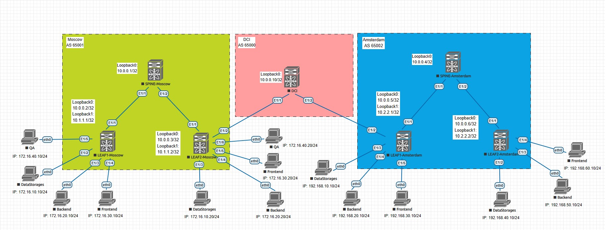

## Проектная работа "Проектирование распределенной сети ЦОД для видеохостинга"

### Оглавление
1. [Цель](#цель)
2. [Задачи](#задачи)
3. [Физическая схема](#физическая-схема-сети)
4. [Московский ЦОД](#московский-цод)
    - [Адресация для построения сети Underlay](#адресация-для-построения-сети-underlay)
    - [Адресация для NVE-интерфейсов](#адресация-для-nve-интерфейсов)
    - [Сетевые зоны](#сетевые-зоны)
    - [Настройка сети Undrelay](#настройка-сети-undrelay)
        - [SPINE-Moscow](#spine-moscow)
        - [LEAF1-Moscow](#leaf1-moscow)
        - [LEAF2-Moscow](#leaf2-moscow)
    - [Настройка сети Overlay](#настройка-сети-overlay)
        - [Накстройка сетевых зон LEAF1-Moscow](#настройка-сетевых-зон-на-leaf1-moscow)
        - [Настройка L2VPN EVPN на LEAF1-Moscow](#настройка-l2vpn-evpn-на-leaf1-moscow)
        - [Накстройка сетевых зон LEAF2-Moscow](#настройка-сетевых-зон-на-leaf2-moscow)
        - [Настройка L2VPN EVPN на LEAF2-Moscow](#настройка-l2vpn-evpn-на-leaf2-moscow)
        - [Настройка L2VPN EVPN на SPINE-Moscow](#настройка-l2vpn-evpn-на-spine-moscow)
5. [Амстердамский ЦОД](#амстердамский-цод)
    - [Адресация для построения сети Underlay](#d0b0d0b4d180d0b5d181d0b0d186d0b8d18f-d0b4d0bbd18f-d0bfd0bed181d182d180d0bed0b5d0bdd0b8d18f-d181d0b5d182d0b8-underlay-1)
    - [Адресация для NVE-интерфейсов](#d0b0d0b4d180d0b5d181d0b0d186d0b8d18f-d0b4d0bbd18f-nve-d0b8d0bdd182d0b5d180d184d0b5d0b9d181d0bed0b2-1)
    - [Сетевые зоны на LEAF1-Amsterdam](#сетевые-зоны-на-leaf1-amsterdam)
    - [Сетевые зоны на LEAF2-Amsterdam](#сетевые-зоны-на-leaf2-amsterdam)
    - [Настройка сети Undrelay](#d0bdd0b0d181d182d180d0bed0b9d0bad0b0-d181d0b5d182d0b8-undrelay-1)
        - [SPINE-Amsterdam](#spine-amsterdam)
        - [LEAF1-Amsterdam](#leaf1-amsterdam)
        - [LEAF2-Amsterdam](#leaf2-amsterdam)
    - [Настройка сети Overlay](#d0bdd0b0d181d182d180d0bed0b9d0bad0b0-d181d0b5d182d0b8-overlay-1)
        - [Настройка сетевых зон на LEAF1-Ansterdam](#настройка-сетевых-зон-на-leaf1-ansterdam)
        - [Настройка L2VPN EVPN на LEAF1-Ansterdam](#настройка-l2vpn-evpn-на-leaf1-ansterdam)
        - [Настройка сетевых зон на LEAF2-Ansterdam](#настройка-сетевых-зон-на-leaf2-ansterdam)
        - [Настройка L2VPN EVPN на LEAF2-Ansterdam](#настройка-l2vpn-evpn-на-leaf2-ansterdam)
        - [Настройка L2VPN EVPN на SPINE-Amsterdam](#настройка-l2vpn-evpn-на-spine-ansterdam)
6. [Настройка Data Center Interconnect (DCI)](#настройка-data-center-interconnect-dci)
7. [Проверка работоспособности](#проверка-работоспособности)

### Цель:
- Спроектировать отказоустойчивое, масштабируемое решение сети ЦОД для видеохостинга

### Задачи:
- Проектирование отказоустойчивой и масштабируемой 5-stage топологии Clos для двух ЦОД
- Проектирование DCI interconnection между площадками
- Проектирование адресного пространства
- Проектирование сетевых зон безопасности и взаимодействия между ними (FrontEnd, BackEnd, QA и Data Storage)

### Физическая схема сети:
Проектирумые ЦОДы будут находиться в Москве (AS 65001) и Амстердаме (AS 65002). Соединять их планируем чечез ряд провайдеров, которые в нашей схеме обозанчены L3-коммутатором DCI с AS 65000.



### Московский ЦОД
#### Адресация для построения сети Underlay
Физическим interconnect-интерфейсам зададим адресацию с помощью <b>IP unnumbered</b>, поэтому будем ипользовать только Loopback-интерфейсы
|Device|Interface|IP Address|
|:-:|:-:|:-:|
|SPINE-Moscow|Loopback 0|10.0.0.1/32|
|LEAF1-Moscow|Loopback 0|10.0.0.2/32|
|LEAF2-Moscow|Loopback 0|10.0.0.3/32|

#### Адресация для NVE-интерфейсов
Loopback 1 используется для построения туннелей внутри автономной системы, Loopback 2 - для построения между AS 65001 и 65002.
|Device|Interface|IP Address|
|:-:|:-:|:-:|
|LEAF1-Moscow|Loopback 1|10.1.1.1/32|
|LEAF2-Moscow|Loopback 1|10.1.1.2/32|
|LEAF2-Moscow|Loopback 2|1.1.1.1/32|

#### Сетевые зоны
Зоны одинаковы на LEAF1-Moscow и LEAF2-Moscow
|Network|Gateway / Interface VLAN IP Address|VLAN ID|VLAN Name|VRF|VNI|Description|
|:-:|:-:|:-:|:-:|:-:|:-:|:-:|
|172.16.10.0/24|172.16.10.1|10|10-DataStorage|PROD|1010|Сеть для размещения систем храненения с загруженными видео|
|172.16.20.0/24|172.16.20.1|20|20-BackEnd|PROD|1020|Сеть для размещения узлов с бизнес-логикой веб и мобильного приложения, баз данных и ковертирования видео|
|172.16.30.0/24|172.16.30.1|30|30-FrontEnd|PROD|1030|Сеть для размещения узлов с веб-серверами|
|172.16.40.0/24|172.16.40.1|40|40-QA|PROD|1040|Сеть для размещения разрабатываемых и тестируемых версий сервиса|

#### Настройка сети Undrelay
Внутри автономной системы используем протокол OSPF
#### SPINE-Moscow

```
feature ospf

router ospf UNDERLAY
  router-id 10.0.0.1

interface loopback0
  ip address 10.0.0.1/32
  ip router ospf UNDERLAY area 0.0.0.0

interface Ethernet1/1
  description Link to LEAF1-Moscow
  no switchport
  mtu 9216
  medium p2p
  ip unnumbered loopback0
  ip ospf network point-to-point
  ip router ospf UNDERLAY area 0.0.0.0
  no shutdown

interface Ethernet1/2
  description Link to LEAF2-Moscow
  no switchport
  mtu 9216
  medium p2p
  ip unnumbered loopback0
  ip ospf network point-to-point
  ip router ospf UNDERLAY area 0.0.0.0
  no shutdown
```
#### LEAF1-Moscow
```
feature ospf

router ospf UNDERLAY
  router-id 10.0.0.2

interface loopback0
  ip address 10.0.0.2/32
  ip router ospf UNDERLAY area 0.0.0.0

interface loopback1
  ip address 10.1.1.1/32
  ip router ospf UNDERLAY area 0.0.0.0

interface Ethernet1/1
  description Link to SPINE-Moscow
  no switchport
  mtu 9216
  medium p2p
  ip unnumbered loopback0
  ip ospf network point-to-point
  ip router ospf UNDERLAY area 0.0.0.0
  no shutdown
```
#### LEAF2-Moscow
```
feature ospf

ip prefix-list eBGP2OSPF seq 5 permit 10.0.0.5/32 
ip prefix-list eBGP2OSPF seq 10 permit 10.2.2.1/32 
ip prefix-list eBGP2OSPF seq 15 permit 10.0.0.6/32 
ip prefix-list eBGP2OSPF seq 20 permit 10.2.2.2/32 

route-map eBGP2OSPF permit 10
  match ip address prefix-list eBGP2OSPF 
  match route-type external 

router ospf UNDERLAY
  router-id 10.0.0.3
  redistribute bgp 65001 route-map eBGP2OSPF

interface loopback0
  ip address 10.0.0.3/32
  ip router ospf UNDERLAY area 0.0.0.0

interface loopback1
  ip address 10.1.1.2/32
  ip router ospf UNDERLAY area 0.0.0.0

interface loopback2
  description Multi-Site Interface
  ip address 1.1.1.1/32
  ip router ospf UNDERLAY area 0.0.0.0

interface Ethernet1/1
  description Link to SPINE-Moscow
  no switchport
  mtu 9216
  medium p2p
  ip unnumbered loopback0
  ip ospf network point-to-point
  ip router ospf UNDERLAY area 0.0.0.0
  no shutdown
```
#### Настройка сети Overlay
#### Настройка сетевых зон на LEAF1-Moscow
```
feature interface-vlan

vlan 10
  name 10-DataStorages
vlan 20
  name 20-Backend
vlan 30
  name 30-Frontend
vlan 40
  name 40-QA
vlan 99

vrf context PROD

interface Vlan10
  no shutdown
  vrf member PROD
  ip address 172.16.10.1/24

interface Vlan20
  no shutdown
  vrf member PROD
  ip address 172.16.20.1/24

interface Vlan30
  no shutdown
  vrf member PROD
  ip address 172.16.30.1/24

interface Vlan40
  no shutdown
  vrf member PROD
  ip address 172.16.40.1/24

interface Vlan99
  description Inter VXLAN Routing
  no shutdown
  vrf member PROD
  ip forward

interface Ethernet1/2
  description Data Storages
  switchport access vlan 10

interface Ethernet1/3
  description Backend
  switchport access vlan 20

interface Ethernet1/4
  description Frontend
  switchport access vlan 30

interface Ethernet1/5
  description QA
  switchport access vlan 40
```
#### Настройка L2VPN EVPN на LEAF1-Moscow
```
nv overlay evpn
feature bgp
feature vn-segment-vlan-based
feature nv overlay

fabric forwarding anycast-gateway-mac 0000.1111.2222

vlan 10
  vn-segment 1010
vlan 20
  vn-segment 1020
vlan 30
  vn-segment 1030
vlan 40
  vn-segment 1040
vlan 99
  vn-segment 990

vrf context PROD
  vni 990
  rd auto
  address-family ipv4 unicast
    route-target both auto
    route-target both auto evpn
    route-target import 65000:111
    route-target import 65000:111 evpn
    route-target export 65000:111
    route-target export 65000:111 evpn

hardware access-list tcam region racl 512
hardware access-list tcam region arp-ether 256 double-wide

interface Vlan10
  fabric forwarding mode anycast-gateway

interface Vlan20
  fabric forwarding mode anycast-gateway

interface Vlan30
  fabric forwarding mode anycast-gateway

interface Vlan40
  fabric forwarding mode anycast-gateway

interface nve1
  no shutdown
  host-reachability protocol bgp
  source-interface loopback1
  member vni 990 associate-vrf
  member vni 1010
    suppress-arp
    ingress-replication protocol bgp
  member vni 1020
    suppress-arp
    ingress-replication protocol bgp
  member vni 1030
    suppress-arp
    ingress-replication protocol bgp
  member vni 1040
    suppress-arp
    ingress-replication protocol bgp

router bgp 65001
  router-id 10.0.0.2
  address-family l2vpn evpn
    maximum-paths ibgp 2
    retain route-target all
  template peer SPINE-L2VPN
    remote-as 65001
    update-source loopback0
    address-family l2vpn evpn
      send-community
      send-community extended
  neighbor 10.0.0.1
    inherit peer SPINE-L2VPN
  vrf PROD
    address-family ipv4 unicast
evpn
  vni 1010 l2
    rd auto
    route-target import auto
    route-target import 65000:111
    route-target export auto
    route-target export 65000:111
  vni 1020 l2
    rd auto
    route-target import auto
    route-target import 65000:111
    route-target export auto
    route-target export 65000:111
  vni 1030 l2
    rd auto
    route-target import auto
    route-target import 65000:111
    route-target export auto
    route-target export 65000:111
  vni 1040 l2
    rd auto
    route-target import auto
    route-target import 65000:111
    route-target export auto
    route-target export 65000:111
```
#### Настройка сетевых зон на LEAF2-Moscow
```
feature interface-vlan

vlan 10
  name 10-DataStorages
vlan 20
  name 20-Backend
vlan 30
  name 30-Frontend
vlan 40
  name 40-QA
vlan 99

vrf context PROD

interface Vlan10
  no shutdown
  vrf member PROD
  ip address 172.16.10.1/24

interface Vlan20
  no shutdown
  vrf member PROD
  ip address 172.16.20.1/24

interface Vlan30
  no shutdown
  vrf member PROD
  ip address 172.16.30.1/24

interface Vlan40
  no shutdown
  vrf member PROD
  ip address 172.16.40.1/24

interface Vlan99
  description Inter VXLAN Routing
  no shutdown
  vrf member PROD
  ip forward

interface Ethernet1/2
  description Data Storages
  switchport access vlan 10

interface Ethernet1/3
  description Backend
  switchport access vlan 20

interface Ethernet1/4
  description Frontend
  switchport access vlan 30

interface Ethernet1/5
  description QA
  switchport access vlan 40
```
#### Настройка L2VPN EVPN на LEAF2-Moscow
LEAF2-Moscow является Border Gateway, поэтому также настраивается в этом режиме
```
nv overlay evpn
feature bgp
feature vn-segment-vlan-based
feature nv overlay
evpn multisite border-gateway 1

fabric forwarding anycast-gateway-mac 0000.1111.2222

vlan 10
  vn-segment 1010
vlan 20
  vn-segment 1020
vlan 30
  vn-segment 1030
vlan 40
  vn-segment 1040
vlan 99
  vn-segment 990

route-map NEXT-HOP-UNCH permit 10
  set ip next-hop unchanged

vrf context PROD
  vni 990
  rd auto
  address-family ipv4 unicast
    route-target both auto
    route-target both auto evpn
    route-target import 65000:111
    route-target import 65000:111 evpn
    route-target export 65000:111
    route-target export 65000:111 evpn

hardware access-list tcam region racl 512
hardware access-list tcam region arp-ether 256 double-wide

interface Vlan10
  fabric forwarding mode anycast-gateway

interface Vlan20
  fabric forwarding mode anycast-gateway

interface Vlan30
  fabric forwarding mode anycast-gateway

interface Vlan40
  fabric forwarding mode anycast-gateway

interface nve1
  no shutdown
  host-reachability protocol bgp
  source-interface loopback1
  multisite border-gateway interface loopback2
  member vni 990 associate-vrf
  member vni 1010
    suppress-arp
    ingress-replication protocol bgp
  member vni 1020
    suppress-arp
    ingress-replication protocol bgp
  member vni 1030
    suppress-arp
    ingress-replication protocol bgp
  member vni 1040
    suppress-arp
    ingress-replication protocol bgp

interface Ethernet1/1
  evpn multisite fabric-tracking

interface Ethernet1/2
  description Link to DCI
  no switchport
  mtu 9216
  ip address 195.11.20.2/30
  no shutdown
  evpn multisite dci-tracking

router bgp 65001
  router-id 10.0.0.3
  address-family ipv4 unicast
    network 1.1.1.1/32
    network 10.0.0.2/32
    network 10.0.0.3/32
    network 10.1.1.1/32
    network 10.1.1.2/32
  address-family l2vpn evpn
    maximum-paths ibgp 2
    nexthop route-map NEXT-HOP-UNCH
    retain route-target all
  template peer BGW
    remote-as 65002
    update-source loopback0
    ebgp-multihop 5
    peer-type fabric-external
    address-family l2vpn evpn
      allowas-in 3
      send-community
      send-community extended
      rewrite-evpn-rt-asn
  template peer SPINE-L2VPN
    remote-as 65001
    update-source loopback0
    address-family l2vpn evpn
      send-community
      send-community extended
  neighbor 10.0.0.1
    inherit peer SPINE-L2VPN
  neighbor 10.0.0.5
    inherit peer BGW
  neighbor 195.11.20.1
    remote-as 65000
    update-source Ethernet1/2
    address-family ipv4 unicast
evpn
  vni 1010 l2
    rd auto
    route-target import auto
    route-target import 65000:111
    route-target export auto
    route-target export 65000:111
  vni 1020 l2
    rd auto
    route-target import auto
    route-target import 65000:111
    route-target export auto
    route-target export 65000:111
  vni 1030 l2
    rd auto
    route-target import auto
    route-target import 65000:111
    route-target export auto
    route-target export 65000:111
  vni 1040 l2
    rd auto
    route-target import auto
    route-target import 65000:111
    route-target export auto
    route-target export 65000:111
```
#### Настройка L2VPN EVPN на SPINE-Moscow
```
nv overlay evpn
feature bgp

router ospf UNDERLAY
  router-id 10.0.0.1
router bgp 65001
  router-id 10.0.0.1
  address-family l2vpn evpn
    maximum-paths ibgp 2
    retain route-target all
  template peer LEAF-L2VPN
    remote-as 65001
    update-source loopback0
    address-family l2vpn evpn
      send-community
      send-community extended
      route-reflector-client
  neighbor 10.0.0.2
    inherit peer LEAF-L2VPN
  neighbor 10.0.0.3
    inherit peer LEAF-L2VPN
```
### Амстердамский ЦОД
#### Адресация для построения сети Underlay
Физическим interconnect-интерфейсам зададим адресацию с помощью <b>IP unnumbered</b>, поэтому будем ипользовать только Loopback-интерфейсы
|Device|Interface|IP Address|
|:-:|:-:|:-:|
|SPINE-Amsterdam|Loopback 0|10.0.0.4/32|
|LEAF1-Amsterdam|Loopback 0|10.0.0.5/32|
|LEAF2-Amsterdam|Loopback 0|10.0.0.6/32|

#### Адресация для NVE-интерфейсов
Loopback 1 используется для построения туннелей внутри автономной системы, Loopback 2 - для построения между AS 65002 и 65001.
|Device|Interface|IP Address|
|:-:|:-:|:-:|
|LEAF1-Amsterdam|Loopback 1|10.2.2.1/32|
|LEAF2-Amsterdam|Loopback 1|10.2.2.2/32|
|LEAF1-Amsterdam|Loopback 2|2.2.2.2/32|

#### Сетевые зоны на LEAF1-Amsterdam
|Network|Gateway / Interface VLAN IP Address|VLAN ID|VLAN Name|VRF|VNI|Description|
|:-:|:-:|:-:|:-:|:-:|:-:|:-:|
|192.168.10.0/24|192.168.10.1|10|10-DataStorages|PROD|2010|Сеть для размещения систем храненения с загруженными видео|
|192.168.20.0/24|192.168.20.1|20|20-Backend|PROD|2020|Сеть для размещения узлов с бизнес-логикой веб и мобильного приложения, баз данных и ковертирования видео|
|192.168.30.0/24|192.168.30.1|30|30-Frontend|PROD|2030|Сеть для размещения узлов с веб-серверами|
#### Сетевые зоны на LEAF2-Amsterdam
|Network|Gateway / Interface VLAN IP Address|VLAN ID|VLAN Name|VRF|VNI|Description|
|:-:|:-:|:-:|:-:|:-:|:-:|:-:|
|192.168.40.0/24|192.168.40.1|40|40-DataStorages|PROD|2040|Сеть для размещения систем храненения с загруженными видео|
|192.168.50.0/24|192.168.50.1|50|50-Backend|PROD|2050|Сеть для размещения узлов с бизнес-логикой веб и мобильного приложения, баз данных и ковертирования видео|
|192.168.60.0/24|192.168.60.1|60|60-Frontend|PROD|2060|Сеть для размещения узлов с веб-серверами|
#### Настройка сети Undrelay
Внутри автономной системы используем протокол OSPF
#### SPINE-Amsterdam
```
feature ospf

interface loopback0
  ip address 10.0.0.4/32
  ip router ospf UNDERLAY area 0.0.0.0

interface Ethernet1/1
  description Link to LEAF1-Amsterdam
  no switchport
  mtu 9216
  medium p2p
  ip unnumbered loopback0
  ip ospf network point-to-point
  ip router ospf UNDERLAY area 0.0.0.0
  no shutdown

interface Ethernet1/2
  description Link to LEAF2-Amsterdam
  no switchport
  mtu 9216
  medium p2p
  ip unnumbered loopback0
  ip ospf network point-to-point
  ip router ospf UNDERLAY area 0.0.0.0
  no shutdown

```
#### LEAF1-Amsterdam
```
feature ospf

ip prefix-list eBGP2OSPF seq 5 permit 10.0.0.3/32 
ip prefix-list eBGP2OSPF seq 10 permit 10.1.1.2/32 
ip prefix-list eBGP2OSPF seq 15 permit 10.0.0.2/32 
ip prefix-list eBGP2OSPF seq 20 permit 10.1.1.1/32 

route-map eBGP2OSPF permit 10
  match ip address prefix-list eBGP2OSPF 
  match route-type external 

router ospf UNDERLAY
  router-id 10.0.0.5
  redistribute bgp 65002 route-map eBGP2OSPF

interface loopback0
  ip address 10.0.0.5/32
  ip router ospf UNDERLAY area 0.0.0.0

interface loopback1
  ip address 10.2.2.1/32
  ip router ospf UNDERLAY area 0.0.0.0

interface loopback2
  description Multi-Site Interface
  ip address 2.2.2.2/32
  ip router ospf UNDERLAY area 0.0.0.0

interface Ethernet1/1
  description Link to SPINE-Amsterdam
  no switchport
  mtu 9216
  medium p2p
  ip unnumbered loopback0
  ip ospf network point-to-point
  ip router ospf UNDERLAY area 0.0.0.0
  no shutdown

```
#### LEAF2-Amsterdam
```
feature ospf

router ospf UNDERLAY
  router-id 10.0.0.6

interface loopback0
  ip address 10.0.0.6/32
  ip router ospf UNDERLAY area 0.0.0.0

interface loopback1
  ip address 10.2.2.2/32
  ip router ospf UNDERLAY area 0.0.0.0

interface Ethernet1/1
  description Link to SPINE-Amsterdam
  no switchport
  mtu 9216
  medium p2p
  ip unnumbered loopback0
  ip ospf network point-to-point
  ip router ospf UNDERLAY area 0.0.0.0
  no shutdown
```
#### Настройка сети Overlay
#### Настройка сетевых зон на LEAF1-Ansterdam
```
feature interface-vlan

vlan 10
  name 10-DataStorages
vlan 20
  name 20-Backend
vlan 30
  name 30-Frontend
vlan 99

vrf context PROD

interface Vlan10
  no shutdown
  vrf member PROD
  ip address 192.168.10.1/24

interface Vlan20
  no shutdown
  vrf member PROD
  ip address 192.168.20.1/24

interface Vlan30
  no shutdown
  vrf member PROD
  ip address 192.168.30.1/24

interface Vlan99
  description Inter VXLAN Routing
  no shutdown
  vrf member PROD
  ip forward

interface Ethernet1/3
  description DataStorages
  switchport access vlan 10

interface Ethernet1/4
  description Backend
  switchport access vlan 20

interface Ethernet1/5
  description Frontend
  switchport access vlan 30
```
#### Настройка L2VPN EVPN на LEAF1-Ansterdam
LEAF1-Ansterdam является Border Gateway, поэтому также настраивается в этом режиме

```
nv overlay evpn
feature bgp
feature vn-segment-vlan-based
feature nv overlay
evpn multisite border-gateway 2

fabric forwarding anycast-gateway-mac 0000.1111.2222

vlan 10
  vn-segment 2010
vlan 20
  vn-segment 2020
vlan 30
  vn-segment 2030
vlan 99
  vn-segment 990

route-map NEXT-HOP-UNCH permit 10
  set ip next-hop unchanged

vrf context PROD
  vni 990
  rd auto
  address-family ipv4 unicast
    route-target both auto
    route-target both auto evpn
    route-target import 65000:111
    route-target import 65000:111 evpn
    route-target export 65000:111
    route-target export 65000:111 evpn

hardware access-list tcam region racl 512
hardware access-list tcam region arp-ether 256 double-wide

interface Vlan10
  fabric forwarding mode anycast-gateway

interface Vlan20
  fabric forwarding mode anycast-gateway

interface Vlan30
  fabric forwarding mode anycast-gateway

interface nve1
  no shutdown
  host-reachability protocol bgp
  source-interface loopback1
  multisite border-gateway interface loopback2
  member vni 990 associate-vrf
  member vni 2010
    suppress-arp
    ingress-replication protocol bgp
  member vni 2020
    suppress-arp
    ingress-replication protocol bgp
  member vni 2030
    suppress-arp
    ingress-replication protocol bgp

interface Ethernet1/1
  evpn multisite fabric-tracking

interface Ethernet1/2
  description Link to DCI
  no switchport
  ip address 87.200.101.2/30
  no shutdown
  evpn multisite dci-tracking

router bgp 65002
  router-id 10.0.0.5
  address-family ipv4 unicast
    network 2.2.2.2/32
    network 10.0.0.5/32
    network 10.0.0.6/32
    network 10.2.2.1/32
    network 10.2.2.2/32
  address-family l2vpn evpn
    maximum-paths ibgp 2
    nexthop route-map NEXT-HOP-UNCH
    retain route-target all
  template peer BGW
    remote-as 65001
    update-source loopback0
    ebgp-multihop 5
    peer-type fabric-external
    address-family l2vpn evpn
      allowas-in 3
      send-community
      send-community extended
      rewrite-evpn-rt-asn
  template peer SPINE-L2VPN
    remote-as 65002
    update-source loopback0
    address-family l2vpn evpn
      send-community
      send-community extended
  neighbor 10.0.0.3
    inherit peer BGW
  neighbor 10.0.0.4
    inherit peer SPINE-L2VPN
  neighbor 87.200.101.1
    remote-as 65000
    update-source Ethernet1/2
    address-family ipv4 unicast
evpn
  vni 2010 l2
    rd auto
    route-target import auto
    route-target import 65000:111
    route-target export auto
    route-target export 65000:111
  vni 2020 l2
    rd auto
    route-target import auto
    route-target import 65000:111
    route-target export auto
    route-target export 65000:111
  vni 2030 l2
    rd auto
    route-target import auto
    route-target import 65000:111
    route-target export auto
    route-target export 65000:111
```
#### Настройка сетевых зон на LEAF2-Ansterdam
```
feature interface-vlan

vlan 40
  name 40-DataStorages
vlan 50
  name 50-Backend
vlan 60
  name 60-Frontend
vlan 99

vrf context PROD

interface Vlan40
  no shutdown
  vrf member PROD
  ip address 192.168.40.1/24

interface Vlan50
  no shutdown
  vrf member PROD
  ip address 192.168.50.1/24

interface Vlan60
  no shutdown
  vrf member PROD
  ip address 192.168.60.1/24

interface Vlan99
  description Inter VXLAN Routing
  no shutdown
  vrf member PROD
  ip forward

interface Ethernet1/2
  description DataStorages
  switchport access vlan 40

interface Ethernet1/3
  description Backend
  switchport access vlan 50

interface Ethernet1/4
  description Frontend
  switchport access vlan 60
```
#### Настройка L2VPN EVPN на LEAF2-Ansterdam
```
nv overlay evpn
feature bgp
feature vn-segment-vlan-based
feature nv overlay

fabric forwarding anycast-gateway-mac 0000.1111.2222
vlan 1,40,50,60,99
vlan 40
  vn-segment 2040
vlan 50
  vn-segment 2050
vlan 60
  vn-segment 2060
vlan 99
  vn-segment 990

vrf context PROD
  vni 990
  rd auto
  address-family ipv4 unicast
    route-target both auto
    route-target both auto evpn
    route-target import 65000:111
    route-target import 65000:111 evpn
    route-target export 65000:111
    route-target export 65000:111 evpn

hardware access-list tcam region racl 512
hardware access-list tcam region arp-ether 256 double-wide

interface Vlan40
  fabric forwarding mode anycast-gateway

interface Vlan50
  fabric forwarding mode anycast-gateway

interface Vlan60
  fabric forwarding mode anycast-gateway

interface nve1
  no shutdown
  host-reachability protocol bgp
  source-interface loopback1
  member vni 990 associate-vrf
  member vni 2040
    suppress-arp
    ingress-replication protocol bgp
  member vni 2050
    suppress-arp
    ingress-replication protocol bgp
  member vni 2060
    suppress-arp
    ingress-replication protocol bgp

router bgp 65002
  router-id 10.0.0.6
  address-family l2vpn evpn
    maximum-paths ibgp 2
    retain route-target all
  template peer SPINE-L2VPN
    remote-as 65002
    update-source loopback0
    address-family l2vpn evpn
      send-community
      send-community extended
  neighbor 10.0.0.4
    inherit peer SPINE-L2VPN
evpn
  vni 2040 l2
    rd auto
    route-target import auto
    route-target import 65000:111
    route-target export auto
    route-target export 65000:111
  vni 2050 l2
    rd auto
    route-target import auto
    route-target import 65000:111
    route-target export auto
    route-target export 65000:111
  vni 2060 l2
    rd auto
    route-target import auto
    route-target import 65000:111
    route-target export auto
    route-target export 65000:111
```
#### Настройка L2VPN EVPN на SPINE-Amsterdam
```
nv overlay evpn
feature bgp

router bgp 65002
  router-id 10.0.0.4
  address-family l2vpn evpn
    maximum-paths ibgp 2
    retain route-target all
  template peer LEAF-L2VPN
    remote-as 65002
    update-source loopback0
    address-family l2vpn evpn
      send-community
      send-community extended
      route-reflector-client
  neighbor 10.0.0.5
    inherit peer LEAF-L2VPN
  neighbor 10.0.0.6
    inherit peer LEAF-L2VPN
```
### Настройка Data Center Interconnect (DCI)

```
feature bgp

interface Ethernet1/1
  description Link to Moscow
  no switchport
  mtu 9216
  ip address 195.11.20.1/30
  no shutdown

interface Ethernet1/2
  description Link to Amsterdam
  no switchport
  mtu 9216
  ip address 87.200.101.1/30
  no shutdown

interface loopback0
  ip address 10.0.0.10/32

router bgp 65000
  router-id 10.0.0.10
  address-family ipv4 unicast
    network 10.0.0.10/32
  neighbor 87.200.101.2
    remote-as 65002
    update-source Ethernet1/2
    address-family ipv4 unicast
  neighbor 195.11.20.2
    remote-as 65001
    update-source Ethernet1/1
    address-family ipv4 unicast
```


### Проверка работоспособности
Проверяем таблицы маршрутизации, NVE Peering и MAC-таблицы на всех LEAF-коммутаторах и IP-связаность клиентов между собой.
<details>
<summary>Проверка на LEAF1-Moscow</summary>

```
LEAF1-Moscow# sh bgp l2vpn evpn
BGP routing table information for VRF default, address family L2VPN EVPN
BGP table version is 202, Local Router ID is 10.0.0.2
Status: s-suppressed, x-deleted, S-stale, d-dampened, h-history, *-valid, >-best
Path type: i-internal, e-external, c-confed, l-local, a-aggregate, r-redist, I-i
njected
Origin codes: i - IGP, e - EGP, ? - incomplete, | - multipath, & - backup, 2 - b
est2

   Network            Next Hop            Metric     LocPrf     Weight Path
Route Distinguisher: 1:1010
*>i[2]:[0]:[0]:[48]:[0050.7966.6810]:[0]:[0.0.0.0]/216
                      1.1.1.1                           100          0 65002 i
*>i[2]:[0]:[0]:[48]:[0050.7966.6811]:[0]:[0.0.0.0]/216
                      1.1.1.1                           100          0 65002 i
*>i[2]:[0]:[0]:[48]:[0050.7966.6812]:[0]:[0.0.0.0]/216
                      1.1.1.1                           100          0 65002 i
*>i[2]:[0]:[0]:[48]:[0050.7966.6813]:[0]:[0.0.0.0]/216
                      1.1.1.1               2000        100          0 65002 i
*>i[2]:[0]:[0]:[48]:[0050.7966.6814]:[0]:[0.0.0.0]/216
                      1.1.1.1               2000        100          0 65002 i
*>i[2]:[0]:[0]:[48]:[0050.7966.6815]:[0]:[0.0.0.0]/216
                      1.1.1.1               2000        100          0 65002 i
*>i[2]:[0]:[0]:[48]:[5005.0000.1b08]:[0]:[0.0.0.0]/216
                      1.1.1.1                           100          0 65002 i
*>i[2]:[0]:[0]:[48]:[0050.7966.6810]:[32]:[192.168.10.10]/272
                      1.1.1.1                           100          0 65002 i
*>i[2]:[0]:[0]:[48]:[0050.7966.6811]:[32]:[192.168.20.10]/272
                      1.1.1.1                           100          0 65002 i
*>i[2]:[0]:[0]:[48]:[0050.7966.6812]:[32]:[192.168.30.10]/272
                      1.1.1.1                           100          0 65002 i
*>i[2]:[0]:[0]:[48]:[0050.7966.6813]:[32]:[192.168.40.10]/272
                      1.1.1.1               2000        100          0 65002 i
*>i[2]:[0]:[0]:[48]:[0050.7966.6814]:[32]:[192.168.50.10]/272
                      1.1.1.1               2000        100          0 65002 i
*>i[2]:[0]:[0]:[48]:[0050.7966.6815]:[32]:[192.168.60.10]/272
                      1.1.1.1               2000        100          0 65002 i

Route Distinguisher: 1:1020
*>i[2]:[0]:[0]:[48]:[0050.7966.6810]:[0]:[0.0.0.0]/216
                      1.1.1.1                           100          0 65002 i
*>i[2]:[0]:[0]:[48]:[0050.7966.6811]:[0]:[0.0.0.0]/216
                      1.1.1.1                           100          0 65002 i
*>i[2]:[0]:[0]:[48]:[0050.7966.6812]:[0]:[0.0.0.0]/216
                      1.1.1.1                           100          0 65002 i
*>i[2]:[0]:[0]:[48]:[0050.7966.6813]:[0]:[0.0.0.0]/216
                      1.1.1.1               2000        100          0 65002 i
*>i[2]:[0]:[0]:[48]:[0050.7966.6814]:[0]:[0.0.0.0]/216
                      1.1.1.1               2000        100          0 65002 i
*>i[2]:[0]:[0]:[48]:[0050.7966.6815]:[0]:[0.0.0.0]/216
                      1.1.1.1               2000        100          0 65002 i
*>i[2]:[0]:[0]:[48]:[5005.0000.1b08]:[0]:[0.0.0.0]/216
                      1.1.1.1                           100          0 65002 i
*>i[2]:[0]:[0]:[48]:[0050.7966.6810]:[32]:[192.168.10.10]/272
                      1.1.1.1                           100          0 65002 i
*>i[2]:[0]:[0]:[48]:[0050.7966.6811]:[32]:[192.168.20.10]/272
                      1.1.1.1                           100          0 65002 i
*>i[2]:[0]:[0]:[48]:[0050.7966.6812]:[32]:[192.168.30.10]/272
                      1.1.1.1                           100          0 65002 i
*>i[2]:[0]:[0]:[48]:[0050.7966.6813]:[32]:[192.168.40.10]/272
                      1.1.1.1               2000        100          0 65002 i
*>i[2]:[0]:[0]:[48]:[0050.7966.6814]:[32]:[192.168.50.10]/272
                      1.1.1.1               2000        100          0 65002 i
*>i[2]:[0]:[0]:[48]:[0050.7966.6815]:[32]:[192.168.60.10]/272
                      1.1.1.1               2000        100          0 65002 i

Route Distinguisher: 1:1030
*>i[2]:[0]:[0]:[48]:[0050.7966.6810]:[0]:[0.0.0.0]/216
                      1.1.1.1                           100          0 65002 i
*>i[2]:[0]:[0]:[48]:[0050.7966.6811]:[0]:[0.0.0.0]/216
                      1.1.1.1                           100          0 65002 i
*>i[2]:[0]:[0]:[48]:[0050.7966.6812]:[0]:[0.0.0.0]/216
                      1.1.1.1                           100          0 65002 i
*>i[2]:[0]:[0]:[48]:[0050.7966.6813]:[0]:[0.0.0.0]/216
                      1.1.1.1               2000        100          0 65002 i
*>i[2]:[0]:[0]:[48]:[0050.7966.6814]:[0]:[0.0.0.0]/216
                      1.1.1.1               2000        100          0 65002 i
*>i[2]:[0]:[0]:[48]:[0050.7966.6815]:[0]:[0.0.0.0]/216
                      1.1.1.1               2000        100          0 65002 i
*>i[2]:[0]:[0]:[48]:[5005.0000.1b08]:[0]:[0.0.0.0]/216
                      1.1.1.1                           100          0 65002 i
*>i[2]:[0]:[0]:[48]:[0050.7966.6810]:[32]:[192.168.10.10]/272
                      1.1.1.1                           100          0 65002 i
*>i[2]:[0]:[0]:[48]:[0050.7966.6811]:[32]:[192.168.20.10]/272
                      1.1.1.1                           100          0 65002 i
*>i[2]:[0]:[0]:[48]:[0050.7966.6812]:[32]:[192.168.30.10]/272
                      1.1.1.1                           100          0 65002 i
*>i[2]:[0]:[0]:[48]:[0050.7966.6813]:[32]:[192.168.40.10]/272
                      1.1.1.1               2000        100          0 65002 i
*>i[2]:[0]:[0]:[48]:[0050.7966.6814]:[32]:[192.168.50.10]/272
                      1.1.1.1               2000        100          0 65002 i
*>i[2]:[0]:[0]:[48]:[0050.7966.6815]:[32]:[192.168.60.10]/272
                      1.1.1.1               2000        100          0 65002 i

Route Distinguisher: 1:1040
*>i[2]:[0]:[0]:[48]:[0050.7966.6810]:[0]:[0.0.0.0]/216
                      1.1.1.1                           100          0 65002 i
*>i[2]:[0]:[0]:[48]:[0050.7966.6811]:[0]:[0.0.0.0]/216
                      1.1.1.1                           100          0 65002 i
*>i[2]:[0]:[0]:[48]:[0050.7966.6812]:[0]:[0.0.0.0]/216
                      1.1.1.1                           100          0 65002 i
*>i[2]:[0]:[0]:[48]:[0050.7966.6813]:[0]:[0.0.0.0]/216
                      1.1.1.1               2000        100          0 65002 i
*>i[2]:[0]:[0]:[48]:[0050.7966.6814]:[0]:[0.0.0.0]/216
                      1.1.1.1               2000        100          0 65002 i
*>i[2]:[0]:[0]:[48]:[0050.7966.6815]:[0]:[0.0.0.0]/216
                      1.1.1.1               2000        100          0 65002 i
*>i[2]:[0]:[0]:[48]:[5005.0000.1b08]:[0]:[0.0.0.0]/216
                      1.1.1.1                           100          0 65002 i
*>i[2]:[0]:[0]:[48]:[0050.7966.6810]:[32]:[192.168.10.10]/272
                      1.1.1.1                           100          0 65002 i
*>i[2]:[0]:[0]:[48]:[0050.7966.6811]:[32]:[192.168.20.10]/272
                      1.1.1.1                           100          0 65002 i
*>i[2]:[0]:[0]:[48]:[0050.7966.6812]:[32]:[192.168.30.10]/272
                      1.1.1.1                           100          0 65002 i
*>i[2]:[0]:[0]:[48]:[0050.7966.6813]:[32]:[192.168.40.10]/272
                      1.1.1.1               2000        100          0 65002 i
*>i[2]:[0]:[0]:[48]:[0050.7966.6814]:[32]:[192.168.50.10]/272
                      1.1.1.1               2000        100          0 65002 i
*>i[2]:[0]:[0]:[48]:[0050.7966.6815]:[32]:[192.168.60.10]/272
                      1.1.1.1               2000        100          0 65002 i

Route Distinguisher: 10.0.0.2:32777    (L2VNI 1010)
*>l[2]:[0]:[0]:[48]:[0050.7966.6808]:[0]:[0.0.0.0]/216
                      10.1.1.1                          100      32768 i
*>i[2]:[0]:[0]:[48]:[0050.7966.680b]:[0]:[0.0.0.0]/216
                      10.1.1.2                          100          0 i
*>i[2]:[0]:[0]:[48]:[0050.7966.680c]:[0]:[0.0.0.0]/216
                      10.1.1.2                          100          0 i
*>i[2]:[0]:[0]:[48]:[0050.7966.680d]:[0]:[0.0.0.0]/216
                      10.1.1.2                          100          0 i
*>i[2]:[0]:[0]:[48]:[0050.7966.680f]:[0]:[0.0.0.0]/216
                      10.1.1.2                          100          0 i
*>i[2]:[0]:[0]:[48]:[0050.7966.6810]:[0]:[0.0.0.0]/216
                      1.1.1.1                           100          0 65002 i
* i                   1.1.1.1                           100          0 65002 i
* i                   1.1.1.1                           100          0 65002 i
* i                   1.1.1.1                           100          0 65002 i
*>i[2]:[0]:[0]:[48]:[0050.7966.6811]:[0]:[0.0.0.0]/216
                      1.1.1.1                           100          0 65002 i
* i                   1.1.1.1                           100          0 65002 i
* i                   1.1.1.1                           100          0 65002 i
* i                   1.1.1.1                           100          0 65002 i
*>i[2]:[0]:[0]:[48]:[0050.7966.6812]:[0]:[0.0.0.0]/216
                      1.1.1.1                           100          0 65002 i
* i                   1.1.1.1                           100          0 65002 i
* i                   1.1.1.1                           100          0 65002 i
* i                   1.1.1.1                           100          0 65002 i
*>i[2]:[0]:[0]:[48]:[0050.7966.6813]:[0]:[0.0.0.0]/216
                      1.1.1.1               2000        100          0 65002 i
* i                   1.1.1.1               2000        100          0 65002 i
* i                   1.1.1.1               2000        100          0 65002 i
* i                   1.1.1.1               2000        100          0 65002 i
*>i[2]:[0]:[0]:[48]:[0050.7966.6814]:[0]:[0.0.0.0]/216
                      1.1.1.1               2000        100          0 65002 i
* i                   1.1.1.1               2000        100          0 65002 i
* i                   1.1.1.1               2000        100          0 65002 i
* i                   1.1.1.1               2000        100          0 65002 i
*>i[2]:[0]:[0]:[48]:[0050.7966.6815]:[0]:[0.0.0.0]/216
                      1.1.1.1               2000        100          0 65002 i
* i                   1.1.1.1               2000        100          0 65002 i
* i                   1.1.1.1               2000        100          0 65002 i
* i                   1.1.1.1               2000        100          0 65002 i
*>i[2]:[0]:[0]:[48]:[5003.0000.1b08]:[0]:[0.0.0.0]/216
                      10.1.1.2                          100          0 i
* i                   10.1.1.2                          100          0 i
* i                   10.1.1.2                          100          0 i
* i                   10.1.1.2                          100          0 i
*>i[2]:[0]:[0]:[48]:[5005.0000.1b08]:[0]:[0.0.0.0]/216
                      1.1.1.1                           100          0 65002 i
* i                   1.1.1.1                           100          0 65002 i
* i                   1.1.1.1                           100          0 65002 i
* i                   1.1.1.1                           100          0 65002 i
*>l[2]:[0]:[0]:[48]:[0050.7966.6808]:[32]:[172.16.10.10]/272
                      10.1.1.1                          100      32768 i
*>i[2]:[0]:[0]:[48]:[0050.7966.680b]:[32]:[172.16.10.20]/272
                      10.1.1.2                          100          0 i
*>i[2]:[0]:[0]:[48]:[0050.7966.680c]:[32]:[172.16.20.20]/272
                      10.1.1.2                          100          0 i
*>i[2]:[0]:[0]:[48]:[0050.7966.680d]:[32]:[172.16.30.20]/272
                      10.1.1.2                          100          0 i
*>i[2]:[0]:[0]:[48]:[0050.7966.680f]:[32]:[172.16.40.20]/272
                      10.1.1.2                          100          0 i
*>i[2]:[0]:[0]:[48]:[0050.7966.6810]:[32]:[192.168.10.10]/272
                      1.1.1.1                           100          0 65002 i
* i                   1.1.1.1                           100          0 65002 i
* i                   1.1.1.1                           100          0 65002 i
* i                   1.1.1.1                           100          0 65002 i
*>i[2]:[0]:[0]:[48]:[0050.7966.6811]:[32]:[192.168.20.10]/272
                      1.1.1.1                           100          0 65002 i
* i                   1.1.1.1                           100          0 65002 i
* i                   1.1.1.1                           100          0 65002 i
* i                   1.1.1.1                           100          0 65002 i
*>i[2]:[0]:[0]:[48]:[0050.7966.6812]:[32]:[192.168.30.10]/272
                      1.1.1.1                           100          0 65002 i
* i                   1.1.1.1                           100          0 65002 i
* i                   1.1.1.1                           100          0 65002 i
* i                   1.1.1.1                           100          0 65002 i
*>i[2]:[0]:[0]:[48]:[0050.7966.6813]:[32]:[192.168.40.10]/272
                      1.1.1.1               2000        100          0 65002 i
* i                   1.1.1.1               2000        100          0 65002 i
* i                   1.1.1.1               2000        100          0 65002 i
* i                   1.1.1.1               2000        100          0 65002 i
*>i[2]:[0]:[0]:[48]:[0050.7966.6814]:[32]:[192.168.50.10]/272
                      1.1.1.1               2000        100          0 65002 i
* i                   1.1.1.1               2000        100          0 65002 i
* i                   1.1.1.1               2000        100          0 65002 i
* i                   1.1.1.1               2000        100          0 65002 i
*>i[2]:[0]:[0]:[48]:[0050.7966.6815]:[32]:[192.168.60.10]/272
                      1.1.1.1               2000        100          0 65002 i
* i                   1.1.1.1               2000        100          0 65002 i
* i                   1.1.1.1               2000        100          0 65002 i
* i                   1.1.1.1               2000        100          0 65002 i
*>l[3]:[0]:[32]:[10.1.1.1]/88
                      10.1.1.1                          100      32768 i
*>i[3]:[0]:[32]:[10.1.1.2]/88
                      10.1.1.2                          100          0 i
* i                   10.1.1.2                          100          0 i
* i                   10.1.1.2                          100          0 i
* i                   10.1.1.2                          100          0 i

Route Distinguisher: 10.0.0.2:32787    (L2VNI 1020)
*>l[2]:[0]:[0]:[48]:[0050.7966.6809]:[0]:[0.0.0.0]/216
                      10.1.1.1                          100      32768 i
*>i[2]:[0]:[0]:[48]:[0050.7966.680b]:[0]:[0.0.0.0]/216
                      10.1.1.2                          100          0 i
*>i[2]:[0]:[0]:[48]:[0050.7966.680c]:[0]:[0.0.0.0]/216
                      10.1.1.2                          100          0 i
*>i[2]:[0]:[0]:[48]:[0050.7966.680d]:[0]:[0.0.0.0]/216
                      10.1.1.2                          100          0 i
*>i[2]:[0]:[0]:[48]:[0050.7966.680f]:[0]:[0.0.0.0]/216
                      10.1.1.2                          100          0 i
*>i[2]:[0]:[0]:[48]:[0050.7966.6810]:[0]:[0.0.0.0]/216
                      1.1.1.1                           100          0 65002 i
* i                   1.1.1.1                           100          0 65002 i
* i                   1.1.1.1                           100          0 65002 i
* i                   1.1.1.1                           100          0 65002 i
*>i[2]:[0]:[0]:[48]:[0050.7966.6811]:[0]:[0.0.0.0]/216
                      1.1.1.1                           100          0 65002 i
* i                   1.1.1.1                           100          0 65002 i
* i                   1.1.1.1                           100          0 65002 i
* i                   1.1.1.1                           100          0 65002 i
*>i[2]:[0]:[0]:[48]:[0050.7966.6812]:[0]:[0.0.0.0]/216
                      1.1.1.1                           100          0 65002 i
* i                   1.1.1.1                           100          0 65002 i
* i                   1.1.1.1                           100          0 65002 i
* i                   1.1.1.1                           100          0 65002 i
*>i[2]:[0]:[0]:[48]:[0050.7966.6813]:[0]:[0.0.0.0]/216
                      1.1.1.1               2000        100          0 65002 i
* i                   1.1.1.1               2000        100          0 65002 i
* i                   1.1.1.1               2000        100          0 65002 i
* i                   1.1.1.1               2000        100          0 65002 i
*>i[2]:[0]:[0]:[48]:[0050.7966.6814]:[0]:[0.0.0.0]/216
                      1.1.1.1               2000        100          0 65002 i
* i                   1.1.1.1               2000        100          0 65002 i
* i                   1.1.1.1               2000        100          0 65002 i
* i                   1.1.1.1               2000        100          0 65002 i
*>i[2]:[0]:[0]:[48]:[0050.7966.6815]:[0]:[0.0.0.0]/216
                      1.1.1.1               2000        100          0 65002 i
* i                   1.1.1.1               2000        100          0 65002 i
* i                   1.1.1.1               2000        100          0 65002 i
* i                   1.1.1.1               2000        100          0 65002 i
*>i[2]:[0]:[0]:[48]:[5003.0000.1b08]:[0]:[0.0.0.0]/216
                      10.1.1.2                          100          0 i
* i                   10.1.1.2                          100          0 i
* i                   10.1.1.2                          100          0 i
* i                   10.1.1.2                          100          0 i
*>i[2]:[0]:[0]:[48]:[5005.0000.1b08]:[0]:[0.0.0.0]/216
                      1.1.1.1                           100          0 65002 i
* i                   1.1.1.1                           100          0 65002 i
* i                   1.1.1.1                           100          0 65002 i
* i                   1.1.1.1                           100          0 65002 i
*>l[2]:[0]:[0]:[48]:[0050.7966.6809]:[32]:[172.16.20.10]/272
                      10.1.1.1                          100      32768 i
*>i[2]:[0]:[0]:[48]:[0050.7966.680b]:[32]:[172.16.10.20]/272
                      10.1.1.2                          100          0 i
*>i[2]:[0]:[0]:[48]:[0050.7966.680c]:[32]:[172.16.20.20]/272
                      10.1.1.2                          100          0 i
*>i[2]:[0]:[0]:[48]:[0050.7966.680d]:[32]:[172.16.30.20]/272
                      10.1.1.2                          100          0 i
*>i[2]:[0]:[0]:[48]:[0050.7966.680f]:[32]:[172.16.40.20]/272
                      10.1.1.2                          100          0 i
*>i[2]:[0]:[0]:[48]:[0050.7966.6810]:[32]:[192.168.10.10]/272
                      1.1.1.1                           100          0 65002 i
* i                   1.1.1.1                           100          0 65002 i
* i                   1.1.1.1                           100          0 65002 i
* i                   1.1.1.1                           100          0 65002 i
*>i[2]:[0]:[0]:[48]:[0050.7966.6811]:[32]:[192.168.20.10]/272
                      1.1.1.1                           100          0 65002 i
* i                   1.1.1.1                           100          0 65002 i
* i                   1.1.1.1                           100          0 65002 i
* i                   1.1.1.1                           100          0 65002 i
*>i[2]:[0]:[0]:[48]:[0050.7966.6812]:[32]:[192.168.30.10]/272
                      1.1.1.1                           100          0 65002 i
* i                   1.1.1.1                           100          0 65002 i
* i                   1.1.1.1                           100          0 65002 i
* i                   1.1.1.1                           100          0 65002 i
*>i[2]:[0]:[0]:[48]:[0050.7966.6813]:[32]:[192.168.40.10]/272
                      1.1.1.1               2000        100          0 65002 i
* i                   1.1.1.1               2000        100          0 65002 i
* i                   1.1.1.1               2000        100          0 65002 i
* i                   1.1.1.1               2000        100          0 65002 i
*>i[2]:[0]:[0]:[48]:[0050.7966.6814]:[32]:[192.168.50.10]/272
                      1.1.1.1               2000        100          0 65002 i
* i                   1.1.1.1               2000        100          0 65002 i
* i                   1.1.1.1               2000        100          0 65002 i
* i                   1.1.1.1               2000        100          0 65002 i
*>i[2]:[0]:[0]:[48]:[0050.7966.6815]:[32]:[192.168.60.10]/272
                      1.1.1.1               2000        100          0 65002 i
* i                   1.1.1.1               2000        100          0 65002 i
* i                   1.1.1.1               2000        100          0 65002 i
* i                   1.1.1.1               2000        100          0 65002 i
*>l[3]:[0]:[32]:[10.1.1.1]/88
                      10.1.1.1                          100      32768 i
*>i[3]:[0]:[32]:[10.1.1.2]/88
                      10.1.1.2                          100          0 i
* i                   10.1.1.2                          100          0 i
* i                   10.1.1.2                          100          0 i
* i                   10.1.1.2                          100          0 i

Route Distinguisher: 10.0.0.2:32797    (L2VNI 1030)
*>l[2]:[0]:[0]:[48]:[0050.7966.680a]:[0]:[0.0.0.0]/216
                      10.1.1.1                          100      32768 i
*>i[2]:[0]:[0]:[48]:[0050.7966.680b]:[0]:[0.0.0.0]/216
                      10.1.1.2                          100          0 i
*>i[2]:[0]:[0]:[48]:[0050.7966.680c]:[0]:[0.0.0.0]/216
                      10.1.1.2                          100          0 i
*>i[2]:[0]:[0]:[48]:[0050.7966.680d]:[0]:[0.0.0.0]/216
                      10.1.1.2                          100          0 i
*>i[2]:[0]:[0]:[48]:[0050.7966.680f]:[0]:[0.0.0.0]/216
                      10.1.1.2                          100          0 i
*>i[2]:[0]:[0]:[48]:[0050.7966.6810]:[0]:[0.0.0.0]/216
                      1.1.1.1                           100          0 65002 i
* i                   1.1.1.1                           100          0 65002 i
* i                   1.1.1.1                           100          0 65002 i
* i                   1.1.1.1                           100          0 65002 i
*>i[2]:[0]:[0]:[48]:[0050.7966.6811]:[0]:[0.0.0.0]/216
                      1.1.1.1                           100          0 65002 i
* i                   1.1.1.1                           100          0 65002 i
* i                   1.1.1.1                           100          0 65002 i
* i                   1.1.1.1                           100          0 65002 i
*>i[2]:[0]:[0]:[48]:[0050.7966.6812]:[0]:[0.0.0.0]/216
                      1.1.1.1                           100          0 65002 i
* i                   1.1.1.1                           100          0 65002 i
* i                   1.1.1.1                           100          0 65002 i
* i                   1.1.1.1                           100          0 65002 i
*>i[2]:[0]:[0]:[48]:[0050.7966.6813]:[0]:[0.0.0.0]/216
                      1.1.1.1               2000        100          0 65002 i
* i                   1.1.1.1               2000        100          0 65002 i
* i                   1.1.1.1               2000        100          0 65002 i
* i                   1.1.1.1               2000        100          0 65002 i
*>i[2]:[0]:[0]:[48]:[0050.7966.6814]:[0]:[0.0.0.0]/216
                      1.1.1.1               2000        100          0 65002 i
* i                   1.1.1.1               2000        100          0 65002 i
* i                   1.1.1.1               2000        100          0 65002 i
* i                   1.1.1.1               2000        100          0 65002 i
*>i[2]:[0]:[0]:[48]:[0050.7966.6815]:[0]:[0.0.0.0]/216
                      1.1.1.1               2000        100          0 65002 i
* i                   1.1.1.1               2000        100          0 65002 i
* i                   1.1.1.1               2000        100          0 65002 i
* i                   1.1.1.1               2000        100          0 65002 i
*>i[2]:[0]:[0]:[48]:[5003.0000.1b08]:[0]:[0.0.0.0]/216
                      10.1.1.2                          100          0 i
* i                   10.1.1.2                          100          0 i
* i                   10.1.1.2                          100          0 i
* i                   10.1.1.2                          100          0 i
*>i[2]:[0]:[0]:[48]:[5005.0000.1b08]:[0]:[0.0.0.0]/216
                      1.1.1.1                           100          0 65002 i
* i                   1.1.1.1                           100          0 65002 i
* i                   1.1.1.1                           100          0 65002 i
* i                   1.1.1.1                           100          0 65002 i
*>l[2]:[0]:[0]:[48]:[0050.7966.680a]:[32]:[172.16.30.10]/272
                      10.1.1.1                          100      32768 i
*>i[2]:[0]:[0]:[48]:[0050.7966.680b]:[32]:[172.16.10.20]/272
                      10.1.1.2                          100          0 i
*>i[2]:[0]:[0]:[48]:[0050.7966.680c]:[32]:[172.16.20.20]/272
                      10.1.1.2                          100          0 i
*>i[2]:[0]:[0]:[48]:[0050.7966.680d]:[32]:[172.16.30.20]/272
                      10.1.1.2                          100          0 i
*>i[2]:[0]:[0]:[48]:[0050.7966.680f]:[32]:[172.16.40.20]/272
                      10.1.1.2                          100          0 i
*>i[2]:[0]:[0]:[48]:[0050.7966.6810]:[32]:[192.168.10.10]/272
                      1.1.1.1                           100          0 65002 i
* i                   1.1.1.1                           100          0 65002 i
* i                   1.1.1.1                           100          0 65002 i
* i                   1.1.1.1                           100          0 65002 i
*>i[2]:[0]:[0]:[48]:[0050.7966.6811]:[32]:[192.168.20.10]/272
                      1.1.1.1                           100          0 65002 i
* i                   1.1.1.1                           100          0 65002 i
* i                   1.1.1.1                           100          0 65002 i
* i                   1.1.1.1                           100          0 65002 i
*>i[2]:[0]:[0]:[48]:[0050.7966.6812]:[32]:[192.168.30.10]/272
                      1.1.1.1                           100          0 65002 i
* i                   1.1.1.1                           100          0 65002 i
* i                   1.1.1.1                           100          0 65002 i
* i                   1.1.1.1                           100          0 65002 i
*>i[2]:[0]:[0]:[48]:[0050.7966.6813]:[32]:[192.168.40.10]/272
                      1.1.1.1               2000        100          0 65002 i
* i                   1.1.1.1               2000        100          0 65002 i
* i                   1.1.1.1               2000        100          0 65002 i
* i                   1.1.1.1               2000        100          0 65002 i
*>i[2]:[0]:[0]:[48]:[0050.7966.6814]:[32]:[192.168.50.10]/272
                      1.1.1.1               2000        100          0 65002 i
* i                   1.1.1.1               2000        100          0 65002 i
* i                   1.1.1.1               2000        100          0 65002 i
* i                   1.1.1.1               2000        100          0 65002 i
*>i[2]:[0]:[0]:[48]:[0050.7966.6815]:[32]:[192.168.60.10]/272
                      1.1.1.1               2000        100          0 65002 i
* i                   1.1.1.1               2000        100          0 65002 i
* i                   1.1.1.1               2000        100          0 65002 i
* i                   1.1.1.1               2000        100          0 65002 i
*>l[3]:[0]:[32]:[10.1.1.1]/88
                      10.1.1.1                          100      32768 i
*>i[3]:[0]:[32]:[10.1.1.2]/88
                      10.1.1.2                          100          0 i
* i                   10.1.1.2                          100          0 i
* i                   10.1.1.2                          100          0 i
* i                   10.1.1.2                          100          0 i

Route Distinguisher: 10.0.0.2:32807    (L2VNI 1040)
*>i[2]:[0]:[0]:[48]:[0050.7966.680b]:[0]:[0.0.0.0]/216
                      10.1.1.2                          100          0 i
*>i[2]:[0]:[0]:[48]:[0050.7966.680c]:[0]:[0.0.0.0]/216
                      10.1.1.2                          100          0 i
*>i[2]:[0]:[0]:[48]:[0050.7966.680d]:[0]:[0.0.0.0]/216
                      10.1.1.2                          100          0 i
*>l[2]:[0]:[0]:[48]:[0050.7966.680e]:[0]:[0.0.0.0]/216
                      10.1.1.1                          100      32768 i
*>i[2]:[0]:[0]:[48]:[0050.7966.680f]:[0]:[0.0.0.0]/216
                      10.1.1.2                          100          0 i
*>i[2]:[0]:[0]:[48]:[0050.7966.6810]:[0]:[0.0.0.0]/216
                      1.1.1.1                           100          0 65002 i
* i                   1.1.1.1                           100          0 65002 i
* i                   1.1.1.1                           100          0 65002 i
* i                   1.1.1.1                           100          0 65002 i
*>i[2]:[0]:[0]:[48]:[0050.7966.6811]:[0]:[0.0.0.0]/216
                      1.1.1.1                           100          0 65002 i
* i                   1.1.1.1                           100          0 65002 i
* i                   1.1.1.1                           100          0 65002 i
* i                   1.1.1.1                           100          0 65002 i
*>i[2]:[0]:[0]:[48]:[0050.7966.6812]:[0]:[0.0.0.0]/216
                      1.1.1.1                           100          0 65002 i
* i                   1.1.1.1                           100          0 65002 i
* i                   1.1.1.1                           100          0 65002 i
* i                   1.1.1.1                           100          0 65002 i
*>i[2]:[0]:[0]:[48]:[0050.7966.6813]:[0]:[0.0.0.0]/216
                      1.1.1.1               2000        100          0 65002 i
* i                   1.1.1.1               2000        100          0 65002 i
* i                   1.1.1.1               2000        100          0 65002 i
* i                   1.1.1.1               2000        100          0 65002 i
*>i[2]:[0]:[0]:[48]:[0050.7966.6814]:[0]:[0.0.0.0]/216
                      1.1.1.1               2000        100          0 65002 i
* i                   1.1.1.1               2000        100          0 65002 i
* i                   1.1.1.1               2000        100          0 65002 i
* i                   1.1.1.1               2000        100          0 65002 i
*>i[2]:[0]:[0]:[48]:[0050.7966.6815]:[0]:[0.0.0.0]/216
                      1.1.1.1               2000        100          0 65002 i
* i                   1.1.1.1               2000        100          0 65002 i
* i                   1.1.1.1               2000        100          0 65002 i
* i                   1.1.1.1               2000        100          0 65002 i
*>i[2]:[0]:[0]:[48]:[5003.0000.1b08]:[0]:[0.0.0.0]/216
                      10.1.1.2                          100          0 i
* i                   10.1.1.2                          100          0 i
* i                   10.1.1.2                          100          0 i
* i                   10.1.1.2                          100          0 i
*>i[2]:[0]:[0]:[48]:[5005.0000.1b08]:[0]:[0.0.0.0]/216
                      1.1.1.1                           100          0 65002 i
* i                   1.1.1.1                           100          0 65002 i
* i                   1.1.1.1                           100          0 65002 i
* i                   1.1.1.1                           100          0 65002 i
*>i[2]:[0]:[0]:[48]:[0050.7966.680b]:[32]:[172.16.10.20]/272
                      10.1.1.2                          100          0 i
*>i[2]:[0]:[0]:[48]:[0050.7966.680c]:[32]:[172.16.20.20]/272
                      10.1.1.2                          100          0 i
*>i[2]:[0]:[0]:[48]:[0050.7966.680d]:[32]:[172.16.30.20]/272
                      10.1.1.2                          100          0 i
*>l[2]:[0]:[0]:[48]:[0050.7966.680e]:[32]:[172.16.40.10]/272
                      10.1.1.1                          100      32768 i
*>i[2]:[0]:[0]:[48]:[0050.7966.680f]:[32]:[172.16.40.20]/272
                      10.1.1.2                          100          0 i
*>i[2]:[0]:[0]:[48]:[0050.7966.6810]:[32]:[192.168.10.10]/272
                      1.1.1.1                           100          0 65002 i
* i                   1.1.1.1                           100          0 65002 i
* i                   1.1.1.1                           100          0 65002 i
* i                   1.1.1.1                           100          0 65002 i
*>i[2]:[0]:[0]:[48]:[0050.7966.6811]:[32]:[192.168.20.10]/272
                      1.1.1.1                           100          0 65002 i
* i                   1.1.1.1                           100          0 65002 i
* i                   1.1.1.1                           100          0 65002 i
* i                   1.1.1.1                           100          0 65002 i
*>i[2]:[0]:[0]:[48]:[0050.7966.6812]:[32]:[192.168.30.10]/272
                      1.1.1.1                           100          0 65002 i
* i                   1.1.1.1                           100          0 65002 i
* i                   1.1.1.1                           100          0 65002 i
* i                   1.1.1.1                           100          0 65002 i
*>i[2]:[0]:[0]:[48]:[0050.7966.6813]:[32]:[192.168.40.10]/272
                      1.1.1.1               2000        100          0 65002 i
* i                   1.1.1.1               2000        100          0 65002 i
* i                   1.1.1.1               2000        100          0 65002 i
* i                   1.1.1.1               2000        100          0 65002 i
*>i[2]:[0]:[0]:[48]:[0050.7966.6814]:[32]:[192.168.50.10]/272
                      1.1.1.1               2000        100          0 65002 i
* i                   1.1.1.1               2000        100          0 65002 i
* i                   1.1.1.1               2000        100          0 65002 i
* i                   1.1.1.1               2000        100          0 65002 i
*>i[2]:[0]:[0]:[48]:[0050.7966.6815]:[32]:[192.168.60.10]/272
                      1.1.1.1               2000        100          0 65002 i
* i                   1.1.1.1               2000        100          0 65002 i
* i                   1.1.1.1               2000        100          0 65002 i
* i                   1.1.1.1               2000        100          0 65002 i
*>l[3]:[0]:[32]:[10.1.1.1]/88
                      10.1.1.1                          100      32768 i
*>i[3]:[0]:[32]:[10.1.1.2]/88
                      10.1.1.2                          100          0 i
* i                   10.1.1.2                          100          0 i
* i                   10.1.1.2                          100          0 i
* i                   10.1.1.2                          100          0 i

Route Distinguisher: 10.0.0.3:27001
*>i[4]:[0300.0000.0000.0100.0309]:[32]:[10.1.1.2]/136
                      10.1.1.2                          100          0 i

Route Distinguisher: 10.0.0.3:32777
*>i[2]:[0]:[0]:[48]:[0050.7966.680b]:[0]:[0.0.0.0]/216
                      10.1.1.2                          100          0 i
*>i[2]:[0]:[0]:[48]:[5003.0000.1b08]:[0]:[0.0.0.0]/216
                      10.1.1.2                          100          0 i
*>i[2]:[0]:[0]:[48]:[0050.7966.680b]:[32]:[172.16.10.20]/272
                      10.1.1.2                          100          0 i
*>i[3]:[0]:[32]:[10.1.1.2]/88
                      10.1.1.2                          100          0 i

Route Distinguisher: 10.0.0.3:32787
*>i[2]:[0]:[0]:[48]:[0050.7966.680c]:[0]:[0.0.0.0]/216
                      10.1.1.2                          100          0 i
*>i[2]:[0]:[0]:[48]:[5003.0000.1b08]:[0]:[0.0.0.0]/216
                      10.1.1.2                          100          0 i
*>i[2]:[0]:[0]:[48]:[0050.7966.680c]:[32]:[172.16.20.20]/272
                      10.1.1.2                          100          0 i
*>i[3]:[0]:[32]:[10.1.1.2]/88
                      10.1.1.2                          100          0 i

Route Distinguisher: 10.0.0.3:32797
*>i[2]:[0]:[0]:[48]:[0050.7966.680d]:[0]:[0.0.0.0]/216
                      10.1.1.2                          100          0 i
*>i[2]:[0]:[0]:[48]:[5003.0000.1b08]:[0]:[0.0.0.0]/216
                      10.1.1.2                          100          0 i
*>i[2]:[0]:[0]:[48]:[0050.7966.680d]:[32]:[172.16.30.20]/272
                      10.1.1.2                          100          0 i
*>i[3]:[0]:[32]:[10.1.1.2]/88
                      10.1.1.2                          100          0 i

Route Distinguisher: 10.0.0.3:32807
*>i[2]:[0]:[0]:[48]:[0050.7966.680f]:[0]:[0.0.0.0]/216
                      10.1.1.2                          100          0 i
*>i[2]:[0]:[0]:[48]:[5003.0000.1b08]:[0]:[0.0.0.0]/216
                      10.1.1.2                          100          0 i
*>i[2]:[0]:[0]:[48]:[0050.7966.680f]:[32]:[172.16.40.20]/272
                      10.1.1.2                          100          0 i
*>i[3]:[0]:[32]:[10.1.1.2]/88
                      10.1.1.2                          100          0 i

Route Distinguisher: 10.0.0.2:3    (L3VNI 990)
*>i[2]:[0]:[0]:[48]:[0050.7966.680b]:[0]:[0.0.0.0]/216
                      10.1.1.2                          100          0 i
*>i[2]:[0]:[0]:[48]:[0050.7966.680c]:[0]:[0.0.0.0]/216
                      10.1.1.2                          100          0 i
*>i[2]:[0]:[0]:[48]:[0050.7966.680d]:[0]:[0.0.0.0]/216
                      10.1.1.2                          100          0 i
*>i[2]:[0]:[0]:[48]:[0050.7966.680f]:[0]:[0.0.0.0]/216
                      10.1.1.2                          100          0 i
*>i[2]:[0]:[0]:[48]:[0050.7966.6810]:[0]:[0.0.0.0]/216
                      1.1.1.1                           100          0 65002 i
* i                   1.1.1.1                           100          0 65002 i
* i                   1.1.1.1                           100          0 65002 i
* i                   1.1.1.1                           100          0 65002 i
*>i[2]:[0]:[0]:[48]:[0050.7966.6811]:[0]:[0.0.0.0]/216
                      1.1.1.1                           100          0 65002 i
* i                   1.1.1.1                           100          0 65002 i
* i                   1.1.1.1                           100          0 65002 i
* i                   1.1.1.1                           100          0 65002 i
*>i[2]:[0]:[0]:[48]:[0050.7966.6812]:[0]:[0.0.0.0]/216
                      1.1.1.1                           100          0 65002 i
* i                   1.1.1.1                           100          0 65002 i
* i                   1.1.1.1                           100          0 65002 i
* i                   1.1.1.1                           100          0 65002 i
*>i[2]:[0]:[0]:[48]:[0050.7966.6813]:[0]:[0.0.0.0]/216
                      1.1.1.1               2000        100          0 65002 i
* i                   1.1.1.1               2000        100          0 65002 i
* i                   1.1.1.1               2000        100          0 65002 i
* i                   1.1.1.1               2000        100          0 65002 i
*>i[2]:[0]:[0]:[48]:[0050.7966.6814]:[0]:[0.0.0.0]/216
                      1.1.1.1               2000        100          0 65002 i
* i                   1.1.1.1               2000        100          0 65002 i
* i                   1.1.1.1               2000        100          0 65002 i
* i                   1.1.1.1               2000        100          0 65002 i
*>i[2]:[0]:[0]:[48]:[0050.7966.6815]:[0]:[0.0.0.0]/216
                      1.1.1.1               2000        100          0 65002 i
* i                   1.1.1.1               2000        100          0 65002 i
* i                   1.1.1.1               2000        100          0 65002 i
* i                   1.1.1.1               2000        100          0 65002 i
*>i[2]:[0]:[0]:[48]:[5003.0000.1b08]:[0]:[0.0.0.0]/216
                      10.1.1.2                          100          0 i
* i                   10.1.1.2                          100          0 i
* i                   10.1.1.2                          100          0 i
* i                   10.1.1.2                          100          0 i
*>i[2]:[0]:[0]:[48]:[5005.0000.1b08]:[0]:[0.0.0.0]/216
                      1.1.1.1                           100          0 65002 i
* i                   1.1.1.1                           100          0 65002 i
* i                   1.1.1.1                           100          0 65002 i
* i                   1.1.1.1                           100          0 65002 i
*>i[2]:[0]:[0]:[48]:[0050.7966.680b]:[32]:[172.16.10.20]/272
                      10.1.1.2                          100          0 i
*>i[2]:[0]:[0]:[48]:[0050.7966.680c]:[32]:[172.16.20.20]/272
                      10.1.1.2                          100          0 i
*>i[2]:[0]:[0]:[48]:[0050.7966.680d]:[32]:[172.16.30.20]/272
                      10.1.1.2                          100          0 i
*>i[2]:[0]:[0]:[48]:[0050.7966.680f]:[32]:[172.16.40.20]/272
                      10.1.1.2                          100          0 i
*>i[2]:[0]:[0]:[48]:[0050.7966.6810]:[32]:[192.168.10.10]/272
                      1.1.1.1                           100          0 65002 i
* i                   1.1.1.1                           100          0 65002 i
* i                   1.1.1.1                           100          0 65002 i
* i                   1.1.1.1                           100          0 65002 i
*>i[2]:[0]:[0]:[48]:[0050.7966.6811]:[32]:[192.168.20.10]/272
                      1.1.1.1                           100          0 65002 i
* i                   1.1.1.1                           100          0 65002 i
* i                   1.1.1.1                           100          0 65002 i
* i                   1.1.1.1                           100          0 65002 i
*>i[2]:[0]:[0]:[48]:[0050.7966.6812]:[32]:[192.168.30.10]/272
                      1.1.1.1                           100          0 65002 i
* i                   1.1.1.1                           100          0 65002 i
* i                   1.1.1.1                           100          0 65002 i
* i                   1.1.1.1                           100          0 65002 i
*>i[2]:[0]:[0]:[48]:[0050.7966.6813]:[32]:[192.168.40.10]/272
                      1.1.1.1               2000        100          0 65002 i
* i                   1.1.1.1               2000        100          0 65002 i
* i                   1.1.1.1               2000        100          0 65002 i
* i                   1.1.1.1               2000        100          0 65002 i
*>i[2]:[0]:[0]:[48]:[0050.7966.6814]:[32]:[192.168.50.10]/272
                      1.1.1.1               2000        100          0 65002 i
* i                   1.1.1.1               2000        100          0 65002 i
* i                   1.1.1.1               2000        100          0 65002 i
* i                   1.1.1.1               2000        100          0 65002 i
*>i[2]:[0]:[0]:[48]:[0050.7966.6815]:[32]:[192.168.60.10]/272
                      1.1.1.1               2000        100          0 65002 i
* i                   1.1.1.1               2000        100          0 65002 i
* i                   1.1.1.1               2000        100          0 65002 i
* i                   1.1.1.1               2000        100          0 65002 i

LEAF1-Moscow# sh nve peers
Interface Peer-IP                                 State LearnType Uptime   Router-Mac
--------- --------------------------------------  ----- --------- -------- -----------------
nve1      1.1.1.1                                 Up    CP        00:55:23 0200.0101.0101
nve1      10.1.1.2                                Up    CP        00:55:23 5003.0000.1b08

LEAF1-Moscow# sh ip route vrf PROD
IP Route Table for VRF "PROD"
'*' denotes best ucast next-hop
'**' denotes best mcast next-hop
'[x/y]' denotes [preference/metric]
'%<string>' in via output denotes VRF <string>

172.16.10.0/24, ubest/mbest: 1/0, attached
    *via 172.16.10.1, Vlan10, [0/0], 01:06:47, direct
172.16.10.1/32, ubest/mbest: 1/0, attached
    *via 172.16.10.1, Vlan10, [0/0], 01:06:47, local
172.16.10.10/32, ubest/mbest: 1/0, attached
    *via 172.16.10.10, Vlan10, [190/0], 00:11:59, hmm
172.16.10.20/32, ubest/mbest: 1/0
    *via 10.1.1.2%default, [200/0], 00:11:50, bgp-65001, internal, tag 65001, segid: 990 tunnelid: 0xa010102 encap: VXLAN

172.16.20.0/24, ubest/mbest: 1/0, attached
    *via 172.16.20.1, Vlan20, [0/0], 01:06:44, direct
172.16.20.1/32, ubest/mbest: 1/0, attached
    *via 172.16.20.1, Vlan20, [0/0], 01:06:44, local
172.16.20.10/32, ubest/mbest: 1/0, attached
    *via 172.16.20.10, Vlan20, [190/0], 00:11:55, hmm
172.16.20.20/32, ubest/mbest: 1/0
    *via 10.1.1.2%default, [200/0], 00:10:37, bgp-65001, internal, tag 65001, segid: 990 tunnelid: 0xa010102 encap: VXLAN

172.16.30.0/24, ubest/mbest: 1/0, attached
    *via 172.16.30.1, Vlan30, [0/0], 01:06:42, direct
172.16.30.1/32, ubest/mbest: 1/0, attached
    *via 172.16.30.1, Vlan30, [0/0], 01:06:42, local
172.16.30.10/32, ubest/mbest: 1/0, attached
    *via 172.16.30.10, Vlan30, [190/0], 00:11:53, hmm
172.16.30.20/32, ubest/mbest: 1/0
    *via 10.1.1.2%default, [200/0], 00:10:35, bgp-65001, internal, tag 65001, segid: 990 tunnelid: 0xa010102 encap: VXLAN

172.16.40.0/24, ubest/mbest: 1/0, attached
    *via 172.16.40.1, Vlan40, [0/0], 01:06:39, direct
172.16.40.1/32, ubest/mbest: 1/0, attached
    *via 172.16.40.1, Vlan40, [0/0], 01:06:39, local
172.16.40.10/32, ubest/mbest: 1/0, attached
    *via 172.16.40.10, Vlan40, [190/0], 00:14:29, hmm
172.16.40.20/32, ubest/mbest: 1/0
    *via 10.1.1.2%default, [200/0], 00:14:20, bgp-65001, internal, tag 65001, segid: 990 tunnelid: 0xa010102 encap: VXLAN

192.168.10.10/32, ubest/mbest: 1/0
    *via 1.1.1.1%default, [200/0], 00:10:32, bgp-65001, internal, tag 65002, segid: 990 tunnelid: 0x1010101 encap: VXLAN

192.168.20.10/32, ubest/mbest: 1/0
    *via 1.1.1.1%default, [200/0], 00:10:29, bgp-65001, internal, tag 65002, segid: 990 tunnelid: 0x1010101 encap: VXLAN

192.168.30.10/32, ubest/mbest: 1/0
    *via 1.1.1.1%default, [200/0], 00:14:15, bgp-65001, internal, tag 65002, segid: 990 tunnelid: 0x1010101 encap: VXLAN

192.168.40.10/32, ubest/mbest: 1/0
    *via 1.1.1.1%default, [200/2000], 00:10:23, bgp-65001, internal, tag 65002,
segid: 990 tunnelid: 0x1010101 encap: VXLAN

192.168.50.10/32, ubest/mbest: 1/0
    *via 1.1.1.1%default, [200/2000], 00:02:26, bgp-65001, internal, tag 65002,
segid: 990 tunnelid: 0x1010101 encap: VXLAN

192.168.60.10/32, ubest/mbest: 1/0
    *via 1.1.1.1%default, [200/2000], 00:14:13, bgp-65001, internal, tag 65002,
segid: 990 tunnelid: 0x1010101 encap: VXLAN

LEAF1-Moscow# sh mac address-table interface nve 1
Legend:
        * - primary entry, G - Gateway MAC, (R) - Routed MAC, O - Overlay MAC
        age - seconds since last seen,+ - primary entry using vPC Peer-Link,
        (T) - True, (F) - False, C - ControlPlane MAC, ~ - vsan
   VNI      MAC Address      Type      age     Secure NTFY Ports
---------+-----------------+--------+---------+------+----+------------------
C   10     0050.7966.680b   dynamic  0         F      F    nve1(10.1.1.2)
C   10     0050.7966.680c   dynamic  0         F      F    nve1(10.1.1.2)
C   10     0050.7966.680d   dynamic  0         F      F    nve1(10.1.1.2)
C   10     0050.7966.680f   dynamic  0         F      F    nve1(10.1.1.2)
C   10     0050.7966.6810   dynamic  0         F      F    nve1(1.1.1.1)
C   10     0050.7966.6811   dynamic  0         F      F    nve1(1.1.1.1)
C   10     0050.7966.6812   dynamic  0         F      F    nve1(1.1.1.1)
C   10     0050.7966.6813   dynamic  0         F      F    nve1(1.1.1.1)
C   10     0050.7966.6814   dynamic  0         F      F    nve1(1.1.1.1)
C   10     0050.7966.6815   dynamic  0         F      F    nve1(1.1.1.1)
C   20     0050.7966.680b   dynamic  0         F      F    nve1(10.1.1.2)
C   20     0050.7966.680c   dynamic  0         F      F    nve1(10.1.1.2)
C   20     0050.7966.680d   dynamic  0         F      F    nve1(10.1.1.2)
C   20     0050.7966.680f   dynamic  0         F      F    nve1(10.1.1.2)
C   20     0050.7966.6810   dynamic  0         F      F    nve1(1.1.1.1)
C   20     0050.7966.6811   dynamic  0         F      F    nve1(1.1.1.1)
C   20     0050.7966.6812   dynamic  0         F      F    nve1(1.1.1.1)
C   20     0050.7966.6813   dynamic  0         F      F    nve1(1.1.1.1)
C   20     0050.7966.6814   dynamic  0         F      F    nve1(1.1.1.1)
C   20     0050.7966.6815   dynamic  0         F      F    nve1(1.1.1.1)
C   30     0050.7966.680b   dynamic  0         F      F    nve1(10.1.1.2)
C   30     0050.7966.680c   dynamic  0         F      F    nve1(10.1.1.2)
C   30     0050.7966.680d   dynamic  0         F      F    nve1(10.1.1.2)
C   30     0050.7966.680f   dynamic  0         F      F    nve1(10.1.1.2)
C   30     0050.7966.6810   dynamic  0         F      F    nve1(1.1.1.1)
C   30     0050.7966.6811   dynamic  0         F      F    nve1(1.1.1.1)
C   30     0050.7966.6812   dynamic  0         F      F    nve1(1.1.1.1)
C   30     0050.7966.6813   dynamic  0         F      F    nve1(1.1.1.1)
C   30     0050.7966.6814   dynamic  0         F      F    nve1(1.1.1.1)
C   30     0050.7966.6815   dynamic  0         F      F    nve1(1.1.1.1)
C   40     0050.7966.680b   dynamic  0         F      F    nve1(10.1.1.2)
C   40     0050.7966.680c   dynamic  0         F      F    nve1(10.1.1.2)
C   40     0050.7966.680d   dynamic  0         F      F    nve1(10.1.1.2)
C   40     0050.7966.680f   dynamic  0         F      F    nve1(10.1.1.2)
C   40     0050.7966.6810   dynamic  0         F      F    nve1(1.1.1.1)
C   40     0050.7966.6811   dynamic  0         F      F    nve1(1.1.1.1)
C   40     0050.7966.6812   dynamic  0         F      F    nve1(1.1.1.1)
C   40     0050.7966.6813   dynamic  0         F      F    nve1(1.1.1.1)
C   40     0050.7966.6814   dynamic  0         F      F    nve1(1.1.1.1)
C   40     0050.7966.6815   dynamic  0         F      F    nve1(1.1.1.1)
*   99     0200.0101.0101   static   -         F      F    nve1(1.1.1.1)
*   99     5003.0000.1b08   static   -         F      F    nve1(10.1.1.2)


```
</details>
<details>
<summary>Проверка на LEAF2-Moscow</summary>

```
LEAF2-Moscow# sh bgp l2vpn evpn
BGP routing table information for VRF default, address family L2VPN EVPN
BGP table version is 182, Local Router ID is 10.0.0.3
Status: s-suppressed, x-deleted, S-stale, d-dampened, h-history, *-valid, >-best
Path type: i-internal, e-external, c-confed, l-local, a-aggregate, r-redist, I-i
njected
Origin codes: i - IGP, e - EGP, ? - incomplete, | - multipath, & - backup, 2 - b
est2

   Network            Next Hop            Metric     LocPrf     Weight Path
Route Distinguisher: 2:2010
*>e[2]:[0]:[0]:[48]:[0050.7966.6813]:[0]:[0.0.0.0]/216
                      2.2.2.2               2000                     0 65002 i
*>e[2]:[0]:[0]:[48]:[0050.7966.6814]:[0]:[0.0.0.0]/216
                      2.2.2.2               2000                     0 65002 i
*>e[2]:[0]:[0]:[48]:[0050.7966.6815]:[0]:[0.0.0.0]/216
                      2.2.2.2               2000                     0 65002 i
*>e[2]:[0]:[0]:[48]:[0050.7966.6813]:[32]:[192.168.40.10]/272
                      2.2.2.2               2000                     0 65002 i
*>e[2]:[0]:[0]:[48]:[0050.7966.6814]:[32]:[192.168.50.10]/272
                      2.2.2.2               2000                     0 65002 i
*>e[2]:[0]:[0]:[48]:[0050.7966.6815]:[32]:[192.168.60.10]/272
                      2.2.2.2               2000                     0 65002 i

Route Distinguisher: 2:2020
*>e[2]:[0]:[0]:[48]:[0050.7966.6813]:[0]:[0.0.0.0]/216
                      2.2.2.2               2000                     0 65002 i
*>e[2]:[0]:[0]:[48]:[0050.7966.6814]:[0]:[0.0.0.0]/216
                      2.2.2.2               2000                     0 65002 i
*>e[2]:[0]:[0]:[48]:[0050.7966.6815]:[0]:[0.0.0.0]/216
                      2.2.2.2               2000                     0 65002 i
*>e[2]:[0]:[0]:[48]:[0050.7966.6813]:[32]:[192.168.40.10]/272
                      2.2.2.2               2000                     0 65002 i
*>e[2]:[0]:[0]:[48]:[0050.7966.6814]:[32]:[192.168.50.10]/272
                      2.2.2.2               2000                     0 65002 i
*>e[2]:[0]:[0]:[48]:[0050.7966.6815]:[32]:[192.168.60.10]/272
                      2.2.2.2               2000                     0 65002 i

Route Distinguisher: 2:2030
*>e[2]:[0]:[0]:[48]:[0050.7966.6813]:[0]:[0.0.0.0]/216
                      2.2.2.2               2000                     0 65002 i
*>e[2]:[0]:[0]:[48]:[0050.7966.6814]:[0]:[0.0.0.0]/216
                      2.2.2.2               2000                     0 65002 i
*>e[2]:[0]:[0]:[48]:[0050.7966.6815]:[0]:[0.0.0.0]/216
                      2.2.2.2               2000                     0 65002 i
*>e[2]:[0]:[0]:[48]:[0050.7966.6813]:[32]:[192.168.40.10]/272
                      2.2.2.2               2000                     0 65002 i
*>e[2]:[0]:[0]:[48]:[0050.7966.6814]:[32]:[192.168.50.10]/272
                      2.2.2.2               2000                     0 65002 i
*>e[2]:[0]:[0]:[48]:[0050.7966.6815]:[32]:[192.168.60.10]/272
                      2.2.2.2               2000                     0 65002 i

Route Distinguisher: 10.0.0.2:32777
*>i[2]:[0]:[0]:[48]:[0050.7966.6808]:[0]:[0.0.0.0]/216
                      10.1.1.1                          100          0 i
*>i[2]:[0]:[0]:[48]:[0050.7966.6808]:[32]:[172.16.10.10]/272
                      10.1.1.1                          100          0 i
*>i[3]:[0]:[32]:[10.1.1.1]/88
                      10.1.1.1                          100          0 i

Route Distinguisher: 10.0.0.2:32787
*>i[2]:[0]:[0]:[48]:[0050.7966.6809]:[0]:[0.0.0.0]/216
                      10.1.1.1                          100          0 i
*>i[2]:[0]:[0]:[48]:[0050.7966.6809]:[32]:[172.16.20.10]/272
                      10.1.1.1                          100          0 i
*>i[3]:[0]:[32]:[10.1.1.1]/88
                      10.1.1.1                          100          0 i

Route Distinguisher: 10.0.0.2:32797
*>i[2]:[0]:[0]:[48]:[0050.7966.680a]:[0]:[0.0.0.0]/216
                      10.1.1.1                          100          0 i
*>i[2]:[0]:[0]:[48]:[0050.7966.680a]:[32]:[172.16.30.10]/272
                      10.1.1.1                          100          0 i
*>i[3]:[0]:[32]:[10.1.1.1]/88
                      10.1.1.1                          100          0 i

Route Distinguisher: 10.0.0.2:32807
*>i[2]:[0]:[0]:[48]:[0050.7966.680e]:[0]:[0.0.0.0]/216
                      10.1.1.1                          100          0 i
*>i[2]:[0]:[0]:[48]:[0050.7966.680e]:[32]:[172.16.40.10]/272
                      10.1.1.1                          100          0 i
*>i[3]:[0]:[32]:[10.1.1.1]/88
                      10.1.1.1                          100          0 i

Route Distinguisher: 10.0.0.3:32777    (L2VNI 1010)
*>i[2]:[0]:[0]:[48]:[0050.7966.6808]:[0]:[0.0.0.0]/216
                      10.1.1.1                          100          0 i
*>i[2]:[0]:[0]:[48]:[0050.7966.6809]:[0]:[0.0.0.0]/216
                      10.1.1.1                          100          0 i
*>i[2]:[0]:[0]:[48]:[0050.7966.680a]:[0]:[0.0.0.0]/216
                      10.1.1.1                          100          0 i
*>l[2]:[0]:[0]:[48]:[0050.7966.680b]:[0]:[0.0.0.0]/216
                      10.1.1.2                          100      32768 i
*>i[2]:[0]:[0]:[48]:[0050.7966.680e]:[0]:[0.0.0.0]/216
                      10.1.1.1                          100          0 i
*>e[2]:[0]:[0]:[48]:[0050.7966.6810]:[0]:[0.0.0.0]/216
                      10.2.2.1                                       0 65002 i
*>e[2]:[0]:[0]:[48]:[0050.7966.6811]:[0]:[0.0.0.0]/216
                      10.2.2.1                                       0 65002 i
*>e[2]:[0]:[0]:[48]:[0050.7966.6812]:[0]:[0.0.0.0]/216
                      10.2.2.1                                       0 65002 i
*>e[2]:[0]:[0]:[48]:[0050.7966.6813]:[0]:[0.0.0.0]/216
                      2.2.2.2               2000                     0 65002 i
* e                   2.2.2.2               2000                     0 65002 i
* e                   2.2.2.2               2000                     0 65002 i
*>e[2]:[0]:[0]:[48]:[0050.7966.6814]:[0]:[0.0.0.0]/216
                      2.2.2.2               2000                     0 65002 i
* e                   2.2.2.2               2000                     0 65002 i
* e                   2.2.2.2               2000                     0 65002 i
*>e[2]:[0]:[0]:[48]:[0050.7966.6815]:[0]:[0.0.0.0]/216
                      2.2.2.2               2000                     0 65002 i
* e                   2.2.2.2               2000                     0 65002 i
* e                   2.2.2.2               2000                     0 65002 i
*>l[2]:[0]:[0]:[48]:[5003.0000.1b08]:[0]:[0.0.0.0]/216
                      10.1.1.2                          100      32768 i
*>e[2]:[0]:[0]:[48]:[5005.0000.1b08]:[0]:[0.0.0.0]/216
                      10.2.2.1                                       0 65002 i
* e                   10.2.2.1                                       0 65002 i
* e                   10.2.2.1                                       0 65002 i
*>i[2]:[0]:[0]:[48]:[0050.7966.6808]:[32]:[172.16.10.10]/272
                      10.1.1.1                          100          0 i
*>i[2]:[0]:[0]:[48]:[0050.7966.6809]:[32]:[172.16.20.10]/272
                      10.1.1.1                          100          0 i
*>i[2]:[0]:[0]:[48]:[0050.7966.680a]:[32]:[172.16.30.10]/272
                      10.1.1.1                          100          0 i
*>l[2]:[0]:[0]:[48]:[0050.7966.680b]:[32]:[172.16.10.20]/272
                      10.1.1.2                          100      32768 i
*>i[2]:[0]:[0]:[48]:[0050.7966.680e]:[32]:[172.16.40.10]/272
                      10.1.1.1                          100          0 i
*>e[2]:[0]:[0]:[48]:[0050.7966.6810]:[32]:[192.168.10.10]/272
                      10.2.2.1                                       0 65002 i
*>e[2]:[0]:[0]:[48]:[0050.7966.6811]:[32]:[192.168.20.10]/272
                      10.2.2.1                                       0 65002 i
*>e[2]:[0]:[0]:[48]:[0050.7966.6812]:[32]:[192.168.30.10]/272
                      10.2.2.1                                       0 65002 i
*>e[2]:[0]:[0]:[48]:[0050.7966.6813]:[32]:[192.168.40.10]/272
                      2.2.2.2               2000                     0 65002 i
* e                   2.2.2.2               2000                     0 65002 i
* e                   2.2.2.2               2000                     0 65002 i
*>e[2]:[0]:[0]:[48]:[0050.7966.6814]:[32]:[192.168.50.10]/272
                      2.2.2.2               2000                     0 65002 i
* e                   2.2.2.2               2000                     0 65002 i
* e                   2.2.2.2               2000                     0 65002 i
*>e[2]:[0]:[0]:[48]:[0050.7966.6815]:[32]:[192.168.60.10]/272
                      2.2.2.2               2000                     0 65002 i
* e                   2.2.2.2               2000                     0 65002 i
* e                   2.2.2.2               2000                     0 65002 i
*>i[3]:[0]:[32]:[10.1.1.1]/88
                      10.1.1.1                          100          0 i
* i                   10.1.1.1                          100          0 i
* i                   10.1.1.1                          100          0 i
* i                   10.1.1.1                          100          0 i
*>l[3]:[0]:[32]:[10.1.1.2]/88
                      10.1.1.2                          100      32768 i

Route Distinguisher: 10.0.0.3:32787    (L2VNI 1020)
*>i[2]:[0]:[0]:[48]:[0050.7966.6808]:[0]:[0.0.0.0]/216
                      10.1.1.1                          100          0 i
*>i[2]:[0]:[0]:[48]:[0050.7966.6809]:[0]:[0.0.0.0]/216
                      10.1.1.1                          100          0 i
*>i[2]:[0]:[0]:[48]:[0050.7966.680a]:[0]:[0.0.0.0]/216
                      10.1.1.1                          100          0 i
*>l[2]:[0]:[0]:[48]:[0050.7966.680c]:[0]:[0.0.0.0]/216
                      10.1.1.2                          100      32768 i
*>i[2]:[0]:[0]:[48]:[0050.7966.680e]:[0]:[0.0.0.0]/216
                      10.1.1.1                          100          0 i
*>e[2]:[0]:[0]:[48]:[0050.7966.6810]:[0]:[0.0.0.0]/216
                      10.2.2.1                                       0 65002 i
*>e[2]:[0]:[0]:[48]:[0050.7966.6811]:[0]:[0.0.0.0]/216
                      10.2.2.1                                       0 65002 i
*>e[2]:[0]:[0]:[48]:[0050.7966.6812]:[0]:[0.0.0.0]/216
                      10.2.2.1                                       0 65002 i
*>e[2]:[0]:[0]:[48]:[0050.7966.6813]:[0]:[0.0.0.0]/216
                      2.2.2.2               2000                     0 65002 i
* e                   2.2.2.2               2000                     0 65002 i
* e                   2.2.2.2               2000                     0 65002 i
*>e[2]:[0]:[0]:[48]:[0050.7966.6814]:[0]:[0.0.0.0]/216
                      2.2.2.2               2000                     0 65002 i
* e                   2.2.2.2               2000                     0 65002 i
* e                   2.2.2.2               2000                     0 65002 i
*>e[2]:[0]:[0]:[48]:[0050.7966.6815]:[0]:[0.0.0.0]/216
                      2.2.2.2               2000                     0 65002 i
* e                   2.2.2.2               2000                     0 65002 i
* e                   2.2.2.2               2000                     0 65002 i
*>l[2]:[0]:[0]:[48]:[5003.0000.1b08]:[0]:[0.0.0.0]/216
                      10.1.1.2                          100      32768 i
*>e[2]:[0]:[0]:[48]:[5005.0000.1b08]:[0]:[0.0.0.0]/216
                      10.2.2.1                                       0 65002 i
* e                   10.2.2.1                                       0 65002 i
* e                   10.2.2.1                                       0 65002 i
*>i[2]:[0]:[0]:[48]:[0050.7966.6808]:[32]:[172.16.10.10]/272
                      10.1.1.1                          100          0 i
*>i[2]:[0]:[0]:[48]:[0050.7966.6809]:[32]:[172.16.20.10]/272
                      10.1.1.1                          100          0 i
*>i[2]:[0]:[0]:[48]:[0050.7966.680a]:[32]:[172.16.30.10]/272
                      10.1.1.1                          100          0 i
*>l[2]:[0]:[0]:[48]:[0050.7966.680c]:[32]:[172.16.20.20]/272
                      10.1.1.2                          100      32768 i
*>i[2]:[0]:[0]:[48]:[0050.7966.680e]:[32]:[172.16.40.10]/272
                      10.1.1.1                          100          0 i
*>e[2]:[0]:[0]:[48]:[0050.7966.6810]:[32]:[192.168.10.10]/272
                      10.2.2.1                                       0 65002 i
*>e[2]:[0]:[0]:[48]:[0050.7966.6811]:[32]:[192.168.20.10]/272
                      10.2.2.1                                       0 65002 i
*>e[2]:[0]:[0]:[48]:[0050.7966.6812]:[32]:[192.168.30.10]/272
                      10.2.2.1                                       0 65002 i
*>e[2]:[0]:[0]:[48]:[0050.7966.6813]:[32]:[192.168.40.10]/272
                      2.2.2.2               2000                     0 65002 i
* e                   2.2.2.2               2000                     0 65002 i
* e                   2.2.2.2               2000                     0 65002 i
*>e[2]:[0]:[0]:[48]:[0050.7966.6814]:[32]:[192.168.50.10]/272
                      2.2.2.2               2000                     0 65002 i
* e                   2.2.2.2               2000                     0 65002 i
* e                   2.2.2.2               2000                     0 65002 i
*>e[2]:[0]:[0]:[48]:[0050.7966.6815]:[32]:[192.168.60.10]/272
                      2.2.2.2               2000                     0 65002 i
* e                   2.2.2.2               2000                     0 65002 i
* e                   2.2.2.2               2000                     0 65002 i
*>i[3]:[0]:[32]:[10.1.1.1]/88
                      10.1.1.1                          100          0 i
* i                   10.1.1.1                          100          0 i
* i                   10.1.1.1                          100          0 i
* i                   10.1.1.1                          100          0 i
*>l[3]:[0]:[32]:[10.1.1.2]/88
                      10.1.1.2                          100      32768 i

Route Distinguisher: 10.0.0.3:32797    (L2VNI 1030)
*>i[2]:[0]:[0]:[48]:[0050.7966.6808]:[0]:[0.0.0.0]/216
                      10.1.1.1                          100          0 i
*>i[2]:[0]:[0]:[48]:[0050.7966.6809]:[0]:[0.0.0.0]/216
                      10.1.1.1                          100          0 i
*>i[2]:[0]:[0]:[48]:[0050.7966.680a]:[0]:[0.0.0.0]/216
                      10.1.1.1                          100          0 i
*>l[2]:[0]:[0]:[48]:[0050.7966.680d]:[0]:[0.0.0.0]/216
                      10.1.1.2                          100      32768 i
*>i[2]:[0]:[0]:[48]:[0050.7966.680e]:[0]:[0.0.0.0]/216
                      10.1.1.1                          100          0 i
*>e[2]:[0]:[0]:[48]:[0050.7966.6810]:[0]:[0.0.0.0]/216
                      10.2.2.1                                       0 65002 i
*>e[2]:[0]:[0]:[48]:[0050.7966.6811]:[0]:[0.0.0.0]/216
                      10.2.2.1                                       0 65002 i
*>e[2]:[0]:[0]:[48]:[0050.7966.6812]:[0]:[0.0.0.0]/216
                      10.2.2.1                                       0 65002 i
*>e[2]:[0]:[0]:[48]:[0050.7966.6813]:[0]:[0.0.0.0]/216
                      2.2.2.2               2000                     0 65002 i
* e                   2.2.2.2               2000                     0 65002 i
* e                   2.2.2.2               2000                     0 65002 i
*>e[2]:[0]:[0]:[48]:[0050.7966.6814]:[0]:[0.0.0.0]/216
                      2.2.2.2               2000                     0 65002 i
* e                   2.2.2.2               2000                     0 65002 i
* e                   2.2.2.2               2000                     0 65002 i
*>e[2]:[0]:[0]:[48]:[0050.7966.6815]:[0]:[0.0.0.0]/216
                      2.2.2.2               2000                     0 65002 i
* e                   2.2.2.2               2000                     0 65002 i
* e                   2.2.2.2               2000                     0 65002 i
*>l[2]:[0]:[0]:[48]:[5003.0000.1b08]:[0]:[0.0.0.0]/216
                      10.1.1.2                          100      32768 i
*>e[2]:[0]:[0]:[48]:[5005.0000.1b08]:[0]:[0.0.0.0]/216
                      10.2.2.1                                       0 65002 i
* e                   10.2.2.1                                       0 65002 i
* e                   10.2.2.1                                       0 65002 i
*>i[2]:[0]:[0]:[48]:[0050.7966.6808]:[32]:[172.16.10.10]/272
                      10.1.1.1                          100          0 i
*>i[2]:[0]:[0]:[48]:[0050.7966.6809]:[32]:[172.16.20.10]/272
                      10.1.1.1                          100          0 i
*>i[2]:[0]:[0]:[48]:[0050.7966.680a]:[32]:[172.16.30.10]/272
                      10.1.1.1                          100          0 i
*>l[2]:[0]:[0]:[48]:[0050.7966.680d]:[32]:[172.16.30.20]/272
                      10.1.1.2                          100      32768 i
*>i[2]:[0]:[0]:[48]:[0050.7966.680e]:[32]:[172.16.40.10]/272
                      10.1.1.1                          100          0 i
*>e[2]:[0]:[0]:[48]:[0050.7966.6810]:[32]:[192.168.10.10]/272
                      10.2.2.1                                       0 65002 i
*>e[2]:[0]:[0]:[48]:[0050.7966.6811]:[32]:[192.168.20.10]/272
                      10.2.2.1                                       0 65002 i
*>e[2]:[0]:[0]:[48]:[0050.7966.6812]:[32]:[192.168.30.10]/272
                      10.2.2.1                                       0 65002 i
*>e[2]:[0]:[0]:[48]:[0050.7966.6813]:[32]:[192.168.40.10]/272
                      2.2.2.2               2000                     0 65002 i
* e                   2.2.2.2               2000                     0 65002 i
* e                   2.2.2.2               2000                     0 65002 i
*>e[2]:[0]:[0]:[48]:[0050.7966.6814]:[32]:[192.168.50.10]/272
                      2.2.2.2               2000                     0 65002 i
* e                   2.2.2.2               2000                     0 65002 i
* e                   2.2.2.2               2000                     0 65002 i
*>e[2]:[0]:[0]:[48]:[0050.7966.6815]:[32]:[192.168.60.10]/272
                      2.2.2.2               2000                     0 65002 i
* e                   2.2.2.2               2000                     0 65002 i
* e                   2.2.2.2               2000                     0 65002 i
*>i[3]:[0]:[32]:[10.1.1.1]/88
                      10.1.1.1                          100          0 i
* i                   10.1.1.1                          100          0 i
* i                   10.1.1.1                          100          0 i
* i                   10.1.1.1                          100          0 i
*>l[3]:[0]:[32]:[10.1.1.2]/88
                      10.1.1.2                          100      32768 i

Route Distinguisher: 10.0.0.3:32807    (L2VNI 1040)
*>i[2]:[0]:[0]:[48]:[0050.7966.6808]:[0]:[0.0.0.0]/216
                      10.1.1.1                          100          0 i
*>i[2]:[0]:[0]:[48]:[0050.7966.6809]:[0]:[0.0.0.0]/216
                      10.1.1.1                          100          0 i
*>i[2]:[0]:[0]:[48]:[0050.7966.680a]:[0]:[0.0.0.0]/216
                      10.1.1.1                          100          0 i
*>i[2]:[0]:[0]:[48]:[0050.7966.680e]:[0]:[0.0.0.0]/216
                      10.1.1.1                          100          0 i
*>l[2]:[0]:[0]:[48]:[0050.7966.680f]:[0]:[0.0.0.0]/216
                      10.1.1.2                          100      32768 i
*>e[2]:[0]:[0]:[48]:[0050.7966.6810]:[0]:[0.0.0.0]/216
                      10.2.2.1                                       0 65002 i
*>e[2]:[0]:[0]:[48]:[0050.7966.6811]:[0]:[0.0.0.0]/216
                      10.2.2.1                                       0 65002 i
*>e[2]:[0]:[0]:[48]:[0050.7966.6812]:[0]:[0.0.0.0]/216
                      10.2.2.1                                       0 65002 i
*>e[2]:[0]:[0]:[48]:[0050.7966.6813]:[0]:[0.0.0.0]/216
                      2.2.2.2               2000                     0 65002 i
* e                   2.2.2.2               2000                     0 65002 i
* e                   2.2.2.2               2000                     0 65002 i
*>e[2]:[0]:[0]:[48]:[0050.7966.6814]:[0]:[0.0.0.0]/216
                      2.2.2.2               2000                     0 65002 i
* e                   2.2.2.2               2000                     0 65002 i
* e                   2.2.2.2               2000                     0 65002 i
*>e[2]:[0]:[0]:[48]:[0050.7966.6815]:[0]:[0.0.0.0]/216
                      2.2.2.2               2000                     0 65002 i
* e                   2.2.2.2               2000                     0 65002 i
* e                   2.2.2.2               2000                     0 65002 i
*>l[2]:[0]:[0]:[48]:[5003.0000.1b08]:[0]:[0.0.0.0]/216
                      10.1.1.2                          100      32768 i
*>e[2]:[0]:[0]:[48]:[5005.0000.1b08]:[0]:[0.0.0.0]/216
                      10.2.2.1                                       0 65002 i
* e                   10.2.2.1                                       0 65002 i
* e                   10.2.2.1                                       0 65002 i
*>i[2]:[0]:[0]:[48]:[0050.7966.6808]:[32]:[172.16.10.10]/272
                      10.1.1.1                          100          0 i
*>i[2]:[0]:[0]:[48]:[0050.7966.6809]:[32]:[172.16.20.10]/272
                      10.1.1.1                          100          0 i
*>i[2]:[0]:[0]:[48]:[0050.7966.680a]:[32]:[172.16.30.10]/272
                      10.1.1.1                          100          0 i
*>i[2]:[0]:[0]:[48]:[0050.7966.680e]:[32]:[172.16.40.10]/272
                      10.1.1.1                          100          0 i
*>l[2]:[0]:[0]:[48]:[0050.7966.680f]:[32]:[172.16.40.20]/272
                      10.1.1.2                          100      32768 i
*>e[2]:[0]:[0]:[48]:[0050.7966.6810]:[32]:[192.168.10.10]/272
                      10.2.2.1                                       0 65002 i
*>e[2]:[0]:[0]:[48]:[0050.7966.6811]:[32]:[192.168.20.10]/272
                      10.2.2.1                                       0 65002 i
*>e[2]:[0]:[0]:[48]:[0050.7966.6812]:[32]:[192.168.30.10]/272
                      10.2.2.1                                       0 65002 i
*>e[2]:[0]:[0]:[48]:[0050.7966.6813]:[32]:[192.168.40.10]/272
                      2.2.2.2               2000                     0 65002 i
* e                   2.2.2.2               2000                     0 65002 i
* e                   2.2.2.2               2000                     0 65002 i
*>e[2]:[0]:[0]:[48]:[0050.7966.6814]:[32]:[192.168.50.10]/272
                      2.2.2.2               2000                     0 65002 i
* e                   2.2.2.2               2000                     0 65002 i
* e                   2.2.2.2               2000                     0 65002 i
*>e[2]:[0]:[0]:[48]:[0050.7966.6815]:[32]:[192.168.60.10]/272
                      2.2.2.2               2000                     0 65002 i
* e                   2.2.2.2               2000                     0 65002 i
* e                   2.2.2.2               2000                     0 65002 i
*>i[3]:[0]:[32]:[10.1.1.1]/88
                      10.1.1.1                          100          0 i
* i                   10.1.1.1                          100          0 i
* i                   10.1.1.1                          100          0 i
* i                   10.1.1.1                          100          0 i
*>l[3]:[0]:[32]:[10.1.1.2]/88
                      10.1.1.2                          100      32768 i

Route Distinguisher: 10.0.0.5:27001
*>e[4]:[0300.0000.0000.0200.0309]:[32]:[10.2.2.1]/136
                      10.2.2.1                                       0 65002 i

Route Distinguisher: 10.0.0.5:32777
*>e[2]:[0]:[0]:[48]:[0050.7966.6810]:[0]:[0.0.0.0]/216
                      10.2.2.1                                       0 65002 i
*>e[2]:[0]:[0]:[48]:[5005.0000.1b08]:[0]:[0.0.0.0]/216
                      10.2.2.1                                       0 65002 i
*>e[2]:[0]:[0]:[48]:[0050.7966.6810]:[32]:[192.168.10.10]/272
                      10.2.2.1                                       0 65002 i

Route Distinguisher: 10.0.0.5:32787
*>e[2]:[0]:[0]:[48]:[0050.7966.6811]:[0]:[0.0.0.0]/216
                      10.2.2.1                                       0 65002 i
*>e[2]:[0]:[0]:[48]:[5005.0000.1b08]:[0]:[0.0.0.0]/216
                      10.2.2.1                                       0 65002 i
*>e[2]:[0]:[0]:[48]:[0050.7966.6811]:[32]:[192.168.20.10]/272
                      10.2.2.1                                       0 65002 i

Route Distinguisher: 10.0.0.5:32797
*>e[2]:[0]:[0]:[48]:[0050.7966.6812]:[0]:[0.0.0.0]/216
                      10.2.2.1                                       0 65002 i
*>e[2]:[0]:[0]:[48]:[5005.0000.1b08]:[0]:[0.0.0.0]/216
                      10.2.2.1                                       0 65002 i
*>e[2]:[0]:[0]:[48]:[0050.7966.6812]:[32]:[192.168.30.10]/272
                      10.2.2.1                                       0 65002 i

Route Distinguisher: 10.0.0.3:27001   (ES [0300.0000.0000.0100.0309 0])
*>l[4]:[0300.0000.0000.0100.0309]:[32]:[10.1.1.2]/136
                      10.1.1.2                          100      32768 i

Route Distinguisher: 10.0.0.3:3    (L3VNI 990)
*>i[2]:[0]:[0]:[48]:[0050.7966.6808]:[0]:[0.0.0.0]/216
                      10.1.1.1                          100          0 i
*>i[2]:[0]:[0]:[48]:[0050.7966.6809]:[0]:[0.0.0.0]/216
                      10.1.1.1                          100          0 i
*>i[2]:[0]:[0]:[48]:[0050.7966.680a]:[0]:[0.0.0.0]/216
                      10.1.1.1                          100          0 i
*>i[2]:[0]:[0]:[48]:[0050.7966.680e]:[0]:[0.0.0.0]/216
                      10.1.1.1                          100          0 i
*>e[2]:[0]:[0]:[48]:[0050.7966.6810]:[0]:[0.0.0.0]/216
                      10.2.2.1                                       0 65002 i
*>e[2]:[0]:[0]:[48]:[0050.7966.6811]:[0]:[0.0.0.0]/216
                      10.2.2.1                                       0 65002 i
*>e[2]:[0]:[0]:[48]:[0050.7966.6812]:[0]:[0.0.0.0]/216
                      10.2.2.1                                       0 65002 i
*>e[2]:[0]:[0]:[48]:[0050.7966.6813]:[0]:[0.0.0.0]/216
                      2.2.2.2               2000                     0 65002 i
* e                   2.2.2.2               2000                     0 65002 i
* e                   2.2.2.2               2000                     0 65002 i
*>e[2]:[0]:[0]:[48]:[0050.7966.6814]:[0]:[0.0.0.0]/216
                      2.2.2.2               2000                     0 65002 i
* e                   2.2.2.2               2000                     0 65002 i
* e                   2.2.2.2               2000                     0 65002 i
*>e[2]:[0]:[0]:[48]:[0050.7966.6815]:[0]:[0.0.0.0]/216
                      2.2.2.2               2000                     0 65002 i
* e                   2.2.2.2               2000                     0 65002 i
* e                   2.2.2.2               2000                     0 65002 i
*>e[2]:[0]:[0]:[48]:[5005.0000.1b08]:[0]:[0.0.0.0]/216
                      10.2.2.1                                       0 65002 i
* e                   10.2.2.1                                       0 65002 i
* e                   10.2.2.1                                       0 65002 i
*>i[2]:[0]:[0]:[48]:[0050.7966.6808]:[32]:[172.16.10.10]/272
                      10.1.1.1                          100          0 i
*>i[2]:[0]:[0]:[48]:[0050.7966.6809]:[32]:[172.16.20.10]/272
                      10.1.1.1                          100          0 i
*>i[2]:[0]:[0]:[48]:[0050.7966.680a]:[32]:[172.16.30.10]/272
                      10.1.1.1                          100          0 i
*>i[2]:[0]:[0]:[48]:[0050.7966.680e]:[32]:[172.16.40.10]/272
                      10.1.1.1                          100          0 i
*>e[2]:[0]:[0]:[48]:[0050.7966.6810]:[32]:[192.168.10.10]/272
                      10.2.2.1                                       0 65002 i
*>e[2]:[0]:[0]:[48]:[0050.7966.6811]:[32]:[192.168.20.10]/272
                      10.2.2.1                                       0 65002 i
*>e[2]:[0]:[0]:[48]:[0050.7966.6812]:[32]:[192.168.30.10]/272
                      10.2.2.1                                       0 65002 i
*>e[2]:[0]:[0]:[48]:[0050.7966.6813]:[32]:[192.168.40.10]/272
                      2.2.2.2               2000                     0 65002 i
* e                   2.2.2.2               2000                     0 65002 i
* e                   2.2.2.2               2000                     0 65002 i
*>e[2]:[0]:[0]:[48]:[0050.7966.6814]:[32]:[192.168.50.10]/272
                      2.2.2.2               2000                     0 65002 i
* e                   2.2.2.2               2000                     0 65002 i
* e                   2.2.2.2               2000                     0 65002 i
*>e[2]:[0]:[0]:[48]:[0050.7966.6815]:[32]:[192.168.60.10]/272
                      2.2.2.2               2000                     0 65002 i
* e                   2.2.2.2               2000                     0 65002 i
* e                   2.2.2.2               2000                     0 65002 i

LEAF2-Moscow# sh nve peers
Interface Peer-IP                                 State LearnType Uptime   Router-Mac
--------- --------------------------------------  ----- --------- -------- -----------------
nve1      2.2.2.2                                 Up    CP        00:16:30 0200.0202.0202
nve1      10.1.1.1                                Up    CP        00:58:09 5002.0000.1b08
nve1      10.2.2.1                                Up    CP        01:17:53 5005.0000.1b08

LEAF2-Moscow# sh ip route vrf PROD
IP Route Table for VRF "PROD"
'*' denotes best ucast next-hop
'**' denotes best mcast next-hop
'[x/y]' denotes [preference/metric]
'%<string>' in via output denotes VRF <string>

172.16.10.0/24, ubest/mbest: 1/0, attached
    *via 172.16.10.1, Vlan10, [0/0], 01:54:14, direct
172.16.10.1/32, ubest/mbest: 1/0, attached
    *via 172.16.10.1, Vlan10, [0/0], 01:54:14, local
172.16.10.10/32, ubest/mbest: 1/0
    *via 10.1.1.1%default, [200/0], 00:14:54, bgp-65001, internal, tag 65001, segid: 990 tunnelid: 0xa010101 encap: VXLAN

172.16.10.20/32, ubest/mbest: 1/0, attached
    *via 172.16.10.20, Vlan10, [190/0], 00:14:46, hmm
172.16.20.0/24, ubest/mbest: 1/0, attached
    *via 172.16.20.1, Vlan20, [0/0], 01:54:12, direct
172.16.20.1/32, ubest/mbest: 1/0, attached
    *via 172.16.20.1, Vlan20, [0/0], 01:54:12, local
172.16.20.10/32, ubest/mbest: 1/0
    *via 10.1.1.1%default, [200/0], 00:14:51, bgp-65001, internal, tag 65001, segid: 990 tunnelid: 0xa010101 encap: VXLAN

172.16.20.20/32, ubest/mbest: 1/0, attached
    *via 172.16.20.20, Vlan20, [190/0], 00:13:33, hmm
172.16.30.0/24, ubest/mbest: 1/0, attached
    *via 172.16.30.1, Vlan30, [0/0], 01:54:10, direct
172.16.30.1/32, ubest/mbest: 1/0, attached
    *via 172.16.30.1, Vlan30, [0/0], 01:54:10, local
172.16.30.10/32, ubest/mbest: 1/0
    *via 10.1.1.1%default, [200/0], 00:14:49, bgp-65001, internal, tag 65001, segid: 990 tunnelid: 0xa010101 encap: VXLAN

172.16.30.20/32, ubest/mbest: 1/0, attached
    *via 172.16.30.20, Vlan30, [190/0], 00:13:31, hmm
172.16.40.0/24, ubest/mbest: 1/0, attached
    *via 172.16.40.1, Vlan40, [0/0], 01:54:08, direct
172.16.40.1/32, ubest/mbest: 1/0, attached
    *via 172.16.40.1, Vlan40, [0/0], 01:54:08, local
172.16.40.10/32, ubest/mbest: 1/0
    *via 10.1.1.1%default, [200/0], 00:17:24, bgp-65001, internal, tag 65001, segid: 990 tunnelid: 0xa010101 encap: VXLAN

172.16.40.20/32, ubest/mbest: 1/0, attached
    *via 172.16.40.20, Vlan40, [190/0], 00:17:16, hmm
192.168.10.10/32, ubest/mbest: 1/0
    *via 10.2.2.1%default, [20/0], 00:13:27, bgp-65001, external, tag 65002, segid: 990 tunnelid: 0xa020201 encap: VXLAN

192.168.20.10/32, ubest/mbest: 1/0
    *via 10.2.2.1%default, [20/0], 00:13:24, bgp-65001, external, tag 65002, segid: 990 tunnelid: 0xa020201 encap: VXLAN

192.168.30.10/32, ubest/mbest: 1/0
    *via 10.2.2.1%default, [20/0], 00:17:11, bgp-65001, external, tag 65002, segid: 990 tunnelid: 0xa020201 encap: VXLAN

192.168.40.10/32, ubest/mbest: 1/0
    *via 2.2.2.2%default, [20/2000], 00:13:19, bgp-65001, external, tag 65002, segid: 990 tunnelid: 0x2020202 encap: VXLAN

192.168.50.10/32, ubest/mbest: 1/0
    *via 2.2.2.2%default, [20/2000], 00:05:22, bgp-65001, external, tag 65002, segid: 990 tunnelid: 0x2020202 encap: VXLAN

192.168.60.10/32, ubest/mbest: 1/0
    *via 2.2.2.2%default, [20/2000], 00:17:08, bgp-65001, external, tag 65002, segid: 990 tunnelid: 0x2020202 encap: VXLAN

LEAF2-Moscow# sh mac address-table interface nve 1
Legend:
        * - primary entry, G - Gateway MAC, (R) - Routed MAC, O - Overlay MAC
        age - seconds since last seen,+ - primary entry using vPC Peer-Link,
        (T) - True, (F) - False, C - ControlPlane MAC, ~ - vsan
   VNI      MAC Address      Type      age     Secure NTFY Ports
---------+-----------------+--------+---------+------+----+------------------
C   10     0050.7966.6808   dynamic  0         F      F    nve1(10.1.1.1)
C   10     0050.7966.6809   dynamic  0         F      F    nve1(10.1.1.1)
C   10     0050.7966.680a   dynamic  0         F      F    nve1(10.1.1.1)
C   10     0050.7966.680e   dynamic  0         F      F    nve1(10.1.1.1)
C   10     0050.7966.6810   dynamic  0         F      F    nve1(10.2.2.1)
C   10     0050.7966.6811   dynamic  0         F      F    nve1(10.2.2.1)
C   10     0050.7966.6812   dynamic  0         F      F    nve1(10.2.2.1)
C   10     0050.7966.6813   dynamic  0         F      F    nve1(2.2.2.2)
C   10     0050.7966.6814   dynamic  0         F      F    nve1(2.2.2.2)
C   10     0050.7966.6815   dynamic  0         F      F    nve1(2.2.2.2)
C   20     0050.7966.6808   dynamic  0         F      F    nve1(10.1.1.1)
C   20     0050.7966.6809   dynamic  0         F      F    nve1(10.1.1.1)
C   20     0050.7966.680a   dynamic  0         F      F    nve1(10.1.1.1)
C   20     0050.7966.680e   dynamic  0         F      F    nve1(10.1.1.1)
C   20     0050.7966.6810   dynamic  0         F      F    nve1(10.2.2.1)
C   20     0050.7966.6811   dynamic  0         F      F    nve1(10.2.2.1)
C   20     0050.7966.6812   dynamic  0         F      F    nve1(10.2.2.1)
C   20     0050.7966.6813   dynamic  0         F      F    nve1(2.2.2.2)
C   20     0050.7966.6814   dynamic  0         F      F    nve1(2.2.2.2)
C   20     0050.7966.6815   dynamic  0         F      F    nve1(2.2.2.2)
C   30     0050.7966.6808   dynamic  0         F      F    nve1(10.1.1.1)
C   30     0050.7966.6809   dynamic  0         F      F    nve1(10.1.1.1)
C   30     0050.7966.680a   dynamic  0         F      F    nve1(10.1.1.1)
C   30     0050.7966.680e   dynamic  0         F      F    nve1(10.1.1.1)
C   30     0050.7966.6810   dynamic  0         F      F    nve1(10.2.2.1)
C   30     0050.7966.6811   dynamic  0         F      F    nve1(10.2.2.1)
C   30     0050.7966.6812   dynamic  0         F      F    nve1(10.2.2.1)
C   30     0050.7966.6813   dynamic  0         F      F    nve1(2.2.2.2)
C   30     0050.7966.6814   dynamic  0         F      F    nve1(2.2.2.2)
C   30     0050.7966.6815   dynamic  0         F      F    nve1(2.2.2.2)
C   40     0050.7966.6808   dynamic  0         F      F    nve1(10.1.1.1)
C   40     0050.7966.6809   dynamic  0         F      F    nve1(10.1.1.1)
C   40     0050.7966.680a   dynamic  0         F      F    nve1(10.1.1.1)
C   40     0050.7966.680e   dynamic  0         F      F    nve1(10.1.1.1)
C   40     0050.7966.6810   dynamic  0         F      F    nve1(10.2.2.1)
C   40     0050.7966.6811   dynamic  0         F      F    nve1(10.2.2.1)
C   40     0050.7966.6812   dynamic  0         F      F    nve1(10.2.2.1)
C   40     0050.7966.6813   dynamic  0         F      F    nve1(2.2.2.2)
C   40     0050.7966.6814   dynamic  0         F      F    nve1(2.2.2.2)
C   40     0050.7966.6815   dynamic  0         F      F    nve1(2.2.2.2)
*   99     0200.0202.0202   static   -         F      F    nve1(2.2.2.2)
*   99     5002.0000.1b08   static   -         F      F    nve1(10.1.1.1)
*   99     5005.0000.1b08   static   -         F      F    nve1(10.2.2.1)
```
</details>
<details>
<summary>Проверка на LEAF1-Amsterdam</summary>

```
LEAF1-Amsterdam# sh bgp l2vpn evpn
BGP routing table information for VRF default, address family L2VPN EVPN
BGP table version is 175, Local Router ID is 10.0.0.5
Status: s-suppressed, x-deleted, S-stale, d-dampened, h-history, *-valid, >-best
Path type: i-internal, e-external, c-confed, l-local, a-aggregate, r-redist, I-i
njected
Origin codes: i - IGP, e - EGP, ? - incomplete, | - multipath, & - backup, 2 - b
est2

   Network            Next Hop            Metric     LocPrf     Weight Path
Route Distinguisher: 1:1010
*>e[2]:[0]:[0]:[48]:[0050.7966.6808]:[0]:[0.0.0.0]/216
                      1.1.1.1               2000                     0 65001 i
*>e[2]:[0]:[0]:[48]:[0050.7966.6809]:[0]:[0.0.0.0]/216
                      1.1.1.1               2000                     0 65001 i
*>e[2]:[0]:[0]:[48]:[0050.7966.680a]:[0]:[0.0.0.0]/216
                      1.1.1.1               2000                     0 65001 i
*>e[2]:[0]:[0]:[48]:[0050.7966.680e]:[0]:[0.0.0.0]/216
                      1.1.1.1               2000                     0 65001 i
*>e[2]:[0]:[0]:[48]:[0050.7966.6808]:[32]:[172.16.10.10]/272
                      1.1.1.1               2000                     0 65001 i
*>e[2]:[0]:[0]:[48]:[0050.7966.6809]:[32]:[172.16.20.10]/272
                      1.1.1.1               2000                     0 65001 i
*>e[2]:[0]:[0]:[48]:[0050.7966.680a]:[32]:[172.16.30.10]/272
                      1.1.1.1               2000                     0 65001 i
*>e[2]:[0]:[0]:[48]:[0050.7966.680e]:[32]:[172.16.40.10]/272
                      1.1.1.1               2000                     0 65001 i

Route Distinguisher: 1:1020
*>e[2]:[0]:[0]:[48]:[0050.7966.6808]:[0]:[0.0.0.0]/216
                      1.1.1.1               2000                     0 65001 i
*>e[2]:[0]:[0]:[48]:[0050.7966.6809]:[0]:[0.0.0.0]/216
                      1.1.1.1               2000                     0 65001 i
*>e[2]:[0]:[0]:[48]:[0050.7966.680a]:[0]:[0.0.0.0]/216
                      1.1.1.1               2000                     0 65001 i
*>e[2]:[0]:[0]:[48]:[0050.7966.680e]:[0]:[0.0.0.0]/216
                      1.1.1.1               2000                     0 65001 i
*>e[2]:[0]:[0]:[48]:[0050.7966.6808]:[32]:[172.16.10.10]/272
                      1.1.1.1               2000                     0 65001 i
*>e[2]:[0]:[0]:[48]:[0050.7966.6809]:[32]:[172.16.20.10]/272
                      1.1.1.1               2000                     0 65001 i
*>e[2]:[0]:[0]:[48]:[0050.7966.680a]:[32]:[172.16.30.10]/272
                      1.1.1.1               2000                     0 65001 i
*>e[2]:[0]:[0]:[48]:[0050.7966.680e]:[32]:[172.16.40.10]/272
                      1.1.1.1               2000                     0 65001 i

Route Distinguisher: 1:1030
*>e[2]:[0]:[0]:[48]:[0050.7966.6808]:[0]:[0.0.0.0]/216
                      1.1.1.1               2000                     0 65001 i
*>e[2]:[0]:[0]:[48]:[0050.7966.6809]:[0]:[0.0.0.0]/216
                      1.1.1.1               2000                     0 65001 i
*>e[2]:[0]:[0]:[48]:[0050.7966.680a]:[0]:[0.0.0.0]/216
                      1.1.1.1               2000                     0 65001 i
*>e[2]:[0]:[0]:[48]:[0050.7966.680e]:[0]:[0.0.0.0]/216
                      1.1.1.1               2000                     0 65001 i
*>e[2]:[0]:[0]:[48]:[0050.7966.6808]:[32]:[172.16.10.10]/272
                      1.1.1.1               2000                     0 65001 i
*>e[2]:[0]:[0]:[48]:[0050.7966.6809]:[32]:[172.16.20.10]/272
                      1.1.1.1               2000                     0 65001 i
*>e[2]:[0]:[0]:[48]:[0050.7966.680a]:[32]:[172.16.30.10]/272
                      1.1.1.1               2000                     0 65001 i
*>e[2]:[0]:[0]:[48]:[0050.7966.680e]:[32]:[172.16.40.10]/272
                      1.1.1.1               2000                     0 65001 i

Route Distinguisher: 1:1040
*>e[2]:[0]:[0]:[48]:[0050.7966.6808]:[0]:[0.0.0.0]/216
                      1.1.1.1               2000                     0 65001 i
*>e[2]:[0]:[0]:[48]:[0050.7966.6809]:[0]:[0.0.0.0]/216
                      1.1.1.1               2000                     0 65001 i
*>e[2]:[0]:[0]:[48]:[0050.7966.680a]:[0]:[0.0.0.0]/216
                      1.1.1.1               2000                     0 65001 i
*>e[2]:[0]:[0]:[48]:[0050.7966.680e]:[0]:[0.0.0.0]/216
                      1.1.1.1               2000                     0 65001 i
*>e[2]:[0]:[0]:[48]:[0050.7966.6808]:[32]:[172.16.10.10]/272
                      1.1.1.1               2000                     0 65001 i
*>e[2]:[0]:[0]:[48]:[0050.7966.6809]:[32]:[172.16.20.10]/272
                      1.1.1.1               2000                     0 65001 i
*>e[2]:[0]:[0]:[48]:[0050.7966.680a]:[32]:[172.16.30.10]/272
                      1.1.1.1               2000                     0 65001 i
*>e[2]:[0]:[0]:[48]:[0050.7966.680e]:[32]:[172.16.40.10]/272
                      1.1.1.1               2000                     0 65001 i

Route Distinguisher: 10.0.0.3:27001
*>e[4]:[0300.0000.0000.0100.0309]:[32]:[10.1.1.2]/136
                      10.1.1.2                                       0 65001 i

Route Distinguisher: 10.0.0.3:32777
*>e[2]:[0]:[0]:[48]:[0050.7966.680b]:[0]:[0.0.0.0]/216
                      10.1.1.2                                       0 65001 i
*>e[2]:[0]:[0]:[48]:[5003.0000.1b08]:[0]:[0.0.0.0]/216
                      10.1.1.2                                       0 65001 i
*>e[2]:[0]:[0]:[48]:[0050.7966.680b]:[32]:[172.16.10.20]/272
                      10.1.1.2                                       0 65001 i

Route Distinguisher: 10.0.0.3:32787
*>e[2]:[0]:[0]:[48]:[0050.7966.680c]:[0]:[0.0.0.0]/216
                      10.1.1.2                                       0 65001 i
*>e[2]:[0]:[0]:[48]:[5003.0000.1b08]:[0]:[0.0.0.0]/216
                      10.1.1.2                                       0 65001 i
*>e[2]:[0]:[0]:[48]:[0050.7966.680c]:[32]:[172.16.20.20]/272
                      10.1.1.2                                       0 65001 i

Route Distinguisher: 10.0.0.3:32797
*>e[2]:[0]:[0]:[48]:[0050.7966.680d]:[0]:[0.0.0.0]/216
                      10.1.1.2                                       0 65001 i
*>e[2]:[0]:[0]:[48]:[5003.0000.1b08]:[0]:[0.0.0.0]/216
                      10.1.1.2                                       0 65001 i
*>e[2]:[0]:[0]:[48]:[0050.7966.680d]:[32]:[172.16.30.20]/272
                      10.1.1.2                                       0 65001 i

Route Distinguisher: 10.0.0.3:32807
*>e[2]:[0]:[0]:[48]:[0050.7966.680f]:[0]:[0.0.0.0]/216
                      10.1.1.2                                       0 65001 i
*>e[2]:[0]:[0]:[48]:[5003.0000.1b08]:[0]:[0.0.0.0]/216
                      10.1.1.2                                       0 65001 i
*>e[2]:[0]:[0]:[48]:[0050.7966.680f]:[32]:[172.16.40.20]/272
                      10.1.1.2                                       0 65001 i

Route Distinguisher: 10.0.0.5:32777    (L2VNI 2010)
*>e[2]:[0]:[0]:[48]:[0050.7966.6808]:[0]:[0.0.0.0]/216
                      1.1.1.1               2000                     0 65001 i
* e                   1.1.1.1               2000                     0 65001 i
* e                   1.1.1.1               2000                     0 65001 i
* e                   1.1.1.1               2000                     0 65001 i
*>e[2]:[0]:[0]:[48]:[0050.7966.6809]:[0]:[0.0.0.0]/216
                      1.1.1.1               2000                     0 65001 i
* e                   1.1.1.1               2000                     0 65001 i
* e                   1.1.1.1               2000                     0 65001 i
* e                   1.1.1.1               2000                     0 65001 i
*>e[2]:[0]:[0]:[48]:[0050.7966.680a]:[0]:[0.0.0.0]/216
                      1.1.1.1               2000                     0 65001 i
* e                   1.1.1.1               2000                     0 65001 i
* e                   1.1.1.1               2000                     0 65001 i
* e                   1.1.1.1               2000                     0 65001 i
*>e[2]:[0]:[0]:[48]:[0050.7966.680b]:[0]:[0.0.0.0]/216
                      10.1.1.2                                       0 65001 i
*>e[2]:[0]:[0]:[48]:[0050.7966.680c]:[0]:[0.0.0.0]/216
                      10.1.1.2                                       0 65001 i
*>e[2]:[0]:[0]:[48]:[0050.7966.680d]:[0]:[0.0.0.0]/216
                      10.1.1.2                                       0 65001 i
*>e[2]:[0]:[0]:[48]:[0050.7966.680e]:[0]:[0.0.0.0]/216
                      1.1.1.1               2000                     0 65001 i
* e                   1.1.1.1               2000                     0 65001 i
* e                   1.1.1.1               2000                     0 65001 i
* e                   1.1.1.1               2000                     0 65001 i
*>e[2]:[0]:[0]:[48]:[0050.7966.680f]:[0]:[0.0.0.0]/216
                      10.1.1.2                                       0 65001 i
*>l[2]:[0]:[0]:[48]:[0050.7966.6810]:[0]:[0.0.0.0]/216
                      10.2.2.1                          100      32768 i
*>i[2]:[0]:[0]:[48]:[0050.7966.6813]:[0]:[0.0.0.0]/216
                      10.2.2.2                          100          0 i
*>i[2]:[0]:[0]:[48]:[0050.7966.6814]:[0]:[0.0.0.0]/216
                      10.2.2.2                          100          0 i
*>i[2]:[0]:[0]:[48]:[0050.7966.6815]:[0]:[0.0.0.0]/216
                      10.2.2.2                          100          0 i
*>e[2]:[0]:[0]:[48]:[5003.0000.1b08]:[0]:[0.0.0.0]/216
                      10.1.1.2                                       0 65001 i
* e                   10.1.1.2                                       0 65001 i
* e                   10.1.1.2                                       0 65001 i
* e                   10.1.1.2                                       0 65001 i
*>l[2]:[0]:[0]:[48]:[5005.0000.1b08]:[0]:[0.0.0.0]/216
                      10.2.2.1                          100      32768 i
*>e[2]:[0]:[0]:[48]:[0050.7966.6808]:[32]:[172.16.10.10]/272
                      1.1.1.1               2000                     0 65001 i
* e                   1.1.1.1               2000                     0 65001 i
* e                   1.1.1.1               2000                     0 65001 i
* e                   1.1.1.1               2000                     0 65001 i
*>e[2]:[0]:[0]:[48]:[0050.7966.6809]:[32]:[172.16.20.10]/272
                      1.1.1.1               2000                     0 65001 i
* e                   1.1.1.1               2000                     0 65001 i
* e                   1.1.1.1               2000                     0 65001 i
* e                   1.1.1.1               2000                     0 65001 i
*>e[2]:[0]:[0]:[48]:[0050.7966.680a]:[32]:[172.16.30.10]/272
                      1.1.1.1               2000                     0 65001 i
* e                   1.1.1.1               2000                     0 65001 i
* e                   1.1.1.1               2000                     0 65001 i
* e                   1.1.1.1               2000                     0 65001 i
*>e[2]:[0]:[0]:[48]:[0050.7966.680b]:[32]:[172.16.10.20]/272
                      10.1.1.2                                       0 65001 i
*>e[2]:[0]:[0]:[48]:[0050.7966.680c]:[32]:[172.16.20.20]/272
                      10.1.1.2                                       0 65001 i
*>e[2]:[0]:[0]:[48]:[0050.7966.680d]:[32]:[172.16.30.20]/272
                      10.1.1.2                                       0 65001 i
*>e[2]:[0]:[0]:[48]:[0050.7966.680e]:[32]:[172.16.40.10]/272
                      1.1.1.1               2000                     0 65001 i
* e                   1.1.1.1               2000                     0 65001 i
* e                   1.1.1.1               2000                     0 65001 i
* e                   1.1.1.1               2000                     0 65001 i
*>e[2]:[0]:[0]:[48]:[0050.7966.680f]:[32]:[172.16.40.20]/272
                      10.1.1.2                                       0 65001 i
*>l[2]:[0]:[0]:[48]:[0050.7966.6810]:[32]:[192.168.10.10]/272
                      10.2.2.1                          100      32768 i
*>i[2]:[0]:[0]:[48]:[0050.7966.6813]:[32]:[192.168.40.10]/272
                      10.2.2.2                          100          0 i
*>i[2]:[0]:[0]:[48]:[0050.7966.6814]:[32]:[192.168.50.10]/272
                      10.2.2.2                          100          0 i
*>i[2]:[0]:[0]:[48]:[0050.7966.6815]:[32]:[192.168.60.10]/272
                      10.2.2.2                          100          0 i
*>l[3]:[0]:[32]:[10.2.2.1]/88
                      10.2.2.1                          100      32768 i
*>i[3]:[0]:[32]:[10.2.2.2]/88
                      10.2.2.2                          100          0 i
* i                   10.2.2.2                          100          0 i
* i                   10.2.2.2                          100          0 i

Route Distinguisher: 10.0.0.5:32787    (L2VNI 2020)
*>e[2]:[0]:[0]:[48]:[0050.7966.6808]:[0]:[0.0.0.0]/216
                      1.1.1.1               2000                     0 65001 i
* e                   1.1.1.1               2000                     0 65001 i
* e                   1.1.1.1               2000                     0 65001 i
* e                   1.1.1.1               2000                     0 65001 i
*>e[2]:[0]:[0]:[48]:[0050.7966.6809]:[0]:[0.0.0.0]/216
                      1.1.1.1               2000                     0 65001 i
* e                   1.1.1.1               2000                     0 65001 i
* e                   1.1.1.1               2000                     0 65001 i
* e                   1.1.1.1               2000                     0 65001 i
*>e[2]:[0]:[0]:[48]:[0050.7966.680a]:[0]:[0.0.0.0]/216
                      1.1.1.1               2000                     0 65001 i
* e                   1.1.1.1               2000                     0 65001 i
* e                   1.1.1.1               2000                     0 65001 i
* e                   1.1.1.1               2000                     0 65001 i
*>e[2]:[0]:[0]:[48]:[0050.7966.680b]:[0]:[0.0.0.0]/216
                      10.1.1.2                                       0 65001 i
*>e[2]:[0]:[0]:[48]:[0050.7966.680c]:[0]:[0.0.0.0]/216
                      10.1.1.2                                       0 65001 i
*>e[2]:[0]:[0]:[48]:[0050.7966.680d]:[0]:[0.0.0.0]/216
                      10.1.1.2                                       0 65001 i
*>e[2]:[0]:[0]:[48]:[0050.7966.680e]:[0]:[0.0.0.0]/216
                      1.1.1.1               2000                     0 65001 i
* e                   1.1.1.1               2000                     0 65001 i
* e                   1.1.1.1               2000                     0 65001 i
* e                   1.1.1.1               2000                     0 65001 i
*>e[2]:[0]:[0]:[48]:[0050.7966.680f]:[0]:[0.0.0.0]/216
                      10.1.1.2                                       0 65001 i
*>l[2]:[0]:[0]:[48]:[0050.7966.6811]:[0]:[0.0.0.0]/216
                      10.2.2.1                          100      32768 i
*>i[2]:[0]:[0]:[48]:[0050.7966.6813]:[0]:[0.0.0.0]/216
                      10.2.2.2                          100          0 i
*>i[2]:[0]:[0]:[48]:[0050.7966.6814]:[0]:[0.0.0.0]/216
                      10.2.2.2                          100          0 i
*>i[2]:[0]:[0]:[48]:[0050.7966.6815]:[0]:[0.0.0.0]/216
                      10.2.2.2                          100          0 i
*>e[2]:[0]:[0]:[48]:[5003.0000.1b08]:[0]:[0.0.0.0]/216
                      10.1.1.2                                       0 65001 i
* e                   10.1.1.2                                       0 65001 i
* e                   10.1.1.2                                       0 65001 i
* e                   10.1.1.2                                       0 65001 i
*>l[2]:[0]:[0]:[48]:[5005.0000.1b08]:[0]:[0.0.0.0]/216
                      10.2.2.1                          100      32768 i
*>e[2]:[0]:[0]:[48]:[0050.7966.6808]:[32]:[172.16.10.10]/272
                      1.1.1.1               2000                     0 65001 i
* e                   1.1.1.1               2000                     0 65001 i
* e                   1.1.1.1               2000                     0 65001 i
* e                   1.1.1.1               2000                     0 65001 i
*>e[2]:[0]:[0]:[48]:[0050.7966.6809]:[32]:[172.16.20.10]/272
                      1.1.1.1               2000                     0 65001 i
* e                   1.1.1.1               2000                     0 65001 i
* e                   1.1.1.1               2000                     0 65001 i
* e                   1.1.1.1               2000                     0 65001 i
*>e[2]:[0]:[0]:[48]:[0050.7966.680a]:[32]:[172.16.30.10]/272
                      1.1.1.1               2000                     0 65001 i
* e                   1.1.1.1               2000                     0 65001 i
* e                   1.1.1.1               2000                     0 65001 i
* e                   1.1.1.1               2000                     0 65001 i
*>e[2]:[0]:[0]:[48]:[0050.7966.680b]:[32]:[172.16.10.20]/272
                      10.1.1.2                                       0 65001 i
*>e[2]:[0]:[0]:[48]:[0050.7966.680c]:[32]:[172.16.20.20]/272
                      10.1.1.2                                       0 65001 i
*>e[2]:[0]:[0]:[48]:[0050.7966.680d]:[32]:[172.16.30.20]/272
                      10.1.1.2                                       0 65001 i
*>e[2]:[0]:[0]:[48]:[0050.7966.680e]:[32]:[172.16.40.10]/272
                      1.1.1.1               2000                     0 65001 i
* e                   1.1.1.1               2000                     0 65001 i
* e                   1.1.1.1               2000                     0 65001 i
* e                   1.1.1.1               2000                     0 65001 i
*>e[2]:[0]:[0]:[48]:[0050.7966.680f]:[32]:[172.16.40.20]/272
                      10.1.1.2                                       0 65001 i
*>l[2]:[0]:[0]:[48]:[0050.7966.6811]:[32]:[192.168.20.10]/272
                      10.2.2.1                          100      32768 i
*>i[2]:[0]:[0]:[48]:[0050.7966.6813]:[32]:[192.168.40.10]/272
                      10.2.2.2                          100          0 i
*>i[2]:[0]:[0]:[48]:[0050.7966.6814]:[32]:[192.168.50.10]/272
                      10.2.2.2                          100          0 i
*>i[2]:[0]:[0]:[48]:[0050.7966.6815]:[32]:[192.168.60.10]/272
                      10.2.2.2                          100          0 i
*>l[3]:[0]:[32]:[10.2.2.1]/88
                      10.2.2.1                          100      32768 i
*>i[3]:[0]:[32]:[10.2.2.2]/88
                      10.2.2.2                          100          0 i
* i                   10.2.2.2                          100          0 i
* i                   10.2.2.2                          100          0 i

Route Distinguisher: 10.0.0.5:32797    (L2VNI 2030)
*>e[2]:[0]:[0]:[48]:[0050.7966.6808]:[0]:[0.0.0.0]/216
                      1.1.1.1               2000                     0 65001 i
* e                   1.1.1.1               2000                     0 65001 i
* e                   1.1.1.1               2000                     0 65001 i
* e                   1.1.1.1               2000                     0 65001 i
*>e[2]:[0]:[0]:[48]:[0050.7966.6809]:[0]:[0.0.0.0]/216
                      1.1.1.1               2000                     0 65001 i
* e                   1.1.1.1               2000                     0 65001 i
* e                   1.1.1.1               2000                     0 65001 i
* e                   1.1.1.1               2000                     0 65001 i
*>e[2]:[0]:[0]:[48]:[0050.7966.680a]:[0]:[0.0.0.0]/216
                      1.1.1.1               2000                     0 65001 i
* e                   1.1.1.1               2000                     0 65001 i
* e                   1.1.1.1               2000                     0 65001 i
* e                   1.1.1.1               2000                     0 65001 i
*>e[2]:[0]:[0]:[48]:[0050.7966.680b]:[0]:[0.0.0.0]/216
                      10.1.1.2                                       0 65001 i
*>e[2]:[0]:[0]:[48]:[0050.7966.680c]:[0]:[0.0.0.0]/216
                      10.1.1.2                                       0 65001 i
*>e[2]:[0]:[0]:[48]:[0050.7966.680d]:[0]:[0.0.0.0]/216
                      10.1.1.2                                       0 65001 i
*>e[2]:[0]:[0]:[48]:[0050.7966.680e]:[0]:[0.0.0.0]/216
                      1.1.1.1               2000                     0 65001 i
* e                   1.1.1.1               2000                     0 65001 i
* e                   1.1.1.1               2000                     0 65001 i
* e                   1.1.1.1               2000                     0 65001 i
*>e[2]:[0]:[0]:[48]:[0050.7966.680f]:[0]:[0.0.0.0]/216
                      10.1.1.2                                       0 65001 i
*>l[2]:[0]:[0]:[48]:[0050.7966.6812]:[0]:[0.0.0.0]/216
                      10.2.2.1                          100      32768 i
*>i[2]:[0]:[0]:[48]:[0050.7966.6813]:[0]:[0.0.0.0]/216
                      10.2.2.2                          100          0 i
*>i[2]:[0]:[0]:[48]:[0050.7966.6814]:[0]:[0.0.0.0]/216
                      10.2.2.2                          100          0 i
*>i[2]:[0]:[0]:[48]:[0050.7966.6815]:[0]:[0.0.0.0]/216
                      10.2.2.2                          100          0 i
*>e[2]:[0]:[0]:[48]:[5003.0000.1b08]:[0]:[0.0.0.0]/216
                      10.1.1.2                                       0 65001 i
* e                   10.1.1.2                                       0 65001 i
* e                   10.1.1.2                                       0 65001 i
* e                   10.1.1.2                                       0 65001 i
*>l[2]:[0]:[0]:[48]:[5005.0000.1b08]:[0]:[0.0.0.0]/216
                      10.2.2.1                          100      32768 i
*>e[2]:[0]:[0]:[48]:[0050.7966.6808]:[32]:[172.16.10.10]/272
                      1.1.1.1               2000                     0 65001 i
* e                   1.1.1.1               2000                     0 65001 i
* e                   1.1.1.1               2000                     0 65001 i
* e                   1.1.1.1               2000                     0 65001 i
*>e[2]:[0]:[0]:[48]:[0050.7966.6809]:[32]:[172.16.20.10]/272
                      1.1.1.1               2000                     0 65001 i
* e                   1.1.1.1               2000                     0 65001 i
* e                   1.1.1.1               2000                     0 65001 i
* e                   1.1.1.1               2000                     0 65001 i
*>e[2]:[0]:[0]:[48]:[0050.7966.680a]:[32]:[172.16.30.10]/272
                      1.1.1.1               2000                     0 65001 i
* e                   1.1.1.1               2000                     0 65001 i
* e                   1.1.1.1               2000                     0 65001 i
* e                   1.1.1.1               2000                     0 65001 i
*>e[2]:[0]:[0]:[48]:[0050.7966.680b]:[32]:[172.16.10.20]/272
                      10.1.1.2                                       0 65001 i
*>e[2]:[0]:[0]:[48]:[0050.7966.680c]:[32]:[172.16.20.20]/272
                      10.1.1.2                                       0 65001 i
*>e[2]:[0]:[0]:[48]:[0050.7966.680d]:[32]:[172.16.30.20]/272
                      10.1.1.2                                       0 65001 i
*>e[2]:[0]:[0]:[48]:[0050.7966.680e]:[32]:[172.16.40.10]/272
                      1.1.1.1               2000                     0 65001 i
* e                   1.1.1.1               2000                     0 65001 i
* e                   1.1.1.1               2000                     0 65001 i
* e                   1.1.1.1               2000                     0 65001 i
*>e[2]:[0]:[0]:[48]:[0050.7966.680f]:[32]:[172.16.40.20]/272
                      10.1.1.2                                       0 65001 i
*>l[2]:[0]:[0]:[48]:[0050.7966.6812]:[32]:[192.168.30.10]/272
                      10.2.2.1                          100      32768 i
*>i[2]:[0]:[0]:[48]:[0050.7966.6813]:[32]:[192.168.40.10]/272
                      10.2.2.2                          100          0 i
*>i[2]:[0]:[0]:[48]:[0050.7966.6814]:[32]:[192.168.50.10]/272
                      10.2.2.2                          100          0 i
*>i[2]:[0]:[0]:[48]:[0050.7966.6815]:[32]:[192.168.60.10]/272
                      10.2.2.2                          100          0 i
*>l[3]:[0]:[32]:[10.2.2.1]/88
                      10.2.2.1                          100      32768 i
*>i[3]:[0]:[32]:[10.2.2.2]/88
                      10.2.2.2                          100          0 i
* i                   10.2.2.2                          100          0 i
* i                   10.2.2.2                          100          0 i

Route Distinguisher: 10.0.0.6:32807
*>i[2]:[0]:[0]:[48]:[0050.7966.6813]:[0]:[0.0.0.0]/216
                      10.2.2.2                          100          0 i
*>i[2]:[0]:[0]:[48]:[0050.7966.6813]:[32]:[192.168.40.10]/272
                      10.2.2.2                          100          0 i
*>i[3]:[0]:[32]:[10.2.2.2]/88
                      10.2.2.2                          100          0 i

Route Distinguisher: 10.0.0.6:32817
*>i[2]:[0]:[0]:[48]:[0050.7966.6814]:[0]:[0.0.0.0]/216
                      10.2.2.2                          100          0 i
*>i[2]:[0]:[0]:[48]:[0050.7966.6814]:[32]:[192.168.50.10]/272
                      10.2.2.2                          100          0 i
*>i[3]:[0]:[32]:[10.2.2.2]/88
                      10.2.2.2                          100          0 i

Route Distinguisher: 10.0.0.6:32827
*>i[2]:[0]:[0]:[48]:[0050.7966.6815]:[0]:[0.0.0.0]/216
                      10.2.2.2                          100          0 i
*>i[2]:[0]:[0]:[48]:[0050.7966.6815]:[32]:[192.168.60.10]/272
                      10.2.2.2                          100          0 i
*>i[3]:[0]:[32]:[10.2.2.2]/88
                      10.2.2.2                          100          0 i

Route Distinguisher: 10.0.0.5:27001   (ES [0300.0000.0000.0200.0309 0])
*>l[4]:[0300.0000.0000.0200.0309]:[32]:[10.2.2.1]/136
                      10.2.2.1                          100      32768 i

Route Distinguisher: 10.0.0.5:3    (L3VNI 990)
*>e[2]:[0]:[0]:[48]:[0050.7966.6808]:[0]:[0.0.0.0]/216
                      1.1.1.1               2000                     0 65001 i
* e                   1.1.1.1               2000                     0 65001 i
* e                   1.1.1.1               2000                     0 65001 i
* e                   1.1.1.1               2000                     0 65001 i
*>e[2]:[0]:[0]:[48]:[0050.7966.6809]:[0]:[0.0.0.0]/216
                      1.1.1.1               2000                     0 65001 i
* e                   1.1.1.1               2000                     0 65001 i
* e                   1.1.1.1               2000                     0 65001 i
* e                   1.1.1.1               2000                     0 65001 i
*>e[2]:[0]:[0]:[48]:[0050.7966.680a]:[0]:[0.0.0.0]/216
                      1.1.1.1               2000                     0 65001 i
* e                   1.1.1.1               2000                     0 65001 i
* e                   1.1.1.1               2000                     0 65001 i
* e                   1.1.1.1               2000                     0 65001 i
*>e[2]:[0]:[0]:[48]:[0050.7966.680b]:[0]:[0.0.0.0]/216
                      10.1.1.2                                       0 65001 i
*>e[2]:[0]:[0]:[48]:[0050.7966.680c]:[0]:[0.0.0.0]/216
                      10.1.1.2                                       0 65001 i
*>e[2]:[0]:[0]:[48]:[0050.7966.680d]:[0]:[0.0.0.0]/216
                      10.1.1.2                                       0 65001 i
*>e[2]:[0]:[0]:[48]:[0050.7966.680e]:[0]:[0.0.0.0]/216
                      1.1.1.1               2000                     0 65001 i
* e                   1.1.1.1               2000                     0 65001 i
* e                   1.1.1.1               2000                     0 65001 i
* e                   1.1.1.1               2000                     0 65001 i
*>e[2]:[0]:[0]:[48]:[0050.7966.680f]:[0]:[0.0.0.0]/216
                      10.1.1.2                                       0 65001 i
*>i[2]:[0]:[0]:[48]:[0050.7966.6813]:[0]:[0.0.0.0]/216
                      10.2.2.2                          100          0 i
*>i[2]:[0]:[0]:[48]:[0050.7966.6814]:[0]:[0.0.0.0]/216
                      10.2.2.2                          100          0 i
*>i[2]:[0]:[0]:[48]:[0050.7966.6815]:[0]:[0.0.0.0]/216
                      10.2.2.2                          100          0 i
*>e[2]:[0]:[0]:[48]:[5003.0000.1b08]:[0]:[0.0.0.0]/216
                      10.1.1.2                                       0 65001 i
* e                   10.1.1.2                                       0 65001 i
* e                   10.1.1.2                                       0 65001 i
* e                   10.1.1.2                                       0 65001 i
*>e[2]:[0]:[0]:[48]:[0050.7966.6808]:[32]:[172.16.10.10]/272
                      1.1.1.1               2000                     0 65001 i
* e                   1.1.1.1               2000                     0 65001 i
* e                   1.1.1.1               2000                     0 65001 i
* e                   1.1.1.1               2000                     0 65001 i
*>e[2]:[0]:[0]:[48]:[0050.7966.6809]:[32]:[172.16.20.10]/272
                      1.1.1.1               2000                     0 65001 i
* e                   1.1.1.1               2000                     0 65001 i
* e                   1.1.1.1               2000                     0 65001 i
* e                   1.1.1.1               2000                     0 65001 i
*>e[2]:[0]:[0]:[48]:[0050.7966.680a]:[32]:[172.16.30.10]/272
                      1.1.1.1               2000                     0 65001 i
* e                   1.1.1.1               2000                     0 65001 i
* e                   1.1.1.1               2000                     0 65001 i
* e                   1.1.1.1               2000                     0 65001 i
*>e[2]:[0]:[0]:[48]:[0050.7966.680b]:[32]:[172.16.10.20]/272
                      10.1.1.2                                       0 65001 i
*>e[2]:[0]:[0]:[48]:[0050.7966.680c]:[32]:[172.16.20.20]/272
                      10.1.1.2                                       0 65001 i
*>e[2]:[0]:[0]:[48]:[0050.7966.680d]:[32]:[172.16.30.20]/272
                      10.1.1.2                                       0 65001 i
*>e[2]:[0]:[0]:[48]:[0050.7966.680e]:[32]:[172.16.40.10]/272
                      1.1.1.1               2000                     0 65001 i
* e                   1.1.1.1               2000                     0 65001 i
* e                   1.1.1.1               2000                     0 65001 i
* e                   1.1.1.1               2000                     0 65001 i
*>e[2]:[0]:[0]:[48]:[0050.7966.680f]:[32]:[172.16.40.20]/272
                      10.1.1.2                                       0 65001 i
*>i[2]:[0]:[0]:[48]:[0050.7966.6813]:[32]:[192.168.40.10]/272
                      10.2.2.2                          100          0 i
*>i[2]:[0]:[0]:[48]:[0050.7966.6814]:[32]:[192.168.50.10]/272
                      10.2.2.2                          100          0 i
*>i[2]:[0]:[0]:[48]:[0050.7966.6815]:[32]:[192.168.60.10]/272
                      10.2.2.2                          100          0 i
					  
LEAF1-Amsterdam# sh nve peers
Interface Peer-IP                                 State LearnType Uptime   Router-Mac
--------- --------------------------------------  ----- --------- -------- -----------------
nve1      1.1.1.1                                 Up    CP        00:19:32 0200.0101.0101
nve1      10.1.1.2                                Up    CP        01:20:40 5003.0000.1b08
nve1      10.2.2.2                                Up    CP        00:21:16 5006.0000.1b08

LEAF1-Amsterdam# sh ip route vrf PROD
IP Route Table for VRF "PROD"
'*' denotes best ucast next-hop
'**' denotes best mcast next-hop
'[x/y]' denotes [preference/metric]
'%<string>' in via output denotes VRF <string>

172.16.10.10/32, ubest/mbest: 1/0
    *via 1.1.1.1%default, [20/2000], 00:17:59, bgp-65002, external, tag 65001, segid: 990 tunnelid: 0x1010101 encap: VXLAN

172.16.10.20/32, ubest/mbest: 1/0
    *via 10.1.1.2%default, [20/0], 00:17:51, bgp-65002, external, tag 65001, segid: 990 tunnelid: 0xa010102 encap: VXLAN

172.16.20.10/32, ubest/mbest: 1/0
    *via 1.1.1.1%default, [20/2000], 00:17:56, bgp-65002, external, tag 65001, segid: 990 tunnelid: 0x1010101 encap: VXLAN

172.16.20.20/32, ubest/mbest: 1/0
    *via 10.1.1.2%default, [20/0], 00:16:38, bgp-65002, external, tag 65001, segid: 990 tunnelid: 0xa010102 encap: VXLAN

172.16.30.10/32, ubest/mbest: 1/0
    *via 1.1.1.1%default, [20/2000], 00:17:54, bgp-65002, external, tag 65001, segid: 990 tunnelid: 0x1010101 encap: VXLAN

172.16.30.20/32, ubest/mbest: 1/0
    *via 10.1.1.2%default, [20/0], 00:16:36, bgp-65002, external, tag 65001, segid: 990 tunnelid: 0xa010102 encap: VXLAN

172.16.40.10/32, ubest/mbest: 1/0
    *via 1.1.1.1%default, [20/2000], 00:20:30, bgp-65002, external, tag 65001, segid: 990 tunnelid: 0x1010101 encap: VXLAN

172.16.40.20/32, ubest/mbest: 1/0
    *via 10.1.1.2%default, [20/0], 00:20:21, bgp-65002, external, tag 65001, segid: 990 tunnelid: 0xa010102 encap: VXLAN

192.168.10.0/24, ubest/mbest: 1/0, attached
    *via 192.168.10.1, Vlan10, [0/0], 01:35:34, direct
192.168.10.1/32, ubest/mbest: 1/0, attached
    *via 192.168.10.1, Vlan10, [0/0], 01:35:34, local
192.168.10.10/32, ubest/mbest: 1/0, attached
    *via 192.168.10.10, Vlan10, [190/0], 00:16:33, hmm
192.168.20.0/24, ubest/mbest: 1/0, attached
    *via 192.168.20.1, Vlan20, [0/0], 01:35:33, direct
192.168.20.1/32, ubest/mbest: 1/0, attached
    *via 192.168.20.1, Vlan20, [0/0], 01:35:33, local
192.168.20.10/32, ubest/mbest: 1/0, attached
    *via 192.168.20.10, Vlan20, [190/0], 00:16:30, hmm
192.168.30.0/24, ubest/mbest: 1/0, attached
    *via 192.168.30.1, Vlan30, [0/0], 01:35:33, direct
192.168.30.1/32, ubest/mbest: 1/0, attached
    *via 192.168.30.1, Vlan30, [0/0], 01:35:33, local
192.168.30.10/32, ubest/mbest: 1/0, attached
    *via 192.168.30.10, Vlan30, [190/0], 00:20:16, hmm
192.168.40.10/32, ubest/mbest: 1/0
    *via 10.2.2.2%default, [200/0], 00:16:24, bgp-65002, internal, tag 65002, segid: 990 tunnelid: 0xa020202 encap: VXLAN

192.168.50.10/32, ubest/mbest: 1/0
    *via 10.2.2.2%default, [200/0], 00:08:27, bgp-65002, internal, tag 65002, segid: 990 tunnelid: 0xa020202 encap: VXLAN

192.168.60.10/32, ubest/mbest: 1/0
    *via 10.2.2.2%default, [200/0], 00:20:14, bgp-65002, internal, tag 65002, segid: 990 tunnelid: 0xa020202 encap: VXLAN

LEAF1-Amsterdam# sh mac address-table interface nve 1
Legend:
        * - primary entry, G - Gateway MAC, (R) - Routed MAC, O - Overlay MAC
        age - seconds since last seen,+ - primary entry using vPC Peer-Link,
        (T) - True, (F) - False, C - ControlPlane MAC, ~ - vsan
   VNI      MAC Address      Type      age     Secure NTFY Ports
---------+-----------------+--------+---------+------+----+------------------
C   10     0050.7966.6808   dynamic  0         F      F    nve1(1.1.1.1)
C   10     0050.7966.6809   dynamic  0         F      F    nve1(1.1.1.1)
C   10     0050.7966.680a   dynamic  0         F      F    nve1(1.1.1.1)
C   10     0050.7966.680b   dynamic  0         F      F    nve1(10.1.1.2)
C   10     0050.7966.680c   dynamic  0         F      F    nve1(10.1.1.2)
C   10     0050.7966.680d   dynamic  0         F      F    nve1(10.1.1.2)
C   10     0050.7966.680e   dynamic  0         F      F    nve1(1.1.1.1)
C   10     0050.7966.680f   dynamic  0         F      F    nve1(10.1.1.2)
C   10     0050.7966.6813   dynamic  0         F      F    nve1(10.2.2.2)
C   10     0050.7966.6814   dynamic  0         F      F    nve1(10.2.2.2)
C   10     0050.7966.6815   dynamic  0         F      F    nve1(10.2.2.2)
C   20     0050.7966.6808   dynamic  0         F      F    nve1(1.1.1.1)
C   20     0050.7966.6809   dynamic  0         F      F    nve1(1.1.1.1)
C   20     0050.7966.680a   dynamic  0         F      F    nve1(1.1.1.1)
C   20     0050.7966.680b   dynamic  0         F      F    nve1(10.1.1.2)
C   20     0050.7966.680c   dynamic  0         F      F    nve1(10.1.1.2)
C   20     0050.7966.680d   dynamic  0         F      F    nve1(10.1.1.2)
C   20     0050.7966.680e   dynamic  0         F      F    nve1(1.1.1.1)
C   20     0050.7966.680f   dynamic  0         F      F    nve1(10.1.1.2)
C   20     0050.7966.6813   dynamic  0         F      F    nve1(10.2.2.2)
C   20     0050.7966.6814   dynamic  0         F      F    nve1(10.2.2.2)
C   20     0050.7966.6815   dynamic  0         F      F    nve1(10.2.2.2)
C   30     0050.7966.6808   dynamic  0         F      F    nve1(1.1.1.1)
C   30     0050.7966.6809   dynamic  0         F      F    nve1(1.1.1.1)
C   30     0050.7966.680a   dynamic  0         F      F    nve1(1.1.1.1)
C   30     0050.7966.680b   dynamic  0         F      F    nve1(10.1.1.2)
C   30     0050.7966.680c   dynamic  0         F      F    nve1(10.1.1.2)
C   30     0050.7966.680d   dynamic  0         F      F    nve1(10.1.1.2)
C   30     0050.7966.680e   dynamic  0         F      F    nve1(1.1.1.1)
C   30     0050.7966.680f   dynamic  0         F      F    nve1(10.1.1.2)
C   30     0050.7966.6813   dynamic  0         F      F    nve1(10.2.2.2)
C   30     0050.7966.6814   dynamic  0         F      F    nve1(10.2.2.2)
C   30     0050.7966.6815   dynamic  0         F      F    nve1(10.2.2.2)
*   99     0200.0101.0101   static   -         F      F    nve1(1.1.1.1)
*   99     5003.0000.1b08   static   -         F      F    nve1(10.1.1.2)
*   99     5006.0000.1b08   static   -         F      F    nve1(10.2.2.2)

```
</details>
<details>
<summary>Проверка на LEAF2-Amsterdam</summary>

```
LEAF2-Amsterdam# sh bgp l2vpn evpn
BGP routing table information for VRF default, address family L2VPN EVPN
BGP table version is 178, Local Router ID is 10.0.0.6
Status: s-suppressed, x-deleted, S-stale, d-dampened, h-history, *-valid, >-best
Path type: i-internal, e-external, c-confed, l-local, a-aggregate, r-redist, I-i
njected
Origin codes: i - IGP, e - EGP, ? - incomplete, | - multipath, & - backup, 2 - b
est2

   Network            Next Hop            Metric     LocPrf     Weight Path
Route Distinguisher: 2:2010
*>i[2]:[0]:[0]:[48]:[0050.7966.6808]:[0]:[0.0.0.0]/216
                      2.2.2.2               2000        100          0 65001 i
*>i[2]:[0]:[0]:[48]:[0050.7966.6809]:[0]:[0.0.0.0]/216
                      2.2.2.2               2000        100          0 65001 i
*>i[2]:[0]:[0]:[48]:[0050.7966.680a]:[0]:[0.0.0.0]/216
                      2.2.2.2               2000        100          0 65001 i
*>i[2]:[0]:[0]:[48]:[0050.7966.680b]:[0]:[0.0.0.0]/216
                      2.2.2.2                           100          0 65001 i
*>i[2]:[0]:[0]:[48]:[0050.7966.680c]:[0]:[0.0.0.0]/216
                      2.2.2.2                           100          0 65001 i
*>i[2]:[0]:[0]:[48]:[0050.7966.680d]:[0]:[0.0.0.0]/216
                      2.2.2.2                           100          0 65001 i
*>i[2]:[0]:[0]:[48]:[0050.7966.680e]:[0]:[0.0.0.0]/216
                      2.2.2.2               2000        100          0 65001 i
*>i[2]:[0]:[0]:[48]:[0050.7966.680f]:[0]:[0.0.0.0]/216
                      2.2.2.2                           100          0 65001 i
*>i[2]:[0]:[0]:[48]:[5003.0000.1b08]:[0]:[0.0.0.0]/216
                      2.2.2.2                           100          0 65001 i
*>i[2]:[0]:[0]:[48]:[0050.7966.6808]:[32]:[172.16.10.10]/272
                      2.2.2.2               2000        100          0 65001 i
*>i[2]:[0]:[0]:[48]:[0050.7966.6809]:[32]:[172.16.20.10]/272
                      2.2.2.2               2000        100          0 65001 i
*>i[2]:[0]:[0]:[48]:[0050.7966.680a]:[32]:[172.16.30.10]/272
                      2.2.2.2               2000        100          0 65001 i
*>i[2]:[0]:[0]:[48]:[0050.7966.680b]:[32]:[172.16.10.20]/272
                      2.2.2.2                           100          0 65001 i
*>i[2]:[0]:[0]:[48]:[0050.7966.680c]:[32]:[172.16.20.20]/272
                      2.2.2.2                           100          0 65001 i
*>i[2]:[0]:[0]:[48]:[0050.7966.680d]:[32]:[172.16.30.20]/272
                      2.2.2.2                           100          0 65001 i
*>i[2]:[0]:[0]:[48]:[0050.7966.680e]:[32]:[172.16.40.10]/272
                      2.2.2.2               2000        100          0 65001 i
*>i[2]:[0]:[0]:[48]:[0050.7966.680f]:[32]:[172.16.40.20]/272
                      2.2.2.2                           100          0 65001 i

Route Distinguisher: 2:2020
*>i[2]:[0]:[0]:[48]:[0050.7966.6808]:[0]:[0.0.0.0]/216
                      2.2.2.2               2000        100          0 65001 i
*>i[2]:[0]:[0]:[48]:[0050.7966.6809]:[0]:[0.0.0.0]/216
                      2.2.2.2               2000        100          0 65001 i
*>i[2]:[0]:[0]:[48]:[0050.7966.680a]:[0]:[0.0.0.0]/216
                      2.2.2.2               2000        100          0 65001 i
*>i[2]:[0]:[0]:[48]:[0050.7966.680b]:[0]:[0.0.0.0]/216
                      2.2.2.2                           100          0 65001 i
*>i[2]:[0]:[0]:[48]:[0050.7966.680c]:[0]:[0.0.0.0]/216
                      2.2.2.2                           100          0 65001 i
*>i[2]:[0]:[0]:[48]:[0050.7966.680d]:[0]:[0.0.0.0]/216
                      2.2.2.2                           100          0 65001 i
*>i[2]:[0]:[0]:[48]:[0050.7966.680e]:[0]:[0.0.0.0]/216
                      2.2.2.2               2000        100          0 65001 i
*>i[2]:[0]:[0]:[48]:[0050.7966.680f]:[0]:[0.0.0.0]/216
                      2.2.2.2                           100          0 65001 i
*>i[2]:[0]:[0]:[48]:[5003.0000.1b08]:[0]:[0.0.0.0]/216
                      2.2.2.2                           100          0 65001 i
*>i[2]:[0]:[0]:[48]:[0050.7966.6808]:[32]:[172.16.10.10]/272
                      2.2.2.2               2000        100          0 65001 i
*>i[2]:[0]:[0]:[48]:[0050.7966.6809]:[32]:[172.16.20.10]/272
                      2.2.2.2               2000        100          0 65001 i
*>i[2]:[0]:[0]:[48]:[0050.7966.680a]:[32]:[172.16.30.10]/272
                      2.2.2.2               2000        100          0 65001 i
*>i[2]:[0]:[0]:[48]:[0050.7966.680b]:[32]:[172.16.10.20]/272
                      2.2.2.2                           100          0 65001 i
*>i[2]:[0]:[0]:[48]:[0050.7966.680c]:[32]:[172.16.20.20]/272
                      2.2.2.2                           100          0 65001 i
*>i[2]:[0]:[0]:[48]:[0050.7966.680d]:[32]:[172.16.30.20]/272
                      2.2.2.2                           100          0 65001 i
*>i[2]:[0]:[0]:[48]:[0050.7966.680e]:[32]:[172.16.40.10]/272
                      2.2.2.2               2000        100          0 65001 i
*>i[2]:[0]:[0]:[48]:[0050.7966.680f]:[32]:[172.16.40.20]/272
                      2.2.2.2                           100          0 65001 i

Route Distinguisher: 2:2030
*>i[2]:[0]:[0]:[48]:[0050.7966.6808]:[0]:[0.0.0.0]/216
                      2.2.2.2               2000        100          0 65001 i
*>i[2]:[0]:[0]:[48]:[0050.7966.6809]:[0]:[0.0.0.0]/216
                      2.2.2.2               2000        100          0 65001 i
*>i[2]:[0]:[0]:[48]:[0050.7966.680a]:[0]:[0.0.0.0]/216
                      2.2.2.2               2000        100          0 65001 i
*>i[2]:[0]:[0]:[48]:[0050.7966.680b]:[0]:[0.0.0.0]/216
                      2.2.2.2                           100          0 65001 i
*>i[2]:[0]:[0]:[48]:[0050.7966.680c]:[0]:[0.0.0.0]/216
                      2.2.2.2                           100          0 65001 i
*>i[2]:[0]:[0]:[48]:[0050.7966.680d]:[0]:[0.0.0.0]/216
                      2.2.2.2                           100          0 65001 i
*>i[2]:[0]:[0]:[48]:[0050.7966.680e]:[0]:[0.0.0.0]/216
                      2.2.2.2               2000        100          0 65001 i
*>i[2]:[0]:[0]:[48]:[0050.7966.680f]:[0]:[0.0.0.0]/216
                      2.2.2.2                           100          0 65001 i
*>i[2]:[0]:[0]:[48]:[5003.0000.1b08]:[0]:[0.0.0.0]/216
                      2.2.2.2                           100          0 65001 i
*>i[2]:[0]:[0]:[48]:[0050.7966.6808]:[32]:[172.16.10.10]/272
                      2.2.2.2               2000        100          0 65001 i
*>i[2]:[0]:[0]:[48]:[0050.7966.6809]:[32]:[172.16.20.10]/272
                      2.2.2.2               2000        100          0 65001 i
*>i[2]:[0]:[0]:[48]:[0050.7966.680a]:[32]:[172.16.30.10]/272
                      2.2.2.2               2000        100          0 65001 i
*>i[2]:[0]:[0]:[48]:[0050.7966.680b]:[32]:[172.16.10.20]/272
                      2.2.2.2                           100          0 65001 i
*>i[2]:[0]:[0]:[48]:[0050.7966.680c]:[32]:[172.16.20.20]/272
                      2.2.2.2                           100          0 65001 i
*>i[2]:[0]:[0]:[48]:[0050.7966.680d]:[32]:[172.16.30.20]/272
                      2.2.2.2                           100          0 65001 i
*>i[2]:[0]:[0]:[48]:[0050.7966.680e]:[32]:[172.16.40.10]/272
                      2.2.2.2               2000        100          0 65001 i
*>i[2]:[0]:[0]:[48]:[0050.7966.680f]:[32]:[172.16.40.20]/272
                      2.2.2.2                           100          0 65001 i

Route Distinguisher: 10.0.0.5:27001
*>i[4]:[0300.0000.0000.0200.0309]:[32]:[10.2.2.1]/136
                      10.2.2.1                          100          0 i

Route Distinguisher: 10.0.0.5:32777
*>i[2]:[0]:[0]:[48]:[0050.7966.6810]:[0]:[0.0.0.0]/216
                      10.2.2.1                          100          0 i
*>i[2]:[0]:[0]:[48]:[5005.0000.1b08]:[0]:[0.0.0.0]/216
                      10.2.2.1                          100          0 i
*>i[2]:[0]:[0]:[48]:[0050.7966.6810]:[32]:[192.168.10.10]/272
                      10.2.2.1                          100          0 i
*>i[3]:[0]:[32]:[10.2.2.1]/88
                      10.2.2.1                          100          0 i

Route Distinguisher: 10.0.0.5:32787
*>i[2]:[0]:[0]:[48]:[0050.7966.6811]:[0]:[0.0.0.0]/216
                      10.2.2.1                          100          0 i
*>i[2]:[0]:[0]:[48]:[5005.0000.1b08]:[0]:[0.0.0.0]/216
                      10.2.2.1                          100          0 i
*>i[2]:[0]:[0]:[48]:[0050.7966.6811]:[32]:[192.168.20.10]/272
                      10.2.2.1                          100          0 i
*>i[3]:[0]:[32]:[10.2.2.1]/88
                      10.2.2.1                          100          0 i

Route Distinguisher: 10.0.0.5:32797
*>i[2]:[0]:[0]:[48]:[0050.7966.6812]:[0]:[0.0.0.0]/216
                      10.2.2.1                          100          0 i
*>i[2]:[0]:[0]:[48]:[5005.0000.1b08]:[0]:[0.0.0.0]/216
                      10.2.2.1                          100          0 i
*>i[2]:[0]:[0]:[48]:[0050.7966.6812]:[32]:[192.168.30.10]/272
                      10.2.2.1                          100          0 i
*>i[3]:[0]:[32]:[10.2.2.1]/88
                      10.2.2.1                          100          0 i

Route Distinguisher: 10.0.0.6:32807    (L2VNI 2040)
*>i[2]:[0]:[0]:[48]:[0050.7966.6808]:[0]:[0.0.0.0]/216
                      2.2.2.2               2000        100          0 65001 i
* i                   2.2.2.2               2000        100          0 65001 i
* i                   2.2.2.2               2000        100          0 65001 i
*>i[2]:[0]:[0]:[48]:[0050.7966.6809]:[0]:[0.0.0.0]/216
                      2.2.2.2               2000        100          0 65001 i
* i                   2.2.2.2               2000        100          0 65001 i
* i                   2.2.2.2               2000        100          0 65001 i
*>i[2]:[0]:[0]:[48]:[0050.7966.680a]:[0]:[0.0.0.0]/216
                      2.2.2.2               2000        100          0 65001 i
* i                   2.2.2.2               2000        100          0 65001 i
* i                   2.2.2.2               2000        100          0 65001 i
*>i[2]:[0]:[0]:[48]:[0050.7966.680b]:[0]:[0.0.0.0]/216
                      2.2.2.2                           100          0 65001 i
* i                   2.2.2.2                           100          0 65001 i
* i                   2.2.2.2                           100          0 65001 i
*>i[2]:[0]:[0]:[48]:[0050.7966.680c]:[0]:[0.0.0.0]/216
                      2.2.2.2                           100          0 65001 i
* i                   2.2.2.2                           100          0 65001 i
* i                   2.2.2.2                           100          0 65001 i
*>i[2]:[0]:[0]:[48]:[0050.7966.680d]:[0]:[0.0.0.0]/216
                      2.2.2.2                           100          0 65001 i
* i                   2.2.2.2                           100          0 65001 i
* i                   2.2.2.2                           100          0 65001 i
*>i[2]:[0]:[0]:[48]:[0050.7966.680e]:[0]:[0.0.0.0]/216
                      2.2.2.2               2000        100          0 65001 i
* i                   2.2.2.2               2000        100          0 65001 i
* i                   2.2.2.2               2000        100          0 65001 i
*>i[2]:[0]:[0]:[48]:[0050.7966.680f]:[0]:[0.0.0.0]/216
                      2.2.2.2                           100          0 65001 i
* i                   2.2.2.2                           100          0 65001 i
* i                   2.2.2.2                           100          0 65001 i
*>i[2]:[0]:[0]:[48]:[0050.7966.6810]:[0]:[0.0.0.0]/216
                      10.2.2.1                          100          0 i
*>i[2]:[0]:[0]:[48]:[0050.7966.6811]:[0]:[0.0.0.0]/216
                      10.2.2.1                          100          0 i
*>i[2]:[0]:[0]:[48]:[0050.7966.6812]:[0]:[0.0.0.0]/216
                      10.2.2.1                          100          0 i
*>l[2]:[0]:[0]:[48]:[0050.7966.6813]:[0]:[0.0.0.0]/216
                      10.2.2.2                          100      32768 i
*>i[2]:[0]:[0]:[48]:[5003.0000.1b08]:[0]:[0.0.0.0]/216
                      2.2.2.2                           100          0 65001 i
* i                   2.2.2.2                           100          0 65001 i
* i                   2.2.2.2                           100          0 65001 i
*>i[2]:[0]:[0]:[48]:[5005.0000.1b08]:[0]:[0.0.0.0]/216
                      10.2.2.1                          100          0 i
* i                   10.2.2.1                          100          0 i
* i                   10.2.2.1                          100          0 i
*>i[2]:[0]:[0]:[48]:[0050.7966.6808]:[32]:[172.16.10.10]/272
                      2.2.2.2               2000        100          0 65001 i
* i                   2.2.2.2               2000        100          0 65001 i
* i                   2.2.2.2               2000        100          0 65001 i
*>i[2]:[0]:[0]:[48]:[0050.7966.6809]:[32]:[172.16.20.10]/272
                      2.2.2.2               2000        100          0 65001 i
* i                   2.2.2.2               2000        100          0 65001 i
* i                   2.2.2.2               2000        100          0 65001 i
*>i[2]:[0]:[0]:[48]:[0050.7966.680a]:[32]:[172.16.30.10]/272
                      2.2.2.2               2000        100          0 65001 i
* i                   2.2.2.2               2000        100          0 65001 i
* i                   2.2.2.2               2000        100          0 65001 i
*>i[2]:[0]:[0]:[48]:[0050.7966.680b]:[32]:[172.16.10.20]/272
                      2.2.2.2                           100          0 65001 i
* i                   2.2.2.2                           100          0 65001 i
* i                   2.2.2.2                           100          0 65001 i
*>i[2]:[0]:[0]:[48]:[0050.7966.680c]:[32]:[172.16.20.20]/272
                      2.2.2.2                           100          0 65001 i
* i                   2.2.2.2                           100          0 65001 i
* i                   2.2.2.2                           100          0 65001 i
*>i[2]:[0]:[0]:[48]:[0050.7966.680d]:[32]:[172.16.30.20]/272
                      2.2.2.2                           100          0 65001 i
* i                   2.2.2.2                           100          0 65001 i
* i                   2.2.2.2                           100          0 65001 i
*>i[2]:[0]:[0]:[48]:[0050.7966.680e]:[32]:[172.16.40.10]/272
                      2.2.2.2               2000        100          0 65001 i
* i                   2.2.2.2               2000        100          0 65001 i
* i                   2.2.2.2               2000        100          0 65001 i
*>i[2]:[0]:[0]:[48]:[0050.7966.680f]:[32]:[172.16.40.20]/272
                      2.2.2.2                           100          0 65001 i
* i                   2.2.2.2                           100          0 65001 i
* i                   2.2.2.2                           100          0 65001 i
*>i[2]:[0]:[0]:[48]:[0050.7966.6810]:[32]:[192.168.10.10]/272
                      10.2.2.1                          100          0 i
*>i[2]:[0]:[0]:[48]:[0050.7966.6811]:[32]:[192.168.20.10]/272
                      10.2.2.1                          100          0 i
*>i[2]:[0]:[0]:[48]:[0050.7966.6812]:[32]:[192.168.30.10]/272
                      10.2.2.1                          100          0 i
*>l[2]:[0]:[0]:[48]:[0050.7966.6813]:[32]:[192.168.40.10]/272
                      10.2.2.2                          100      32768 i
*>i[3]:[0]:[32]:[10.2.2.1]/88
                      10.2.2.1                          100          0 i
* i                   10.2.2.1                          100          0 i
* i                   10.2.2.1                          100          0 i
*>l[3]:[0]:[32]:[10.2.2.2]/88
                      10.2.2.2                          100      32768 i

Route Distinguisher: 10.0.0.6:32817    (L2VNI 2050)
*>i[2]:[0]:[0]:[48]:[0050.7966.6808]:[0]:[0.0.0.0]/216
                      2.2.2.2               2000        100          0 65001 i
* i                   2.2.2.2               2000        100          0 65001 i
* i                   2.2.2.2               2000        100          0 65001 i
*>i[2]:[0]:[0]:[48]:[0050.7966.6809]:[0]:[0.0.0.0]/216
                      2.2.2.2               2000        100          0 65001 i
* i                   2.2.2.2               2000        100          0 65001 i
* i                   2.2.2.2               2000        100          0 65001 i
*>i[2]:[0]:[0]:[48]:[0050.7966.680a]:[0]:[0.0.0.0]/216
                      2.2.2.2               2000        100          0 65001 i
* i                   2.2.2.2               2000        100          0 65001 i
* i                   2.2.2.2               2000        100          0 65001 i
*>i[2]:[0]:[0]:[48]:[0050.7966.680b]:[0]:[0.0.0.0]/216
                      2.2.2.2                           100          0 65001 i
* i                   2.2.2.2                           100          0 65001 i
* i                   2.2.2.2                           100          0 65001 i
*>i[2]:[0]:[0]:[48]:[0050.7966.680c]:[0]:[0.0.0.0]/216
                      2.2.2.2                           100          0 65001 i
* i                   2.2.2.2                           100          0 65001 i
* i                   2.2.2.2                           100          0 65001 i
*>i[2]:[0]:[0]:[48]:[0050.7966.680d]:[0]:[0.0.0.0]/216
                      2.2.2.2                           100          0 65001 i
* i                   2.2.2.2                           100          0 65001 i
* i                   2.2.2.2                           100          0 65001 i
*>i[2]:[0]:[0]:[48]:[0050.7966.680e]:[0]:[0.0.0.0]/216
                      2.2.2.2               2000        100          0 65001 i
* i                   2.2.2.2               2000        100          0 65001 i
* i                   2.2.2.2               2000        100          0 65001 i
*>i[2]:[0]:[0]:[48]:[0050.7966.680f]:[0]:[0.0.0.0]/216
                      2.2.2.2                           100          0 65001 i
* i                   2.2.2.2                           100          0 65001 i
* i                   2.2.2.2                           100          0 65001 i
*>i[2]:[0]:[0]:[48]:[0050.7966.6810]:[0]:[0.0.0.0]/216
                      10.2.2.1                          100          0 i
*>i[2]:[0]:[0]:[48]:[0050.7966.6811]:[0]:[0.0.0.0]/216
                      10.2.2.1                          100          0 i
*>i[2]:[0]:[0]:[48]:[0050.7966.6812]:[0]:[0.0.0.0]/216
                      10.2.2.1                          100          0 i
*>l[2]:[0]:[0]:[48]:[0050.7966.6814]:[0]:[0.0.0.0]/216
                      10.2.2.2                          100      32768 i
*>i[2]:[0]:[0]:[48]:[5003.0000.1b08]:[0]:[0.0.0.0]/216
                      2.2.2.2                           100          0 65001 i
* i                   2.2.2.2                           100          0 65001 i
* i                   2.2.2.2                           100          0 65001 i
*>i[2]:[0]:[0]:[48]:[5005.0000.1b08]:[0]:[0.0.0.0]/216
                      10.2.2.1                          100          0 i
* i                   10.2.2.1                          100          0 i
* i                   10.2.2.1                          100          0 i
*>i[2]:[0]:[0]:[48]:[0050.7966.6808]:[32]:[172.16.10.10]/272
                      2.2.2.2               2000        100          0 65001 i
* i                   2.2.2.2               2000        100          0 65001 i
* i                   2.2.2.2               2000        100          0 65001 i
*>i[2]:[0]:[0]:[48]:[0050.7966.6809]:[32]:[172.16.20.10]/272
                      2.2.2.2               2000        100          0 65001 i
* i                   2.2.2.2               2000        100          0 65001 i
* i                   2.2.2.2               2000        100          0 65001 i
*>i[2]:[0]:[0]:[48]:[0050.7966.680a]:[32]:[172.16.30.10]/272
                      2.2.2.2               2000        100          0 65001 i
* i                   2.2.2.2               2000        100          0 65001 i
* i                   2.2.2.2               2000        100          0 65001 i
*>i[2]:[0]:[0]:[48]:[0050.7966.680b]:[32]:[172.16.10.20]/272
                      2.2.2.2                           100          0 65001 i
* i                   2.2.2.2                           100          0 65001 i
* i                   2.2.2.2                           100          0 65001 i
*>i[2]:[0]:[0]:[48]:[0050.7966.680c]:[32]:[172.16.20.20]/272
                      2.2.2.2                           100          0 65001 i
* i                   2.2.2.2                           100          0 65001 i
* i                   2.2.2.2                           100          0 65001 i
*>i[2]:[0]:[0]:[48]:[0050.7966.680d]:[32]:[172.16.30.20]/272
                      2.2.2.2                           100          0 65001 i
* i                   2.2.2.2                           100          0 65001 i
* i                   2.2.2.2                           100          0 65001 i
*>i[2]:[0]:[0]:[48]:[0050.7966.680e]:[32]:[172.16.40.10]/272
                      2.2.2.2               2000        100          0 65001 i
* i                   2.2.2.2               2000        100          0 65001 i
* i                   2.2.2.2               2000        100          0 65001 i
*>i[2]:[0]:[0]:[48]:[0050.7966.680f]:[32]:[172.16.40.20]/272
                      2.2.2.2                           100          0 65001 i
* i                   2.2.2.2                           100          0 65001 i
* i                   2.2.2.2                           100          0 65001 i
*>i[2]:[0]:[0]:[48]:[0050.7966.6810]:[32]:[192.168.10.10]/272
                      10.2.2.1                          100          0 i
*>i[2]:[0]:[0]:[48]:[0050.7966.6811]:[32]:[192.168.20.10]/272
                      10.2.2.1                          100          0 i
*>i[2]:[0]:[0]:[48]:[0050.7966.6812]:[32]:[192.168.30.10]/272
                      10.2.2.1                          100          0 i
*>l[2]:[0]:[0]:[48]:[0050.7966.6814]:[32]:[192.168.50.10]/272
                      10.2.2.2                          100      32768 i
*>i[3]:[0]:[32]:[10.2.2.1]/88
                      10.2.2.1                          100          0 i
* i                   10.2.2.1                          100          0 i
* i                   10.2.2.1                          100          0 i
*>l[3]:[0]:[32]:[10.2.2.2]/88
                      10.2.2.2                          100      32768 i

Route Distinguisher: 10.0.0.6:32827    (L2VNI 2060)
*>i[2]:[0]:[0]:[48]:[0050.7966.6808]:[0]:[0.0.0.0]/216
                      2.2.2.2               2000        100          0 65001 i
* i                   2.2.2.2               2000        100          0 65001 i
* i                   2.2.2.2               2000        100          0 65001 i
*>i[2]:[0]:[0]:[48]:[0050.7966.6809]:[0]:[0.0.0.0]/216
                      2.2.2.2               2000        100          0 65001 i
* i                   2.2.2.2               2000        100          0 65001 i
* i                   2.2.2.2               2000        100          0 65001 i
*>i[2]:[0]:[0]:[48]:[0050.7966.680a]:[0]:[0.0.0.0]/216
                      2.2.2.2               2000        100          0 65001 i
* i                   2.2.2.2               2000        100          0 65001 i
* i                   2.2.2.2               2000        100          0 65001 i
*>i[2]:[0]:[0]:[48]:[0050.7966.680b]:[0]:[0.0.0.0]/216
                      2.2.2.2                           100          0 65001 i
* i                   2.2.2.2                           100          0 65001 i
* i                   2.2.2.2                           100          0 65001 i
*>i[2]:[0]:[0]:[48]:[0050.7966.680c]:[0]:[0.0.0.0]/216
                      2.2.2.2                           100          0 65001 i
* i                   2.2.2.2                           100          0 65001 i
* i                   2.2.2.2                           100          0 65001 i
*>i[2]:[0]:[0]:[48]:[0050.7966.680d]:[0]:[0.0.0.0]/216
                      2.2.2.2                           100          0 65001 i
* i                   2.2.2.2                           100          0 65001 i
* i                   2.2.2.2                           100          0 65001 i
*>i[2]:[0]:[0]:[48]:[0050.7966.680e]:[0]:[0.0.0.0]/216
                      2.2.2.2               2000        100          0 65001 i
* i                   2.2.2.2               2000        100          0 65001 i
* i                   2.2.2.2               2000        100          0 65001 i
*>i[2]:[0]:[0]:[48]:[0050.7966.680f]:[0]:[0.0.0.0]/216
                      2.2.2.2                           100          0 65001 i
* i                   2.2.2.2                           100          0 65001 i
* i                   2.2.2.2                           100          0 65001 i
*>i[2]:[0]:[0]:[48]:[0050.7966.6810]:[0]:[0.0.0.0]/216
                      10.2.2.1                          100          0 i
*>i[2]:[0]:[0]:[48]:[0050.7966.6811]:[0]:[0.0.0.0]/216
                      10.2.2.1                          100          0 i
*>i[2]:[0]:[0]:[48]:[0050.7966.6812]:[0]:[0.0.0.0]/216
                      10.2.2.1                          100          0 i
*>l[2]:[0]:[0]:[48]:[0050.7966.6815]:[0]:[0.0.0.0]/216
                      10.2.2.2                          100      32768 i
*>i[2]:[0]:[0]:[48]:[5003.0000.1b08]:[0]:[0.0.0.0]/216
                      2.2.2.2                           100          0 65001 i
* i                   2.2.2.2                           100          0 65001 i
* i                   2.2.2.2                           100          0 65001 i
*>i[2]:[0]:[0]:[48]:[5005.0000.1b08]:[0]:[0.0.0.0]/216
                      10.2.2.1                          100          0 i
* i                   10.2.2.1                          100          0 i
* i                   10.2.2.1                          100          0 i
*>i[2]:[0]:[0]:[48]:[0050.7966.6808]:[32]:[172.16.10.10]/272
                      2.2.2.2               2000        100          0 65001 i
* i                   2.2.2.2               2000        100          0 65001 i
* i                   2.2.2.2               2000        100          0 65001 i
*>i[2]:[0]:[0]:[48]:[0050.7966.6809]:[32]:[172.16.20.10]/272
                      2.2.2.2               2000        100          0 65001 i
* i                   2.2.2.2               2000        100          0 65001 i
* i                   2.2.2.2               2000        100          0 65001 i
*>i[2]:[0]:[0]:[48]:[0050.7966.680a]:[32]:[172.16.30.10]/272
                      2.2.2.2               2000        100          0 65001 i
* i                   2.2.2.2               2000        100          0 65001 i
* i                   2.2.2.2               2000        100          0 65001 i
*>i[2]:[0]:[0]:[48]:[0050.7966.680b]:[32]:[172.16.10.20]/272
                      2.2.2.2                           100          0 65001 i
* i                   2.2.2.2                           100          0 65001 i
* i                   2.2.2.2                           100          0 65001 i
*>i[2]:[0]:[0]:[48]:[0050.7966.680c]:[32]:[172.16.20.20]/272
                      2.2.2.2                           100          0 65001 i
* i                   2.2.2.2                           100          0 65001 i
* i                   2.2.2.2                           100          0 65001 i
*>i[2]:[0]:[0]:[48]:[0050.7966.680d]:[32]:[172.16.30.20]/272
                      2.2.2.2                           100          0 65001 i
* i                   2.2.2.2                           100          0 65001 i
* i                   2.2.2.2                           100          0 65001 i
*>i[2]:[0]:[0]:[48]:[0050.7966.680e]:[32]:[172.16.40.10]/272
                      2.2.2.2               2000        100          0 65001 i
* i                   2.2.2.2               2000        100          0 65001 i
* i                   2.2.2.2               2000        100          0 65001 i
*>i[2]:[0]:[0]:[48]:[0050.7966.680f]:[32]:[172.16.40.20]/272
                      2.2.2.2                           100          0 65001 i
* i                   2.2.2.2                           100          0 65001 i
* i                   2.2.2.2                           100          0 65001 i
*>i[2]:[0]:[0]:[48]:[0050.7966.6810]:[32]:[192.168.10.10]/272
                      10.2.2.1                          100          0 i
*>i[2]:[0]:[0]:[48]:[0050.7966.6811]:[32]:[192.168.20.10]/272
                      10.2.2.1                          100          0 i
*>i[2]:[0]:[0]:[48]:[0050.7966.6812]:[32]:[192.168.30.10]/272
                      10.2.2.1                          100          0 i
*>l[2]:[0]:[0]:[48]:[0050.7966.6815]:[32]:[192.168.60.10]/272
                      10.2.2.2                          100      32768 i
*>i[3]:[0]:[32]:[10.2.2.1]/88
                      10.2.2.1                          100          0 i
* i                   10.2.2.1                          100          0 i
* i                   10.2.2.1                          100          0 i
*>l[3]:[0]:[32]:[10.2.2.2]/88
                      10.2.2.2                          100      32768 i

Route Distinguisher: 10.0.0.6:3    (L3VNI 990)
*>i[2]:[0]:[0]:[48]:[0050.7966.6808]:[0]:[0.0.0.0]/216
                      2.2.2.2               2000        100          0 65001 i
* i                   2.2.2.2               2000        100          0 65001 i
* i                   2.2.2.2               2000        100          0 65001 i
*>i[2]:[0]:[0]:[48]:[0050.7966.6809]:[0]:[0.0.0.0]/216
                      2.2.2.2               2000        100          0 65001 i
* i                   2.2.2.2               2000        100          0 65001 i
* i                   2.2.2.2               2000        100          0 65001 i
*>i[2]:[0]:[0]:[48]:[0050.7966.680a]:[0]:[0.0.0.0]/216
                      2.2.2.2               2000        100          0 65001 i
* i                   2.2.2.2               2000        100          0 65001 i
* i                   2.2.2.2               2000        100          0 65001 i
*>i[2]:[0]:[0]:[48]:[0050.7966.680b]:[0]:[0.0.0.0]/216
                      2.2.2.2                           100          0 65001 i
* i                   2.2.2.2                           100          0 65001 i
* i                   2.2.2.2                           100          0 65001 i
*>i[2]:[0]:[0]:[48]:[0050.7966.680c]:[0]:[0.0.0.0]/216
                      2.2.2.2                           100          0 65001 i
* i                   2.2.2.2                           100          0 65001 i
* i                   2.2.2.2                           100          0 65001 i
*>i[2]:[0]:[0]:[48]:[0050.7966.680d]:[0]:[0.0.0.0]/216
                      2.2.2.2                           100          0 65001 i
* i                   2.2.2.2                           100          0 65001 i
* i                   2.2.2.2                           100          0 65001 i
*>i[2]:[0]:[0]:[48]:[0050.7966.680e]:[0]:[0.0.0.0]/216
                      2.2.2.2               2000        100          0 65001 i
* i                   2.2.2.2               2000        100          0 65001 i
* i                   2.2.2.2               2000        100          0 65001 i
*>i[2]:[0]:[0]:[48]:[0050.7966.680f]:[0]:[0.0.0.0]/216
                      2.2.2.2                           100          0 65001 i
* i                   2.2.2.2                           100          0 65001 i
* i                   2.2.2.2                           100          0 65001 i
*>i[2]:[0]:[0]:[48]:[0050.7966.6810]:[0]:[0.0.0.0]/216
                      10.2.2.1                          100          0 i
*>i[2]:[0]:[0]:[48]:[0050.7966.6811]:[0]:[0.0.0.0]/216
                      10.2.2.1                          100          0 i
*>i[2]:[0]:[0]:[48]:[0050.7966.6812]:[0]:[0.0.0.0]/216
                      10.2.2.1                          100          0 i
*>i[2]:[0]:[0]:[48]:[5003.0000.1b08]:[0]:[0.0.0.0]/216
                      2.2.2.2                           100          0 65001 i
* i                   2.2.2.2                           100          0 65001 i
* i                   2.2.2.2                           100          0 65001 i
*>i[2]:[0]:[0]:[48]:[5005.0000.1b08]:[0]:[0.0.0.0]/216
                      10.2.2.1                          100          0 i
* i                   10.2.2.1                          100          0 i
* i                   10.2.2.1                          100          0 i
*>i[2]:[0]:[0]:[48]:[0050.7966.6808]:[32]:[172.16.10.10]/272
                      2.2.2.2               2000        100          0 65001 i
* i                   2.2.2.2               2000        100          0 65001 i
* i                   2.2.2.2               2000        100          0 65001 i
*>i[2]:[0]:[0]:[48]:[0050.7966.6809]:[32]:[172.16.20.10]/272
                      2.2.2.2               2000        100          0 65001 i
* i                   2.2.2.2               2000        100          0 65001 i
* i                   2.2.2.2               2000        100          0 65001 i
*>i[2]:[0]:[0]:[48]:[0050.7966.680a]:[32]:[172.16.30.10]/272
                      2.2.2.2               2000        100          0 65001 i
* i                   2.2.2.2               2000        100          0 65001 i
* i                   2.2.2.2               2000        100          0 65001 i
*>i[2]:[0]:[0]:[48]:[0050.7966.680b]:[32]:[172.16.10.20]/272
                      2.2.2.2                           100          0 65001 i
* i                   2.2.2.2                           100          0 65001 i
* i                   2.2.2.2                           100          0 65001 i
*>i[2]:[0]:[0]:[48]:[0050.7966.680c]:[32]:[172.16.20.20]/272
                      2.2.2.2                           100          0 65001 i
* i                   2.2.2.2                           100          0 65001 i
* i                   2.2.2.2                           100          0 65001 i
*>i[2]:[0]:[0]:[48]:[0050.7966.680d]:[32]:[172.16.30.20]/272
                      2.2.2.2                           100          0 65001 i
* i                   2.2.2.2                           100          0 65001 i
* i                   2.2.2.2                           100          0 65001 i
*>i[2]:[0]:[0]:[48]:[0050.7966.680e]:[32]:[172.16.40.10]/272
                      2.2.2.2               2000        100          0 65001 i
* i                   2.2.2.2               2000        100          0 65001 i
* i                   2.2.2.2               2000        100          0 65001 i
*>i[2]:[0]:[0]:[48]:[0050.7966.680f]:[32]:[172.16.40.20]/272
                      2.2.2.2                           100          0 65001 i
* i                   2.2.2.2                           100          0 65001 i
* i                   2.2.2.2                           100          0 65001 i
*>i[2]:[0]:[0]:[48]:[0050.7966.6810]:[32]:[192.168.10.10]/272
                      10.2.2.1                          100          0 i
*>i[2]:[0]:[0]:[48]:[0050.7966.6811]:[32]:[192.168.20.10]/272
                      10.2.2.1                          100          0 i
*>i[2]:[0]:[0]:[48]:[0050.7966.6812]:[32]:[192.168.30.10]/272
                      10.2.2.1                          100          0 i

LEAF2-Amsterdam# sh nve peers
Interface Peer-IP                                 State LearnType Uptime   Router-Mac
--------- --------------------------------------  ----- --------- -------- -----------------
nve1      2.2.2.2                                 Up    CP        00:27:05 0200.0202.0202
nve1      10.2.2.1                                Up    CP        00:27:05 5005.0000.1b08

LEAF2-Amsterdam# sh ip route vrf PROD
IP Route Table for VRF "PROD"
'*' denotes best ucast next-hop
'**' denotes best mcast next-hop
'[x/y]' denotes [preference/metric]
'%<string>' in via output denotes VRF <string>

172.16.10.10/32, ubest/mbest: 1/0
    *via 2.2.2.2%default, [200/2000], 00:23:59, bgp-65002, internal, tag 65001,
segid: 990 tunnelid: 0x2020202 encap: VXLAN

172.16.10.20/32, ubest/mbest: 1/0
    *via 2.2.2.2%default, [200/0], 00:23:51, bgp-65002, internal, tag 65001,
segid: 990 tunnelid: 0x2020202 encap: VXLAN

172.16.20.10/32, ubest/mbest: 1/0
    *via 2.2.2.2%default, [200/2000], 00:23:56, bgp-65002, internal, tag 65001,
segid: 990 tunnelid: 0x2020202 encap: VXLAN

172.16.20.20/32, ubest/mbest: 1/0
    *via 2.2.2.2%default, [200/0], 00:22:38, bgp-65002, internal, tag 65001, segid: 990 tunnelid: 0x2020202 encap: VXLAN

172.16.30.10/32, ubest/mbest: 1/0
    *via 2.2.2.2%default, [200/2000], 00:23:54, bgp-65002, internal, tag 65001,
segid: 990 tunnelid: 0x2020202 encap: VXLAN

172.16.30.20/32, ubest/mbest: 1/0
    *via 2.2.2.2%default, [200/0], 00:22:36, bgp-65002, internal, tag 65001, segid: 990 tunnelid: 0x2020202 encap: VXLAN

172.16.40.10/32, ubest/mbest: 1/0
    *via 2.2.2.2%default, [200/2000], 00:26:29, bgp-65002, internal, tag 65001,
segid: 990 tunnelid: 0x2020202 encap: VXLAN

172.16.40.20/32, ubest/mbest: 1/0
    *via 2.2.2.2%default, [200/0], 00:26:21, bgp-65002, internal, tag 65001, segid: 990 tunnelid: 0x2020202 encap: VXLAN

192.168.10.10/32, ubest/mbest: 1/0
    *via 10.2.2.1%default, [200/0], 00:22:33, bgp-65002, internal, tag 65002, segid: 990 tunnelid: 0xa020201 encap: VXLAN

192.168.20.10/32, ubest/mbest: 1/0
    *via 10.2.2.1%default, [200/0], 00:22:30, bgp-65002, internal, tag 65002, segid: 990 tunnelid: 0xa020201 encap: VXLAN

192.168.30.10/32, ubest/mbest: 1/0
    *via 10.2.2.1%default, [200/0], 00:26:16, bgp-65002, internal, tag 65002, segid: 990 tunnelid: 0xa020201 encap: VXLAN

192.168.40.0/24, ubest/mbest: 1/0, attached
    *via 192.168.40.1, Vlan40, [0/0], 00:42:08, direct
192.168.40.1/32, ubest/mbest: 1/0, attached
    *via 192.168.40.1, Vlan40, [0/0], 00:42:08, local
192.168.40.10/32, ubest/mbest: 1/0, attached
    *via 192.168.40.10, Vlan40, [190/0], 00:22:24, hmm
192.168.50.0/24, ubest/mbest: 1/0, attached
    *via 192.168.50.1, Vlan50, [0/0], 00:42:07, direct
192.168.50.1/32, ubest/mbest: 1/0, attached
    *via 192.168.50.1, Vlan50, [0/0], 00:42:07, local
192.168.50.10/32, ubest/mbest: 1/0, attached
    *via 192.168.50.10, Vlan50, [190/0], 00:14:27, hmm
192.168.60.0/24, ubest/mbest: 1/0, attached
    *via 192.168.60.1, Vlan60, [0/0], 00:42:07, direct
192.168.60.1/32, ubest/mbest: 1/0, attached
    *via 192.168.60.1, Vlan60, [0/0], 00:42:07, local
192.168.60.10/32, ubest/mbest: 1/0, attached
    *via 192.168.60.10, Vlan60, [190/0], 00:26:14, hmm

LEAF2-Amsterdam# sh mac address-table interface nve 1
Legend:
        * - primary entry, G - Gateway MAC, (R) - Routed MAC, O - Overlay MAC
        age - seconds since last seen,+ - primary entry using vPC Peer-Link,
        (T) - True, (F) - False, C - ControlPlane MAC, ~ - vsan
   VNI      MAC Address      Type      age     Secure NTFY Ports
---------+-----------------+--------+---------+------+----+------------------
C   40     0050.7966.6808   dynamic  0         F      F    nve1(2.2.2.2)
C   40     0050.7966.6809   dynamic  0         F      F    nve1(2.2.2.2)
C   40     0050.7966.680a   dynamic  0         F      F    nve1(2.2.2.2)
C   40     0050.7966.680b   dynamic  0         F      F    nve1(2.2.2.2)
C   40     0050.7966.680c   dynamic  0         F      F    nve1(2.2.2.2)
C   40     0050.7966.680d   dynamic  0         F      F    nve1(2.2.2.2)
C   40     0050.7966.680e   dynamic  0         F      F    nve1(2.2.2.2)
C   40     0050.7966.680f   dynamic  0         F      F    nve1(2.2.2.2)
C   40     0050.7966.6810   dynamic  0         F      F    nve1(10.2.2.1)
C   40     0050.7966.6811   dynamic  0         F      F    nve1(10.2.2.1)
C   40     0050.7966.6812   dynamic  0         F      F    nve1(10.2.2.1)
C   50     0050.7966.6808   dynamic  0         F      F    nve1(2.2.2.2)
C   50     0050.7966.6809   dynamic  0         F      F    nve1(2.2.2.2)
C   50     0050.7966.680a   dynamic  0         F      F    nve1(2.2.2.2)
C   50     0050.7966.680b   dynamic  0         F      F    nve1(2.2.2.2)
C   50     0050.7966.680c   dynamic  0         F      F    nve1(2.2.2.2)
C   50     0050.7966.680d   dynamic  0         F      F    nve1(2.2.2.2)
C   50     0050.7966.680e   dynamic  0         F      F    nve1(2.2.2.2)
C   50     0050.7966.680f   dynamic  0         F      F    nve1(2.2.2.2)
C   50     0050.7966.6810   dynamic  0         F      F    nve1(10.2.2.1)
C   50     0050.7966.6811   dynamic  0         F      F    nve1(10.2.2.1)
C   50     0050.7966.6812   dynamic  0         F      F    nve1(10.2.2.1)
C   60     0050.7966.6808   dynamic  0         F      F    nve1(2.2.2.2)
C   60     0050.7966.6809   dynamic  0         F      F    nve1(2.2.2.2)
C   60     0050.7966.680a   dynamic  0         F      F    nve1(2.2.2.2)
C   60     0050.7966.680b   dynamic  0         F      F    nve1(2.2.2.2)
C   60     0050.7966.680c   dynamic  0         F      F    nve1(2.2.2.2)
C   60     0050.7966.680d   dynamic  0         F      F    nve1(2.2.2.2)
C   60     0050.7966.680e   dynamic  0         F      F    nve1(2.2.2.2)
C   60     0050.7966.680f   dynamic  0         F      F    nve1(2.2.2.2)
C   60     0050.7966.6810   dynamic  0         F      F    nve1(10.2.2.1)
C   60     0050.7966.6811   dynamic  0         F      F    nve1(10.2.2.1)
C   60     0050.7966.6812   dynamic  0         F      F    nve1(10.2.2.1)
*   99     0200.0202.0202   static   -         F      F    nve1(2.2.2.2)
*   99     5005.0000.1b08   static   -         F      F    nve1(10.2.2.1)
```
</details>
<details>
<summary>Проверка IP-связанности клиентов</summary>

```
QA> sh ip

NAME        : QA[1]
IP/MASK     : 172.16.40.10/24
GATEWAY     : 172.16.40.1
DNS         :
MAC         : 00:50:79:66:68:0e
LPORT       : 20000
RHOST:PORT  : 127.0.0.1:30000
MTU         : 1500

QA> ping 172.16.10.20

84 bytes from 172.16.10.20 icmp_seq=1 ttl=62 time=28.096 ms
84 bytes from 172.16.10.20 icmp_seq=2 ttl=62 time=19.643 ms
84 bytes from 172.16.10.20 icmp_seq=3 ttl=62 time=26.369 ms
84 bytes from 172.16.10.20 icmp_seq=4 ttl=62 time=16.423 ms
84 bytes from 172.16.10.20 icmp_seq=5 ttl=62 time=31.905 ms

QA> ping 172.16.10.10

84 bytes from 172.16.10.10 icmp_seq=1 ttl=63 time=8.672 ms
84 bytes from 172.16.10.10 icmp_seq=2 ttl=63 time=5.496 ms
84 bytes from 172.16.10.10 icmp_seq=3 ttl=63 time=8.450 ms
84 bytes from 172.16.10.10 icmp_seq=4 ttl=63 time=7.080 ms
84 bytes from 172.16.10.10 icmp_seq=5 ttl=63 time=6.649 ms

QA> ping 192.168.20.10

84 bytes from 192.168.20.10 icmp_seq=1 ttl=61 time=43.722 ms
84 bytes from 192.168.20.10 icmp_seq=2 ttl=61 time=25.669 ms
84 bytes from 192.168.20.10 icmp_seq=3 ttl=61 time=26.464 ms
84 bytes from 192.168.20.10 icmp_seq=4 ttl=61 time=31.412 ms
84 bytes from 192.168.20.10 icmp_seq=5 ttl=61 time=36.230 ms

QA> ping 192.168.50.10

84 bytes from 192.168.50.10 icmp_seq=1 ttl=60 time=45.684 ms
84 bytes from 192.168.50.10 icmp_seq=2 ttl=60 time=44.747 ms
84 bytes from 192.168.50.10 icmp_seq=3 ttl=60 time=53.421 ms
84 bytes from 192.168.50.10 icmp_seq=4 ttl=60 time=51.660 ms
84 bytes from 192.168.50.10 icmp_seq=5 ttl=60 time=43.376 ms

--------------------------------------------------------------------

DataStorages> sh ip

NAME        : DataStorages[1]
IP/MASK     : 172.16.10.20/24
GATEWAY     : 172.16.10.1
DNS         :
MAC         : 00:50:79:66:68:0b
LPORT       : 20000
RHOST:PORT  : 127.0.0.1:30000
MTU         : 1500

DataStorages> ping 172.16.30.10

84 bytes from 172.16.30.10 icmp_seq=1 ttl=62 time=45.433 ms
84 bytes from 172.16.30.10 icmp_seq=2 ttl=62 time=16.021 ms
84 bytes from 172.16.30.10 icmp_seq=3 ttl=62 time=21.488 ms
84 bytes from 172.16.30.10 icmp_seq=4 ttl=62 time=33.739 ms
84 bytes from 172.16.30.10 icmp_seq=5 ttl=62 time=18.943 ms

DataStorages> ping 172.16.20.20

84 bytes from 172.16.20.20 icmp_seq=1 ttl=63 time=20.207 ms
84 bytes from 172.16.20.20 icmp_seq=2 ttl=63 time=9.993 ms
84 bytes from 172.16.20.20 icmp_seq=3 ttl=63 time=7.311 ms
84 bytes from 172.16.20.20 icmp_seq=4 ttl=63 time=4.706 ms
84 bytes from 172.16.20.20 icmp_seq=5 ttl=63 time=4.949 ms

DataStorages> ping 192.168.10.10

84 bytes from 192.168.10.10 icmp_seq=1 ttl=62 time=26.047 ms
84 bytes from 192.168.10.10 icmp_seq=2 ttl=62 time=20.764 ms
84 bytes from 192.168.10.10 icmp_seq=3 ttl=62 time=19.546 ms
84 bytes from 192.168.10.10 icmp_seq=4 ttl=62 time=16.562 ms
84 bytes from 192.168.10.10 icmp_seq=5 ttl=62 time=20.148 ms

DataStorages> ping 192.168.60.10

84 bytes from 192.168.60.10 icmp_seq=1 ttl=61 time=51.457 ms
84 bytes from 192.168.60.10 icmp_seq=2 ttl=61 time=34.316 ms
84 bytes from 192.168.60.10 icmp_seq=3 ttl=61 time=44.072 ms
84 bytes from 192.168.60.10 icmp_seq=4 ttl=61 time=28.981 ms
84 bytes from 192.168.60.10 icmp_seq=5 ttl=61 time=33.650 ms


----------------------------------------------------------------------

Backend> sh ip

NAME        : Backend[1]
IP/MASK     : 192.168.20.10/24
GATEWAY     : 192.168.20.1
DNS         :
MAC         : 00:50:79:66:68:11
LPORT       : 20000
RHOST:PORT  : 127.0.0.1:30000
MTU         : 1500

Backend> ping 172.16.20.10

84 bytes from 172.16.20.10 icmp_seq=1 ttl=61 time=58.054 ms
84 bytes from 172.16.20.10 icmp_seq=2 ttl=61 time=34.480 ms
84 bytes from 172.16.20.10 icmp_seq=3 ttl=61 time=33.471 ms
84 bytes from 172.16.20.10 icmp_seq=4 ttl=61 time=35.810 ms
84 bytes from 172.16.20.10 icmp_seq=5 ttl=61 time=40.923 ms

Backend> ping 172.16.40.20

84 bytes from 172.16.40.20 icmp_seq=1 ttl=62 time=24.905 ms
84 bytes from 172.16.40.20 icmp_seq=2 ttl=62 time=32.695 ms
84 bytes from 172.16.40.20 icmp_seq=3 ttl=62 time=16.441 ms
84 bytes from 172.16.40.20 icmp_seq=4 ttl=62 time=30.143 ms
84 bytes from 172.16.40.20 icmp_seq=5 ttl=62 time=22.482 ms

Backend> ping 192.168.10.10

84 bytes from 192.168.10.10 icmp_seq=1 ttl=63 time=9.530 ms
84 bytes from 192.168.10.10 icmp_seq=2 ttl=63 time=4.216 ms
84 bytes from 192.168.10.10 icmp_seq=3 ttl=63 time=11.714 ms
84 bytes from 192.168.10.10 icmp_seq=4 ttl=63 time=6.419 ms
84 bytes from 192.168.10.10 icmp_seq=5 ttl=63 time=4.508 ms

Backend> ping 192.168.50.10

84 bytes from 192.168.50.10 icmp_seq=1 ttl=62 time=37.065 ms
84 bytes from 192.168.50.10 icmp_seq=2 ttl=62 time=30.629 ms
84 bytes from 192.168.50.10 icmp_seq=3 ttl=62 time=17.702 ms
84 bytes from 192.168.50.10 icmp_seq=4 ttl=62 time=17.793 ms
84 bytes from 192.168.50.10 icmp_seq=5 ttl=62 time=24.910 ms

------------------------------------------------------------------

Backend> sh ip

NAME        : Backend[1]
IP/MASK     : 192.168.50.10/24
GATEWAY     : 192.168.50.1
DNS         :
MAC         : 00:50:79:66:68:14
LPORT       : 20000
RHOST:PORT  : 127.0.0.1:30000
MTU         : 1500

Backend> ping 172.16.20.10

84 bytes from 172.16.20.10 icmp_seq=1 ttl=60 time=82.170 ms
84 bytes from 172.16.20.10 icmp_seq=2 ttl=60 time=44.491 ms
84 bytes from 172.16.20.10 icmp_seq=3 ttl=60 time=51.218 ms
84 bytes from 172.16.20.10 icmp_seq=4 ttl=60 time=53.849 ms
84 bytes from 172.16.20.10 icmp_seq=5 ttl=60 time=39.818 ms

Backend> ping 172.16.10.20

84 bytes from 172.16.10.20 icmp_seq=1 ttl=61 time=45.378 ms
84 bytes from 172.16.10.20 icmp_seq=2 ttl=61 time=31.606 ms
84 bytes from 172.16.10.20 icmp_seq=3 ttl=61 time=32.584 ms
84 bytes from 172.16.10.20 icmp_seq=4 ttl=61 time=34.777 ms
84 bytes from 172.16.10.20 icmp_seq=5 ttl=61 time=36.124 ms

Backend> ping 192.168.30.10

84 bytes from 192.168.30.10 icmp_seq=1 ttl=62 time=37.091 ms
84 bytes from 192.168.30.10 icmp_seq=2 ttl=62 time=16.368 ms
84 bytes from 192.168.30.10 icmp_seq=3 ttl=62 time=19.882 ms
84 bytes from 192.168.30.10 icmp_seq=4 ttl=62 time=31.171 ms
84 bytes from 192.168.30.10 icmp_seq=5 ttl=62 time=18.169 ms

Backend> ping 192.168.40.10

84 bytes from 192.168.40.10 icmp_seq=1 ttl=63 time=3.887 ms
84 bytes from 192.168.40.10 icmp_seq=2 ttl=63 time=4.561 ms
84 bytes from 192.168.40.10 icmp_seq=3 ttl=63 time=4.149 ms
84 bytes from 192.168.40.10 icmp_seq=4 ttl=63 time=5.084 ms
84 bytes from 192.168.40.10 icmp_seq=5 ttl=63 time=4.635 ms
```

</details>
VTEP-коммутаторы обмениваются маршрутной информацией и строят туннели как внутри своих автономных систем, так и между ними. Клиенты в разных сетях и на разных LEAF связаны друг с другом внутри и между автномных систем.